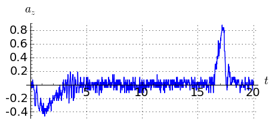
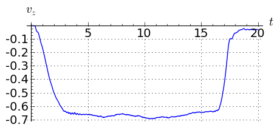
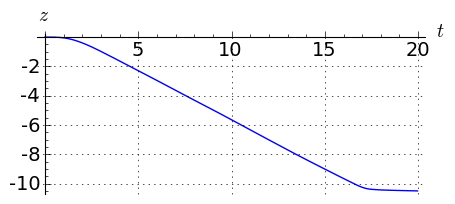

.. -*- coding: utf-8 -*-

iCSE \- przykład użycia metody
==============================

Na naszych oczach obserwujemy rewolucję technologii informatycznych: tempo zmian jest jak nigdy w historii rozwoju cywilizacji niesłychanie szybkie. Od pojawienia się komputerów osobistych, następnie  internetu i telefonii  komórkowej aż do najnowszych osiągnięć w postaci smartfonów, ipodów i palmtopów mija niewiele lat w sensie czasu historycznego.  Pamiętajmy, że fizyka jako nauka fundamentalna,  w niekwestionowany sposób przyczyniła się i przyczynia się do rozwoju powyższych technologii informatycznych. I jak to tempo zmian rozwoju w/w technologii oraz rola fizyki w tym tempie zmian przekłada się na zmiany w metodach kształcenia  na  kierunkach ścisłych, w szczególności fizyki i kierunków pokrewnych w  naszym kraju?  Dobrze znane nam są metody nauczania w naszym Instytucie, w instytutach fizyki czy wydziałach fizyki na innych polskich uczelniach i wielu uczelniach europejskich. Odpowiedź  jest pesymistyczna: fizyka w zdecydowanym  rozmiarze jest nauczana tradycyjnie.  Tradycyjne metody kształcenia studentów na kierunkach ścisłych i technicznych skupiają się głównie na stosunkowo prostych, a tym samym nierealistycznych modelach, dla których można uzyskać w krótkim czasie "dokładne" analityczne rozwiązania. Nie negujemy niektórych tradycyjnych metod w odniesieniu do nauczania fundamentalnych aspektów teorii fizycznych. Są one potrzebne, aby studenci nabyli intuicję i zrozumienie istoty zjawisk fizycznych.  Jak wynika z naszej krótkotrwałej praktyki, stosowanie metod numerycznych, w szczególności wspomaganych wizualizacją przebiegu zjawisk fizycznych pozwala studentom (w szczególności tym słabszym studentom) znacznie lepiej zrozumieć fizykę problemu.  Stosowanie metod numerycznych do rozwiązywania problemów na zajęciach należy obecnie do rzadkości z oczywistych  powodów nieprzygotowania kadry dydaktycznej do wyzwań i potrzeb obecnych czasów. Przeprowadzanie obliczeń przy pomocy przysłowiowego "ołówka i kartki papieru" czy "kredy i tablicy" oznacza ogromną stratę czasu na żmudne i czasochłonne obliczenia i oznacza brak czasu na dyskuję istoty ptoblemu.  To jest jedna z przyczyn, że przy obecnych metodach nauczanie  **student nie ma czasu na studiowanie** .   Tradycyjne metody nauczania  oddalają studenta od rzeczywistych problemów, z którymi przyjdzie mu się zetknąć w późniejszym życiu zawodowym. Współcześnie, zarówno inżynier\-projektant, analityk finansowy, aktuariusz  jak i pracownik naukowy korzystają na co dzień z wyników obliczeń numerycznych i symulacji komputerowych, przeprowadzanych w sposób mniej lub bardziej świadomy, zależnie od konkretnego przypadku i rodzaju wykorzystywanego oprogramowania.

Nauka i technika XXI wieku, jakkolwiek zbudowana na misternej konstrukcji osiągnięć poprzednich pokoleń, zawiera elementy  **jakościowo odmienne** pod względem praktycznie rozumianej obliczalności. Oznacza to, że można wskazać dziedziny nauki, konieczne w strukturze współczesnych studiów, których jednak  **nie można skutecznie**  nauczać bez użycia komputera. A oto przykłady:

- **Statystyka, ekonometria oraz analiza szeregów czasowych** . Ta triada stanowi rdzeń współczesnej ekonomii, inżynierii finasowej i ekonofizyki. Bez użycia komputera wykładowca i, co gorsza student, pozostaje skazany na analizę problemów 'akadamickich', z aplikacyjnego punktu widzenia niemal zawsze trywialnych 

- **Teoria chaosu** . Zachowanie chaotyczne układów dynamicznych jest obserwowalne wyłacznie na drodze subtelnych i czesto niełatwych eksperymentów numerycznych. Podobnie jest w przypadku problemów sprowadzalnych do  **dynamiki płynów** . Ma to istotne znaczenie w wielu dziedzinach nauki: poczynając od medycyny, gdzie modelowane są przepływy krwi w sercu człowieka, poprzez szeroką gamę problemów inżynierskich,  aż po ogólną teorię wzgledności.    

- **Modelowanie zjawisk losowych** . Wykorzystanie metod dynamiki stochastycznej do badania rzeczywistych problemów ekonfizyki i inzynierii finansowej wymaga zastosowania opisu przy pomocy szerokiej klasy procesów (stabilnych) Levy'ego, których nawet zapisanie jest niemożliwe przy uzyciu tylko funkcji elementarnych 

- **Nanofizyka i nanotechnologia** . Nanoukłady to podstawa technologii dnia jutrzejszego oraz chleb powszedni dziesiejszych badaczy. Niestety skala nanoukładów stawia je na pograniczu świata mikro i makro. Jest to  *terra incognita*   wspóczesnej nauki. Hybrydowy (klasyczno\-kwantowy) charakter nanourządzeń skazuje ich projektantów na użycie zaawansowanych metod numerycznych.  Metody analityczne tutaj praktycznie nie istnieją 

 .     

Jak się okazuje w praktyce, proste dodanie do programu studiów przedmiotów informatycznych w rodzaju "Programowanie w języku X" bądź poszerzenie wymaganego zazwyczaj w programach studiów nieinformatycznych przedmiotu "Technologia Informacyjna" niewiele daje, konieczna jest integracja komputerowych metod obliczeniowych z dotychczasowymi treściami nauczania przedmiotów kierunkowych, i to konsekwentnie od samego początku studiów. Oznacza to wprowadzenie daleko idących zmian w istniejących programach nauczania oraz konieczność przygotowania od zera nowych materiałów dydaktycznych wraz z odpowiednim do nich zapleczem IT. Tego typu działania wymagają dużego nakładu pracy ze strony kadry dydaktycznej oraz zaangażowanego personelu IT a ponadto są one również kosztowne i czasochłonne, dlatego też realizowane są w praktyce nader rzadko.

W tym materiale postaramy się pokazać na kilku przykładach w jaki sposób klasyczny proces nauczania zostanie wzbogacony o nowoczesne technologie komputerowe.

Kinematyka
---------- 

*Pociąg przebył drogę ze stacji :math:`A` do :math:`B` w ciagu :math:`10` minut, oblicz średnią prędkość jeśli odległość miedzy stacjami wynosi :math:`10`km."*

Dana jest  droga przebyta w czasie, a chcemy policzyć prędkość i przyśpieszenie. Zadanie to nie wykracza poza materiał ze szkoły średniej. Przypuśćmy jednak, że mamy dane wiecej niż szkolne dwa punkty pomiaru :math:`A` i :math:`B`:

.. code-block:: python

    sage: t=[0, 1, 2, 3, 4, 5, 6, 7]
    sage: x = [0.96, 2.03, 2.88, 3.67, 5.71, 6.66, 8.19, 8.99]

.. end of output

Oblicznamy z drogi przędkośc korzystając ze wzoru na prędkość średnią:  

.. MATH::

    v=\frac{\Delta x}{\Delta t}

.. code-block:: python

    sage: v=[]
    sage: for i in range(0,len(x)-1):
    ...       v.append ((x[i+1]-x[i])/(t[i+1]-t[i]))

.. end of output

.. code-block:: python

    sage: line(zip(t[1:],v),figsize=4)

.. image:: Warsztaty_akcelerometr_media/cell_22_sage0.png
    :align: center

.. end of output

Co nam daje algorytmiczne zautomatywowanie powyższych rachunków?

Zyskiem jest możliwość przetworzenia dowolnej ilości danych. Jednym z fascynujących przykładów jest próba wykorzystania nowoczesnego telefonu jaqko źródła danych. Tak zwane smartfony maja wiele czujników \- między innymi akcelerometr. Weźmy realne dane z pomiaru akcelerometrem z telefonu komórkowego, który leżał na podłodze windy. Doświadczenie to może wykonać każdy student.

Pytanie brzmi: na jaką wysokośc wjechała winda?

.. code-block:: python

    sage: import csv 
    sage: import numpy as np 
    sage: data = csv.reader(open(DATA+'sensorlog_2011082200122729_acc.csv'), delimiter=';')
    sage: waveII=np.array([ [int(row[0])]+map(float,row[1:]) for row in data])

.. end of output

Analizę danych można przeprowadzić korzystając z samodzielnie napisanego, kilkulinijkowego skryptu, który wykorzystując technikę interact umożliwi w wygodny sposób wybranie właściwego podzbioru danych.

.. code-block:: python

    sage: N=waveII.shape[0]
    sage: @interact
    sage: def _(i1=slider(0,N,default=int(N/6)),i2=slider(0,N,default=int(N-N/6))  ):
    ...       l=list_plot( zip( waveII[i1:i2,0]-waveII[0,0],waveII[i1:i2,3] ) ,plotjoined=True,figsize=(7,4),gridlines=True)
    ...       show(l)

.. end of output

Mając wybrane zakresy dokonujemy  przeliczeń:

.. code-block:: python

    sage: t=waveII[1057:2020,0]
    sage: a=waveII[1057:2020,3]
    sage: bg_a=waveII[1214:1839,3].mean()
    sage: a=(a-bg_a)*9.81
    sage: t=t/1000.0
    sage: xc=[]
    sage: vc=[]
    sage: xc.append(0)
    sage: vc.append(0)
    sage: N=a.shape[0]
    sage: for i in range(0,N-1):
    ...       vc.append( vc[i]+a[i]*(t[i+1]-t[i]) )
    sage: for i in range(0,len(vc)-1):
    ...       xc.append( xc[i]+vc[i]*(t[i+1]-t[i]) )

.. end of output

.. code-block:: python

    sage: p1 = list_plot(zip(t-t[0],a),plotjoined=True,gridlines=True,fontsize=14,axes_labels=['$t$','$a_z$'],figsize=[5,2] )
    sage: p2 = list_plot(zip(t-t[0],vc),plotjoined=True,gridlines=True,fontsize=14,axes_labels=['$t$','$v_z$'],figsize=[5,2]) 
    sage: p3 = list_plot(zip(t-t[0],xc),plotjoined=True,gridlines=True,fontsize=14,axes_labels=['$t$','$z$'],figsize=[5,2]) 
    sage: print "Przyśpieszenie"
    sage: show(p1)
    sage: print "Prędkość"
    sage: show(p2)
    sage: print "Droga"
    sage: show(p3)
    Przyśpieszenie
    Prędkość
    Droga

.. end of output

Z ostatniego rysunku widać odpowiedź: winda zjechała w dół na ok. :math:`10`m.

