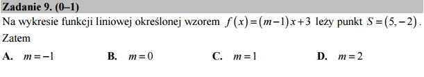

.. _matura2015_p09.rst:

O tym jak technologia :code:`@interact` pomoże rozwiązać równanie z parametrem
------------------------------------------------------------------------------

Korzystając z algebry komputerowej wynik otrzymujemy natychmiast:

.. sagecellserver::

   var('x,y,m')
   rownanie = y == (m-1)*x+3
   show(rownanie)
   show(rownanie.subs({x:5,y:-2}).solve(m))

.. only:: latex

    Otrzymujemy :math:`m=1`
    

Ponieważ mamy do sprawdzenia tylko cztery możliwości można też pokusić
się o narysowanie graficznej reprezentacji w każdym z przypadków:

.. sagecellserver::

   var('x,y,m')
   rownanie = y == (m-1)*x+3
   @interact
   def rysuj(m_=[1,2,-1,0]):
        p = point((5,-2),size=20,color='red')
        p+=implicit_plot(rownanie.subs({m:m_}),(x,-10,10),(y,-10,10))
        p.show(figsize=4,aspect_ratio=1) 

.. admonition:: Jak to działa? - `@interact`

   W systemie Sage polecenie to jest niezwykle wygodnym narzędziem do
   szybkiego tworzenia interaktywnych wykresów lub
   obliczeń. :code:`@interact` jest tak zwanym dekoratorem funkcji
   :code:`rysuj`. Dekorator uruchamia funkcję :code:`rysuj` jako
   argument innej funkcji, która generuje dla nas wygodne przyciski i
   po ich nacisnięciu wywołuje funkcje :code:`rysuj` z wybraną
   wartością parametru.

