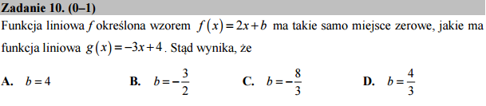

.. _matura2015_p10.rst:

O konstrukcji złożonych poleceń z pomocą metod
----------------------------------------------

Korzystając z algebry komputerowej możemy praktycznie w jednej linijce
otrzymać wynik:

.. sagecellserver::

   var('x,b')
   f =  2*x + b
   g = -3*x + 4
   f.subs(solve(g,x)[0]).solve(b)[0].show()

.. only:: latex

    Otrzymujemy :math:`b=-\frac{8}{3}`.
    

Co oznacza wyrażenie :code:`f.subs(solve(g,x)[0]).solve(b)[0].show()`?
W bezpośrednim przekładzie z Pythona na Polski:

  Podstaw do wyrażenia :code:`f` pierwsze rozwiązanie równania
  :math:`g(x)=0`, rozwiąż ze względu na :math:`b` i pokaż ładnie na
  ekranie pierwsze rozwiązanie.

.. note::

   Warto zauważyć, że dla Sage :code:`solve(g,x)` to jest to samo co
   :code:`solve(g==0,x)` oznacza: rozwiąż :math:`g(x)=0`. Wynikiem
   rozwiązywania jest zawsze lista, może być pusta jeśli nie ma
   rozwiązań lub jednoelementowa.

.. admonition:: Jak to działa?  -  metody i funkcje. 

   Językiem systemu algebry komputerowej Sage jest Python. W Python-ie
   wszystkie zmienne są objektami i posiadają, prócz danych takich jak
   np. wartość zmiennej, tak zwane metody. Metodami są funkcje, które
   wywołujemy taką składnią:   :code:`nazwa_objektu.funkcja()`. 

Wypróbuj sam działanie metod. Weż na przykład wyrażenie algebraiczne
Sage, które jest bardzo złożonym objektem i posiada np. rozmaite
metody do manipulacji na wyrażeniach. Na przykład w komórce:

.. sagecellserver::

   var('x,a')
   wyrazenie = (x+a)^2
   wyrazenie      

dopisz do statniej  liniki:

a. :code:`wyrazenie.show()` - pokaże nam ładną postać matematyczną wzoru.
#. :code:`wyrazenie.expand()` - rozwinie wzór, spróboj połączyć z
   poprzednim: :code:`wyrażenie.expand().show()`
#. :code:`wyrazenie.subs(a==2)`

.. note::

   W Sage jest system pomocy, spróbuj napisać
   :code:`wyrazenie.expand?`. Lista dostępnych metod jest olbrzymia: :code:`dir(wyrazenie)`.

   W notatniku (sagenb lub jupyter) działa klawisz uzupełnienia
   :code:`TAB` (tabulator) po :code:`wyrazenie.`

