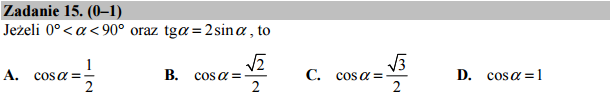

.. _matura2015_p15.rst:

O tożsamości trygonometrycznej i założeniach
--------------------------------------------

Sprawdźmy czy Sage potrafi rozwiązać równanie :math:`\tan(x)=2\sin(x)`?

.. sagecellserver::

   var('x')
   print solve(tan(x)==2*sin(x),x)

Otrzymujemy dwa rozwiązania. Które jest poprawne? Zauważmy, że mamy
podany w zadaniu warunek dla kąta, co wyklucza jedno z nich.  W Sage
możemy spróbowac podać ten warunek używając funkcji :code:`assume()`:

.. sagecellserver::

   var('x')
   assume(x>0)
   assume(x<pi)
   show( cos(solve(tan(x)==2*sin(x),x)[0].rhs()) ) 

Warto też przyjrzeć się wykresom lewej i prowej strony równania. Nie
pomoże to w tym przypadku  otrzymać rozwiązanie, ale zasugeruje,
że rozwiązanie istnieje i pokaże mniej więcej jego wartość:

.. sagecellserver::

   p = plot([tan(x),2*sin(x)],(x,0,pi),\
         ymax=5,ymin=-5,detect_poles='show')
   p.show()

.. admonition:: Jak to działa? - :code:`rhs()`

   W Sage funkcja :code:`solve` standardowo zwraca listę wyrażeń w postaci:

   .. code-block:: python

      [ x==2, x==3 ]
 
   Czasem chcemy podstawić - bez ręcznego przepisywania wyrażenia -
   wartość rozwiązania po lewej stronie równości np. do innego
   wyrażenie. W Sage służy do tego celu metoda :code:`.rhs()` (z
   ang. *right hand side*), która zwraca prawą strone wyrażenia
   zawierającego logiczne (matematycznie) równa się :code:`==`. Na
   przykład :code:`(a==1).rhs()`, zwróci 1.

   Istnieje też metoda :code:`.lhs()` (z ang. *left hand side*), która
   zwraca lewą stronę wyrażenia.
