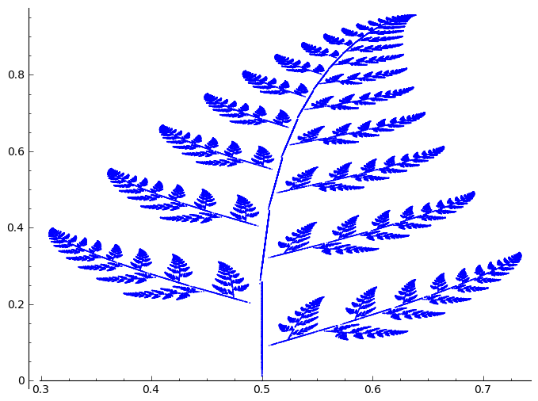
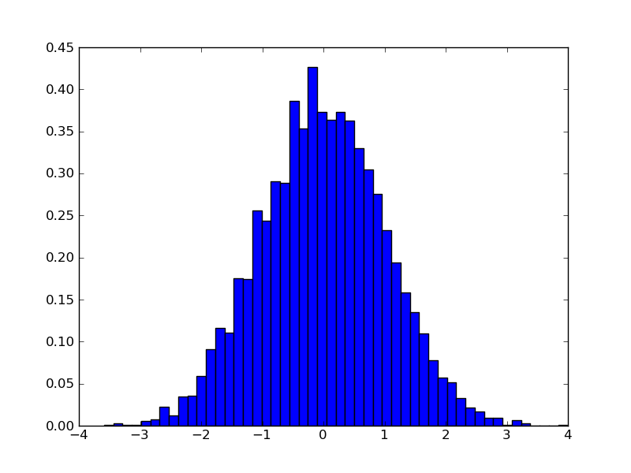
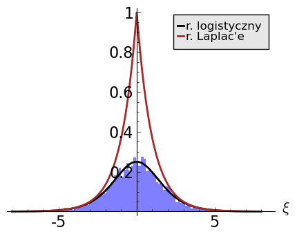

.. sectnum::

Algebra liniowa
---------------

Liczby zespolone (interpretacja geometryczna).
~~~~~~~~~~~~~~~~~~~~~~~~~~~~~~~~~~~~~~~~~~~~~~

| *Zastosowania systemu algebry komputerowej oraz wizualizacji do liczb zespolonych.* 

- `Liczby zespolone  <https://sage2.icse.us.edu.pl/pub/?typ=pub&search=iCSE_MAlg03_z7>`__

Interaktywne materiały:
 
- `dodawanie liczb zespolonych  <http://visual.icse.us.edu.pl/wizualizacje/algebra-i-analiza/zobacz/DodawanieLiczbZespolonych/>`__

- `mnożenie liczb zespolonych  <http://visual.icse.us.edu.pl/wizualizacje/algebra-i-analiza/zobacz/MnozenieLiczbZespolonych/>`__

- `potegowanie liczb zespolonych  <http://visual.icse.us.edu.pl/wizualizacje/algebra-i-analiza/zobacz/PotegowanieLiczbZespolonych/>`__

- `pierwiastkowanie liczb zespolonych  <http://visual.icse.us.edu.pl/wizualizacje/algebra-i-analiza/zobacz/PierwiastkowanieLiczbZespolonych/>`__

Wprowadzenie do układów równań liniowych
~~~~~~~~~~~~~~~~~~~~~~~~~~~~~~~~~~~~~~~~

| *Przestrzeń wektorów kolumnowych nad ciałem* :math:`\,K.`
| *Geometryczna interpretacja oznaczonych, nieoznaczonych i sprzecznych układów równań.*
| *Doprowadzenie układu równań do postaci schodkowej poprzez operacje elementarne.*

- `rozdział  <http://visual.icse.us.edu.pl/LA/#wprowadzenie-do-ukladow-rownan-liniowych>`__
-  `Sage <https://sage2.icse.us.edu.pl/pub/?typ=pub&search=iCSE_MAlg01_z12>`__

Algebra macierzy
~~~~~~~~~~~~~~~~

| *Wprowadzenie macierzy jako prostokątnej tablicy elementów z pewnego ciała.*
| *Definicja dodawania macierzy, mnożenia ich przez liczbę i mnożenia macierzy przez macierz.*
| *Praktyczne operacje na wektorach i macierzach w systemie Sage.*

- `rozdział  <http://visual.icse.us.edu.pl/LA/#algebra-macierzy>`__

- `Wyznaczanie rzędu macierzy - automatycznie generowane zadanie <https://sage2.icse.us.edu.pl/pub/?typ=pub&search=iCSE_MAlg02_z82>`__

Operacje na macierzach
~~~~~~~~~~~~~~~~~~~~~~

| *Metoda eliminacji w zastosowaniu do macierzy.*
| *Transpozycja macierzy. Macierze symetryczne i antysymetryczne.*
| *Macierz odwrotna. Macierze elementarne. Macierze permutacji.*
| *Algorytm praktycznego obliczania macierzy odwrotnej.*
| *Rozkład LU i jego zastosowania.*

- `rozdział    <http://visual.icse.us.edu.pl/LA/#operacje-na-macierzach>`__
- `Macierze i operacje na macierzach <https://sage2.icse.us.edu.pl/pub/?typ=pub&search=iCSE_MAlg02_z44>`__

Wyznaczniki
~~~~~~~~~~~

| *Aksjomatyczna definicja wyznacznika. Rozwinięcie permutacyjne.*
| *Rozwinięcie Laplace'a jako praktyczna metoda obliczania wyznacznika.*
| *Własności i zastosowania wyznaczników.*

- `rozdział    <http://visual.icse.us.edu.pl/LA/#wyznaczniki>`__

- `Obliczanie, własności i interpretacja geometryczna wyznacznika macierzy <https://sage2.icse.us.edu.pl/pub/?typ=pub&search=iCSE_MAlg02_z38>`__

Teoria i praktyka układów równań liniowych
~~~~~~~~~~~~~~~~~~~~~~~~~~~~~~~~~~~~~~~~~~

- `rozdział    <http://visual.icse.us.edu.pl/LA/#teoria-i-praktyka-ukladow-rownan-liniowych>`__

.. | *Zarys teorii układów równań liniowych.*
   | *Rozwiązywanie układów równań w systemie Sage.*

Przekształcenia liniowe
~~~~~~~~~~~~~~~~~~~~~~~

| *Własności i zastosowania przekształceń liniowych.*
| *Izomorfizm przestrzeni wektorowych.*
| *Reprezentacja macierzowa przekształceń liniowych.*

- `rozdział    <http://visual.icse.us.edu.pl/LA/#przeksztalcenia-liniowe>`__
- `Przekształcenia liniowe, jądro i obraz, interpretacja   geometryczna <https://sage2.icse.us.edu.pl/pub/?typ=pub&search=iCSE_MAlg02_z43>`__

Przestrzenie unitarne
~~~~~~~~~~~~~~~~~~~~~

| *Iloczyn skalarny w przestrzeni zespolonej i rzeczywistej.*
| *Definicja i przykłady przestrzeni unitarnych.*
| *Nierówność Schwarza i jej konkretne realizacje.*
| *Ortogonalność. Dopełnienie ortogonalne.*
| *Baza ortogonalna i ortonormalna. Procedura Grama-Schmidta.*
| *Macierze hermitowskie i unitarne.*
| *Operatory hermitowskie i unitarne.*

- `rozdział    <http://visual.icse.us.edu.pl/LA/#przestrzenie-unitarne>`__

Wartości i wektory własne
~~~~~~~~~~~~~~~~~~~~~~~~~

| *Definicja problemu własnego operatora liniowego.*
| *Rozwiązanie problemu własnego w przestrzeniach skończenie wymiarowych.*
| *Wartości i wektory własne operatorów hermitowskich i unitarnych.*

- `rozdział    <http://visual.icse.us.edu.pl/LA/#wartosci-i-wektory-wlasne>`__

-  `Wartości własne, wyznaczanie i  interpretetacja <https://sage2.icse.us.edu.pl/pub/?typ=pub&search=iCSE_MAlg05_z45>`__

-  `Zastosowania wartości własnych w fizyce: macierze Pauliego, pole wektorowe w otoczeniu punktu osobliwego, ekstrema funkcji wielu zmiennych. <https://sage2.icse.us.edu.pl/pub/?typ=pub&search=iCSE_MAlg05_z46>`__
-  `Zastosowanie wartości własnych w mechanice bryły sztywnej: tensor bezwładności <https://sage2.icse.us.edu.pl/pub/?typ=pub&search=iCSE_MAlg05_z83>`__

Rozkłady macierzy LU,RU, SVD.
~~~~~~~~~~~~~~~~~~~~~~~~~~~~~

-  `Postać schodkowa macierzy, przekształcenia elementarne i rozkład
   LU <https://sage2.icse.us.edu.pl/pub/?typ=pub&search=iCSE_MAlg08_z47>`__
-  `Rozkład QR <https://sage2.icse.us.edu.pl/pub/?typ=pub&search=iCSE_MAlg08_z48>`__
-  `Rozkład SVD <https://sage2.icse.us.edu.pl/pub/?typ=pub&search=iCSE_MAlg08_z49>`__
-  `Zastosowania rozkładu  SVD w kompresji obrazu. <https://sage2.icse.us.edu.pl/pub/?typ=pub&search=iCSE_MAlg08_z84>`__

Zastosowania algebry liniowej
~~~~~~~~~~~~~~~~~~~~~~~~~~~~~

-  `Metoda najmniejszych kwadratów, aproksymacja
   wielomianowa <https://sage2.icse.us.edu.pl/pub/?typ=pub&search=iCSE_MAlg10_z50>`__
-  `Teoria obwodów
   elektrycznych <https://sage2.icse.us.edu.pl/pub/?typ=pub&search=iCSE_MAlg10_z51>`__
-  `Operatory różniczkowania, zagadnienia
   brzegowe <https://sage2.icse.us.edu.pl/pub/?typ=pub&search=iCSE_MAlg10_z52>`__

Analiza matematyczna
--------------------

Funkcje jednej zmiennej
~~~~~~~~~~~~~~~~~~~~~~~

| *Wizualizacja przebiegu zmienności funkcji jednej i wielu zmiennych.*
| *Krzywe parametryczne.*

- `Funkcje jednej zmiennej. <https://sage2.icse.us.edu.pl/pub/?typ=pub&search=iCSE_MAmat01_z1>`__

Elementy geometrii różniczkowej
~~~~~~~~~~~~~~~~~~~~~~~~~~~~~~~

-  `Analiza  wektorowa. <https://sage2.icse.us.edu.pl/pub/?typ=pub&search=iCSE_MAmat02_z15>`__
-  `Krzywe parametryczne,wektor  styczny. <https://sage2.icse.us.edu.pl/pub/?typ=pub&search=iCSE_MAmat02_z16>`__
-  `Operatory różniczkowe w krzywoliniowych ukłach współrzędnych. <https://sage2.icse.us.edu.pl/pub/?typ=pub&search=iCSE_MAmat02_z17>`__
-  `Tor ruchu po krzywej - zastosowanie  geometrii  różniczkowej do kinematyki. <https://sage2.icse.us.edu.pl/pub/?typ=pub&search=iCSE_MAmat02_z86>`__

Transforma Fouriera
~~~~~~~~~~~~~~~~~~~

| *Dyskretna transformata Fouriera.*
| *Związek DFT z transformatą ciągłą.*
| *DFT jako przekształcenie unitarne.*
| *Własności DFT - wizualizacja i eksperymentowanie.*

-  `Dyskretna Transformata
   Fouriera <https://sage2.icse.us.edu.pl/pub/?typ=pub&search=iCSE_MAmat03_z124>`__

Pierwiastki wielomianów i zera funkcji.
~~~~~~~~~~~~~~~~~~~~~~~~~~~~~~~~~~~~~~~

-  `Obliczanie zer
   wielomianów <https://sage2.icse.us.edu.pl/pub/?typ=pub&search=iCSE_MAmat04_z28>`__
-  `Zera funkcji jednej
   zmiennej <https://sage2.icse.us.edu.pl/pub/?typ=pub&search=iCSE_MAmat04_z29>`__
-  `Zera funkcji zespolonych i funkcji rzeczywistych wielu
   zmiennych <https://sage2.icse.us.edu.pl/pub/?typ=pub&search=iCSE_MAmat04_z30>`__

Pochodna funkcji jednej zmiennej; algorytmy obliczające pochodną numerycznie.
~~~~~~~~~~~~~~~~~~~~~~~~~~~~~~~~~~~~~~~~~~~~~~~~~~~~~~~~~~~~~~~~~~~~~~~~~~~~~

-  `Rachunek różniczkowy funkcji jednej zmiennej: teoria i wizualizacja i zadania <https://sage2.icse.us.edu.pl/pub/?typ=pub&search=iCSE_MAmat05_z2>`__

-  `Pochodna funkcji jednej zmiennej - badanie własności za pomocą systemu algebry komputerowej. <https://sage2.icse.us.edu.pl/pub/?typ=pub&search=iCSE_MAmat04_z87>`__

Definicja całki oznaczonej, metody numeryczne obliczania całki oznaczonej,w tym metoda prostokątów oraz metoda trapezów.
~~~~~~~~~~~~~~~~~~~~~~~~~~~~~~~~~~~~~~~~~~~~~~~~~~~~~~~~~~~~~~~~~~~~~~~~~~~~~~~~~~~~~~~~~~~~~~~~~~~~~~~~~~~~~~~~~~~~~~~~

-  `Rachunek całkowy  funkcji jednej zmiennej: teoria wizualizacja i zadania. <https://sage2.icse.us.edu.pl/pub/?typ=pub&search=iCSE_MAmat06_z8>`__

Funkcje wielu zmiennych: całki wielokrotne, krzywoliniowe, rachunek różniczkowy f. wielu zmiennych.
~~~~~~~~~~~~~~~~~~~~~~~~~~~~~~~~~~~~~~~~~~~~~~~~~~~~~~~~~~~~~~~~~~~~~~~~~~~~~~~~~~~~~~~~~~~~~~~~~~~

-  `Elementy rachunku różniczkowego wielu zmiennych z Sage <https://sage2.icse.us.edu.pl/pub/?typ=pub&search=iCSE_MAmat08_z31>`__

-  `Całka
   krzywoliniowa <https://sage2.icse.us.edu.pl/pub/?typ=pub&search=iCSE_MAmat08_z14>`__

-  `Zastosowania całek wielokrotnych i
   krzywoliniowych <https://sage2.icse.us.edu.pl/pub/?typ=pub&search=iCSE_MAmat08_z32>`__

Analiza równań różniczkowych zwyczajnych
~~~~~~~~~~~~~~~~~~~~~~~~~~~~~~~~~~~~~~~~

-  `Rozwiązywanie równań różnicznowych zwyczajnych, metody algebraiczne
   i numeryczne <https://sage2.icse.us.edu.pl/pub/?typ=pub&search=iCSE_MAmat10_z40>`__
-  `Stany stacjonarne oraz ich stabilność. Klasyfikacja punktów
   osoblicwych. <https://sage2.icse.us.edu.pl/pub/?typ=pub&search=iCSE_MAmat10_z41>`__
-  `Diagramy bifurkacyjne dla równań różniczkowych i algorytmy ich konstrukcji <https://sage2.icse.us.edu.pl/pub/?typ=pub&search=iCSE_MAmat10_z42>`__
-  `Praktyczy przewodnik po metodach analizy równań różniczkowych
   zwyczajnych w Sage. <https://sage2.icse.us.edu.pl/pub/?typ=pub&search=iCSE_MAmat10_z88>`__

Astronomia
----------

Prawa Keplera.
~~~~~~~~~~~~~~

Fizyka gwiazd
~~~~~~~~~~~~~

Astronomia obserwacyjna.
~~~~~~~~~~~~~~~~~~~~~~~~

-  `Wyznaczanie odległości
   astronomicznych <https://sage2.icse.us.edu.pl/pub/?typ=pub&search=iCSE_Astro04_z260>`__

Biofizyczne aspekty wzrostu i rozwoju roślin
--------------------------------------------

Modelowanie wzrostu roślin.
~~~~~~~~~~~~~~~~~~~~~~~~~~~

-  `Oscylacyjny model wzrostu łagiewek
   pyłkowych. <https://sage2.icse.us.edu.pl/pub/?typ=pub&search=iCSE_BWzrostroslin01_z314>`__

Zagadnienia proliferacji komórek, wzrost organów roślinnych.
~~~~~~~~~~~~~~~~~~~~~~~~~~~~~~~~~~~~~~~~~~~~~~~~~~~~~~~~~~~~

-  `Modelowanie wzrostu liścia w dwóch wymiarach <https://sage2.icse.us.edu.pl/pub/?typ=pub&search=iCSE_BWzrostroslin03_z311>`__

Kwasowa teoria wzrostu, rola białek (ekspansyny) we wzroście roślin.
~~~~~~~~~~~~~~~~~~~~~~~~~~~~~~~~~~~~~~~~~~~~~~~~~~~~~~~~~~~~~~~~~~~~

-  `Szczególne rozwiązania równania Ortegi dla regularnego wzrostu
   komórki roślinnej <https://sage2.icse.us.edu.pl/pub/?typ=pub&search=iCSE_BWzrostroslin04_z313>`__

Biofizyka tkanek. Molekularne procesy zachodzące w tkankach
-----------------------------------------------------------

Podstawowe modele wzrostu populacji komórkowych. 
~~~~~~~~~~~~~~~~~~~~~~~~~~~~~~~~~~~~~~~~~~~~~~~~

| *Model Malthusa, model ciągły i dyskretny, model logistyczny.*

Przełozyć!

Modelowanie wzrostu guza nowotworowego
~~~~~~~~~~~~~~~~~~~~~~~~~~~~~~~~~~~~~~

https://sage2.icse.us.edu.pl/home/pub/486/

Modelowanie kinetyki zachodzenia reakcji w komórkach (Michaelis-Menten).
~~~~~~~~~~~~~~~~~~~~~~~~~~~~~~~~~~~~~~~~~~~~~~~~~~~~~~~~~~~~~~~~~~~~~~~~

Przełożyć!

Elastomechanika
---------------

Ruch drgający w ośrodkach sprężystych
~~~~~~~~~~~~~~~~~~~~~~~~~~~~~~~~~~~~~

- `Drgania i fale mechaniczne  <https://sage2.icse.us.edu.pl/pub/?typ=pub&search=iCSE_FElastmech01_z184>`__
- `Wyznaczanie przyśpieszenia ziemskiego - wahadło matematyczne, różnicowe i fizyczne  <https://sage2.icse.us.edu.pl/pub/?typ=pub&search=iCSE_FElastmech01_z212>`__
- `Wahadło matematyczne i rewersyjne. <https://sage2.icse.us.edu.pl/pub/?typ=pub&search=iCSE_FElastmech01_z213>`__
- `Wyznaczanie modułu sztywności metodą dynamiczną  <https://sage2.icse.us.edu.pl/pub/?typ=pub&search=iCSE_FElastmech01_z221>`__

Sztywność i wytrzymałość ośrodków elastycznych
~~~~~~~~~~~~~~~~~~~~~~~~~~~~~~~~~~~~~~~~~~~~~~

- `Badanie drgań obciążonej sprężyny. <https://sage2.icse.us.edu.pl/pub/?typ=pub&search=iCSE_FElastmech02_z215>`__
- `Zderzenia sprężyste i niesprężyste  <https://sage2.icse.us.edu.pl/pub/?typ=pub&search=iCSE_FElastmech02_z216>`__

Moduł Younga
~~~~~~~~~~~~

-  `Wyznaczanie prędkości dźwięku i modułu Younga za pomocą rury  Kundta <https://sage2.icse.us.edu.pl/pub/?typ=pub&search=iCSE_FElastomech03_z217>`__
-  `Wyznaczanie modułu Younga metodą ugięcia  belki. <https://sage2.icse.us.edu.pl/pub/?typ=pub&search=iCSE_FElastomech03_z220>`__

Elektrodynamika klasyczna
-------------------------

Transformacja Lorenza.
~~~~~~~~~~~~~~~~~~~~~~

Uzupełnić - Łobejko and co.!

Fale elektromagnetyczne, superpozycja.
~~~~~~~~~~~~~~~~~~~~~~~~~~~~~~~~~~~~~~

- `Niezmienniki relatywistyczne i ich wykorzystanie w opisie zjawisk
  fizycznych   <https://sage2.icse.us.edu.pl/pub/?typ=pub&search=iCSE_FEklas02_z73>`__

.. -  `Dipol Hertza,pola elektromagnetyczne wokół dipola,
.. promieniowanie <https://sage2.icse.us.edu.pl/pub/?typ=pub&search=iCSE_FEklas02_z146>`__

Szczególna Teoria Względności: zastosowanie techniki ray tracing.
~~~~~~~~~~~~~~~~~~~~~~~~~~~~~~~~~~~~~~~~~~~~~~~~~~~~~~~~~~~~~~~~~

!PDF file

-  `Szczególna Teoria Względności: zastosowanie
   techniki ”ray tracing” <https://sage2.icse.us.edu.pl/pub/?typ=pub&search=iCSE_FEklas03_z5>`__

Ogólna Teoria Względności: soczewkowanie grawitacyjne.
~~~~~~~~~~~~~~~~~~~~~~~~~~~~~~~~~~~~~~~~~~~~~~~~~~~~~~

- `Ogólna Teoria Względności
  <https://sage2.icse.us.edu.pl/pub/?typ=pub&search=iCSE_FEklas04_z152>`__

Równanie Poissona
~~~~~~~~~~~~~~~~~

Materiał ten zawiera opracowanie numerycznego podejścia do
rozwiązywania równania Poissona metodą różnic skończonych. Krok po
kroku zaprezentowano sposób konstrukcji od jedno-, dwu- i
trójwymiarowego dyskretnego operatora Laplace'a oraz jego wydajną
reprezentację na macierzach rzadkich wykorzystując do tego bibliotekę
:code:`scipy.sparse`.

-  `Numeryczne analiza równania
   Poissona <https://sage2.icse.us.edu.pl/pub/?typ=pub&search=iCSE_FEklas05_z254>`__

Dipole i multipole
~~~~~~~~~~~~~~~~~~

-  `Dipole i
   multipole <https://sage2.icse.us.edu.pl/pub/?typ=pub&search=iCSE_FEklas06_z310>`__

Elektryczność i magnetyzm
-------------------------

Natężenie pola elektrycznego.
~~~~~~~~~~~~~~~~~~~~~~~~~~~~~

-  `Pole pochodzące od rozkładu ładunków punktowych <https://sage2.icse.us.edu.pl/pub/?typ=pub&search=iCSE_FElekmag01_z67>`__

.. -  `Pole pochodzące od ładunku poruszającego się ruchem jednostajnie
.. liniowym <https://sage2.icse.us.edu.pl/pub/?typ=pub&search=iCSE_FElekmag01_z68>`__

Ładunek w polu elektrycznym.
~~~~~~~~~~~~~~~~~~~~~~~~~~~~

-  `Wyznaczanie pojemności kondensatora z krzywej
   rozładowania <https://sage2.icse.us.edu.pl/pub/?typ=pub&search=iCSE_FElekmag02_z190>`__
-  `Wyznaczanie współczynnika samoindukcji i pojemności za pomocą
   obwodów prądu
   zmiennego <https://sage2.icse.us.edu.pl/pub/?typ=pub&search=iCSE_FElekmag02_z191>`__

Siła Lorenza.
~~~~~~~~~~~~~

.. image:: figs/rel_czastka_w_polu.png
   :alt: Propagacja implulsu w równaniu falowym
   :align: right
   :height: 160

-  `Symulacja spektrometru masowego. 
   <https://sage2.icse.us.edu.pl/pub/?typ=pub&search=iCSE_FElekmag03_z27>`__

-  `Relatywistyczna cząstka w polu
   elektromagnetycznym <https://sage2.icse.us.edu.pl/pub/?typ=pub&search=iCSE_FElekmag03_z39>`__

Prawo Ohma i Kirchoffa - symulacje obwodów elektrycznych.
~~~~~~~~~~~~~~~~~~~~~~~~~~~~~~~~~~~~~~~~~~~~~~~~~~~~~~~~~

-  `Rozwiązywanie złożonych obwodów jako grafów
   ukierunkowanych <https://sage2.icse.us.edu.pl/pub/?typ=pub&search=iCSE_FElekmag04_z69>`__

.. -  `Liniowe obwody elektryczne (sieci) DC, Tw. Thevenina i Tw.
..    Nortona <https://sage2.icse.us.edu.pl/pub/?typ=pub&search=iCSE_FElekmag04_z154>`__

Obwody prądu zmiennego.
~~~~~~~~~~~~~~~~~~~~~~~

.. image:: figs/RLC.png
   :alt: Numeryczne rozwiązanie dwuwymiarowego równania Poissona
   :align: right
   :height: 160

Analiza własności obwodów prądu zmiennego z zastosowaniem aparatu
algebry komputerowej i metod numerycznych do rozwiązywania równań
różniczkowych 

-  `Obwody prądu zmiennego <https://sage2.icse.us.edu.pl/pub/?typ=pub&search=iCSE_FElekmag05_z10>`__

Pomiary i symulacje komputerowe wiekości elektrycznych
~~~~~~~~~~~~~~~~~~~~~~~~~~~~~~~~~~~~~~~~~~~~~~~~~~~~~~

-  `Wyznaczanie oporu elektrycznego za pomocą mierników prądu <https://sage2.icse.us.edu.pl/pub/?typ=pub&search=iCSE_FElekmag06_z173>`__
-  `Cechowanie watomierza i licznika energii elektrycznej <https://sage2.icse.us.edu.pl/pub/?typ=pub&search=iCSE_FElekmag06_z176>`__
-  `Wyznaczanie oporu elektrycznego metodą mostka Wheatstone'a <https://sage2.icse.us.edu.pl/pub/?typ=pub&search=iCSE_FElekmag06_z211>`__

Doświadczalne badanie obwodów prądu zmiennego
~~~~~~~~~~~~~~~~~~~~~~~~~~~~~~~~~~~~~~~~~~~~~

-  `Pomiar napięcia i prądu w obwodzie  RC <https://sage2.icse.us.edu.pl/pub/?typ=pub&search=iCSE_FElekmag07_z194>`__
-  `Badanie rezonansu elektrycznego <https://sage2.icse.us.edu.pl/pub/?typ=pub&search=iCSE_FElekmag07_z195>`__

Eksperymentalne badanie siły Lorenza
~~~~~~~~~~~~~~~~~~~~~~~~~~~~~~~~~~~~

-  `Wyznaczanie wartości stosunku e/m <https://sage2.icse.us.edu.pl/pub/?typ=pub&search=iCSE_FElekmag08_z196>`__
-  `Oscyloskop katodowy <https://sage2.icse.us.edu.pl/pub/?typ=pub&search=iCSE_FElekmag08_z197>`__
-  `Siła działająca na przewodnik z prądem w polu magnetycznym <https://sage2.icse.us.edu.pl/pub/?typ=pub&search=iCSE_FElekmag08_z198>`__

Siła elektromotoryczna
~~~~~~~~~~~~~~~~~~~~~~

-  `Wyznaczanie siły elektromotorycznej i oporu wewnętrznego ogniwa <https://sage2.icse.us.edu.pl/pub/?typ=pub&search=iCSE_FElekmag09_z172>`__
-  `Pomiar SEM fotoogniw za pomocą kompensatora prądu stałego <https://sage2.icse.us.edu.pl/pub/?typ=pub&search=iCSE_FElekmag09_z177>`__
-  `Indukcja elektromagnetyczna <https://sage2.icse.us.edu.pl/pub/?typ=pub&search=iCSE_FElekmag09_z179>`__

Pojemność kondensatora
~~~~~~~~~~~~~~~~~~~~~~

-  `Wyznaczanie pojemności kondensatora oraz stałej dielektrycznej metodą  mostkową <https://sage2.icse.us.edu.pl/pub/?typ=pub&search=iCSE_FElekmag10_z174>`__
-  `Drgania relaksacyjne <https://sage2.icse.us.edu.pl/pub/?typ=pub&search=iCSE_FElekmag10_z175>`__

Badanie\_wektorowego\_dodawania\_napiecia
~~~~~~~~~~~~~~~~~~~~~~~~~~~~~~~~~~~~~~~~~

-  `Badanie wektorowego dodawania napięć zmiennych w obwodzie RLC <https://sage2.icse.us.edu.pl/pub/?typ=pub&search=iCSE_FElekmag11_z193>`__

Pole elektryczne
~~~~~~~~~~~~~~~~

.. image:: figs/linie_pola.png
   :alt: Numeryczne rozwiązanie dwuwymiarowego równania Poissona
   :align: right
   :height: 160

Analiza i wizualizacja pola elektrycznego pochodzącego od ładunków
punktowych. Nacisk został położony na wykorzystanie algebry
komputerowej do prostej automatyzacji algorytmicznej otrzymywania
formuł i wizualizacji. W przypadku ciągłego rozkładu ładunku została
zastosowana algebra komputerowa do otrzymania klasycznych wzorów. 

-  `Pole elektryczne <https://sage2.icse.us.edu.pl/pub/?typ=pub&search=iCSE_FElekmag12_z251>`__

Potencjal elektryczny
~~~~~~~~~~~~~~~~~~~~~

.. image:: figs/Psi_dysk.png
   :alt: Potencjał od naładowanego dysku
   :align: right
   :width: 360
..   :height: 160

Analiza i wizualizacja powierzchni ekwipotencjalnych pochodzących od
ładunków punktowych . Nacisk został położony na wykorzystanie algebry
komputerowej do wyprowadzania wzorów i wizualizacji. Klasyczne formuły
na potencjał pochodzący od pewnych symetrycznych ciągłych rozkładów
ładunków zostały wyprowadzone stosując CAS.

-  `Potencjal
   elektryczny <https://sage2.icse.us.edu.pl/pub/?typ=pub&search=iCSE_FElekmag13_z252>`__

Energia układów ładunków
~~~~~~~~~~~~~~~~~~~~~~~~

Obliczanie energii skończonych i nieskończonych układów ładunków z
zastosowaniem zarówno metod algebry komputerowej jak i podejsciem
algorytmicznym. Wykorzystano możliwości Sage do alternatywnego
rozwiązywania szeregu klasycznych zadań.

-  `Energia uładu ładunków <https://sage2.icse.us.edu.pl/pub/?typ=pub&search=iCSE_FElekmag14_z253>`__

Eksperymentalne badanie pola elektrycznego
~~~~~~~~~~~~~~~~~~~~~~~~~~~~~~~~~~~~~~~~~~

-  `Badanie rozkładu pola elektrycznego <https://sage2.icse.us.edu.pl/pub/?typ=pub&search=iCSE_FElekmag15_z192>`__

Ładunek i materia: oddziaływania ładunek-sieć.
~~~~~~~~~~~~~~~~~~~~~~~~~~~~~~~~~~~~~~~~~~~~~~

   Układ ładunek - sieć

Zastosowanie metod komputerowych do analizy i wizualizacji układów
ładunek-sieć krystaliczna. Pomimo swojej prostoty, własności takiego
układu są trudne do przedstawienia analitycznego a zastosowanie
komputera powoduje przeniesienie środka ciężkości analizy na własności
fizyczne.

-  `Oddziaływanie ładunku z modelem sieci krystalicznej <https://sage2.icse.us.edu.pl/pub/?typ=pub&search=iCSE_FElekmag16_z316>`__

Ładunek i materia: oddziaływania dipol-sieć dipoli.
~~~~~~~~~~~~~~~~~~~~~~~~~~~~~~~~~~~~~~~~~~~~~~~~~~~

   Układ ładunek - dipol

Zastosowanie metod komputerowych do analizy i wizualizacji dipola
oddziaływującego z siecią ładunków bądź dipoli. Sage okazuje się jest
idealnym narzędziem do pokazania, własności takiego układu w sposób
ścisły, ale bez żmudnych rachunków.

- `Oddziaływanie dipola z modelem sieci krystalicznej <https://sage2.icse.us.edu.pl/pub/?typ=pub&search=iCSE_FElekmag17_z317>`__

Komunikacja z przyrządami pomiarowymi
-------------------------------------

Standardy interfejsów szeregowych RS-232, 422, 485, USB i IEEE-488.
~~~~~~~~~~~~~~~~~~~~~~~~~~~~~~~~~~~~~~~~~~~~~~~~~~~~~~~~~~~~~~~~~~~

Przykłady współczesnych interfejsów szeregowych.  Zalety i wady
transmisji szeregowej.  Połączenia syncho- i asynchroniczne.
Połączenia bezkolizyjne i kolizyjne wraz z przykładową kontrolą
przepływu.  Architektura Master-Slave.  Warstwa fizyczna - połączenia
wielo- i jednoprzewodowe.  Sygnały różnicowe jako metoda usuwania
szumów.  Struktura znaku i parametry transmisji w interfejsie RS-232.
Znaczenie kodów ASCII w transmisji szeregowej.  Transmisja przy użyciu
ramek.  Proste metody korekcji błędów.

-  `Wprowadzenie do standardów transmisji
   szeregowej <https://sage2.icse.us.edu.pl/pub/?typ=pub&search=iCSE_FPomiar01_z305>`__

Tworzenie oprogramowania do komunikacji szeregowej w języku C.
~~~~~~~~~~~~~~~~~~~~~~~~~~~~~~~~~~~~~~~~~~~~~~~~~~~~~~~~~~~~~~

Realizacja prostego urządzenia pomiarowego w oparciu o powszechnie
dostępne i tanie mikrokontrolery.  Przykład oparty będzie na odczycie
temperatury z termometru wbudowanego w miktrokontroler TI MSP430.
Przygotowanie kodu obejmuje określenie optymalnych parametrów
transmisji oraz ustawień miktrokontrolera.  W szczególności ćwiczenie
obejmie obliczanie dzielników zegara potrzebnych do uzyskania danej
szybkości transmisji oraz tworzenia przykładowych ramek wraz z sumami
kontrolnymi.  Kod w języku C prezentował będzie część transmisyjną
oprogramowania w 3 różnych wersjach:

a) wersji opartej na porcie ogólnego przeznaczenia i liczniku, bez użycia przerwań,
b) wersji opartej na porcie ogólnego przeznaczenia, w której czas odmierzany jest przy użyciu przerwania,
c) w wersji używającej wbudowanego w układ modułu UART.

-  `Oprogramowanie przykładowego mikrokontrolera w języku C <https://sage2.icse.us.edu.pl/pub/?typ=pub&search=iCSE_FPomiar02_z306>`__

Komunikacja szeregowa w języku Python.
~~~~~~~~~~~~~~~~~~~~~~~~~~~~~~~~~~~~~~

Moduł w miarę możliwości może być realizowany poprzez arkusz SAGE pod
warunkiem, że student może go uruchomić lokalnie.  Program domyślnie
napisany będzie w Python 2.6 - 2.7 z podkreśleniem różnić w zapisie
ciągów pomiędzy Pythonem2 a Py3k.  Moduł zawiera:

1) Identyfikację portów szeregowych w systemach Linux i Windows,
2) opis i konfiguracje modułu serial,
3) przygotowanie ramki transmisyjnej wraz z sumą kontrolną,
4) prostą kontrolę przepływu opartą na metodzie poll
5) różnice między typami str, bytes, unicode, bytearray

-  `Program komunikacji szeregowej w języku
   Python <https://sage2.icse.us.edu.pl/pub/?typ=pub&search=iCSE_FPomiar03_z307>`__

Komunikacja z podstawowymi przyrządami pomiarowymi.
~~~~~~~~~~~~~~~~~~~~~~~~~~~~~~~~~~~~~~~~~~~~~~~~~~~

W module opisane będą przykładowe programy napisane w różnych językach
programowania Python (Linux, Windows), Visual Basic .Net lub C#
(Windows) służące do komunikacji z:

a) multimetrem HP (Agilent)
b) kontrolerem temperatury Lakeshore 340/330
c) przystawkami temperaturowymi

-  `Przykładowe programy
   komunikacyjne <https://sage2.icse.us.edu.pl/pub/?typ=pub&search=iCSE_FPomiar04_z308>`__

Matematyczne metody biofizyki
-----------------------------

Układy dynamiczne w biofizyce.
~~~~~~~~~~~~~~~~~~~~~~~~~~~~~~

.. image:: figs/verhulst.png
   :alt: Kilka rozwiązań modelu Verhulsta
   :align: right
   :height: 160

Wstęp do metody budowania modeli z zakresu dynamiki populacyjnej na
prostych przykładach: procesów urodzin, śmierci i migracji.

-  `Struktura modeli dynamiki  populacyjnej. <https://sage2.icse.us.edu.pl/pub/?typ=pub&search=iCSE_BMetmatem01_z116>`__

Fraktale, algorytmy otrzymywania, własności.
~~~~~~~~~~~~~~~~~~~~~~~~~~~~~~~~~~~~~~~~~~~~

Podstawowe definicje (wymiar podobieństwa, wymiar
Hausdorffa). Przekształcenia
afiniczne. Samo-niezmienniczość. Konstrukcja zbioru Cantora
(algorytmy, wizualizacja).

Podstawowe fraktale: dywan i trójkąt Sierpińskiego, krzywa Kocha,
krzywa Peano, krzywa C Levy'ego, smok Heighwaya, paproć Barnsleya,
zbiór Julii, zbiór Mandelbrota. IFS, wizualizacje, obliczanie wymiaru
fraktalnego. Zadania.

-  `Fraktale -
   wstęp. <https://sage2.icse.us.edu.pl/pub/?typ=pub&search=iCSE_BMetmatem02_z115>`__
-  `Fraktale -
   przykłady. <https://sage2.icse.us.edu.pl/pub/?typ=pub&search=iCSE_BMetmatem02_z117>`__

Równanie dyfuzji: numeryczne metody rozwiązywania.
~~~~~~~~~~~~~~~~~~~~~~~~~~~~~~~~~~~~~~~~~~~~~~~~~~

.. image:: figs/spiral.gif
   :alt: Rozwiązanie układu Bielousowa-Żabotyńskiego
   :align: right
   :height: 160

Przedstawione są schematy całkowanie równań parabolicznych równań
różniczkowych typu dyfuzji i reakcji z dyfuzją (RDS). Nacisk położony
jest na zrozumienie podstaw algorytmu oraz na prostą i efektywną
implementację w środowisku python. 

-  `Numeryczne rozwiązywanie równań
   dyfuzji i reakcji z dyfuzją  <https://sage2.icse.us.edu.pl/pub/?typ=pub&search=iCSE_BMetmatem03_z123>`__

Mechanika klasyczna
-------------------

Kinematyka punktu materialnego, analiza i wizualizacja rozwiązań równań ruchu.
~~~~~~~~~~~~~~~~~~~~~~~~~~~~~~~~~~~~~~~~~~~~~~~~~~~~~~~~~~~~~~~~~~~~~~~~~~~~~~

Prosty przykład komputerowej obróbki realnych danych pochodzących z
akcelerometra wbudowanego w telefon komórkowy.

-  `Kinematyka - numeryczna analiza danych z akcelerometru <https://sage2.icse.us.edu.pl/pub/?typ=pub&search=iCSE_FMklas01_z3>`__

Dynamika punktu materialnego.
~~~~~~~~~~~~~~~~~~~~~~~~~~~~~

Rozwiązywanie probemów i zadań z mechaniki z użyciem systemu algebry komputerowej.

-  `Dynamika i statyka <https://sage2.icse.us.edu.pl/pub/?typ=pub&search=iCSE_FMklas02_z4>`__
-  `Spadek swobodny w warunkach rzeczywistych <https://sage2.icse.us.edu.pl/pub/?typ=pub&search=iCSE_FMklas02_z121>`__

Ruch układów punktów materialnych.
~~~~~~~~~~~~~~~~~~~~~~~~~~~~~~~~~~

Analiza ruchu układów punktów materialnych z użyciem systemu algebry komputerowej.

-  `Środek masy układu punktów materialnych <https://sage2.icse.us.edu.pl/pub/?typ=pub&search=iCSE_FMklas03_z100>`__
-  `Zagadnienie dwóch ciał. <https://sage2.icse.us.edu.pl/pub/?typ=pub&search=iCSE_FMklas03_z54>`__
-  `Układy fizyczne z więzami <https://sage2.icse.us.edu.pl/pub/?typ=pub&search=iCSE_FMklas03_z74>`__

Drgania - numeryczne rozwiązania równań ruchu.
~~~~~~~~~~~~~~~~~~~~~~~~~~~~~~~~~~~~~~~~~~~~~~

.. image:: figs/oscylatory.gif
   :alt: Rozwiązanie numeryczne układu Fermiego-Pasty-Ulama
   :align: right
..   :height: 160

Zbiór problemów obejmujących liniowe i nieliniowe drgania w układach
jednowymiarowych i wielowymiarowych. Klasyczne zagadnienia drgań
normalych czy liniowej sieci oscylatorów zostały poszerzone o
wnikliwą analizę trudnego zagadnienia - problemu Fermiego-Pasty-Ulama.

-  `Granica małych drgań w układzie
   jednowymiarowym <https://sage2.icse.us.edu.pl/pub/?typ=pub&search=iCSE_FMklas04_z56>`__
-  `Drgania normalne, częstości własne w układzie
   dwuwymiarowym. <https://sage2.icse.us.edu.pl/pub/?typ=pub&search=iCSE_FMklas04_z57>`__
-  `Liniowo sprzężone
   oscylatory <https://sage2.icse.us.edu.pl/pub/?typ=pub&search=iCSE_FMklas04_z58>`__
-  `Problem
   Fermiego-Pasty-Ulama <https://sage2.icse.us.edu.pl/pub/?typ=pub&search=iCSE_FMklas04_z59>`__

Rozwiązywanie równań ruchu z więzami
~~~~~~~~~~~~~~~~~~~~~~~~~~~~~~~~~~~~

Zastosowanie systemu algebry komputerowej do problemów
wykorzystujących zasadę dAleberta. Materiał zawiera metodologię pracy
wykorzystującą częściową automatyzacje generacji równań ruchu, tak by
z jednej strony uniknąć powtarzania niepotrzebnych definicji a z
drugiej strony cały kod był w dydaktyczny sposób podany dla czytelnika.

-  `Zasada dAlemberta z systemem algebry
   komputerowej <https://sage2.icse.us.edu.pl/pub/?typ=pub&search=iCSE_FMklas05_z222>`__

Chaos deterministyczny - wprowadzenie.
~~~~~~~~~~~~~~~~~~~~~~~~~~~~~~~~~~~~~~

.. image:: figs/logistyczne.png
   :alt: Diagram difurkacyjny równania logistycznego
   :align: right
   :height: 240

Chaos deterministyczny jest zjawiskiem, które jest badane przede
wszystkim metodami komputerowymi, co powoduje, że brak go w
klasycznych podręcznikach. Poniższe materiały prezentują analizę
komputerową tego zjawiska.

-  `Klasyczne układy chaotyczne - równanie logistyczne i układ
   Lorenza <https://sage2.icse.us.edu.pl/pub/?typ=pub&search=iCSE_FMklas06_z60>`__

-  Chaos u układzie nieliniowego oscylatora z siłą
   napędzającą: 

     - `Symulacja online - przejście do chaosu <http://visual.icse.us.edu.pl/wizualizacje/mechanika-teoretyczna/zobacz/Chaos/>`__
     - `Symulacja online - czułość na warunki początkowe <http://visual.icse.us.edu.pl/wizualizacje/mechanika-teoretyczna/zobacz/Chaos2/>`__

-  `Wykładniki Lapunova <https://sage2.icse.us.edu.pl/pub/?typ=pub&search=iCSE_FMklas06_z63>`__

Modelowanie realistycznych układów mechnicznych
~~~~~~~~~~~~~~~~~~~~~~~~~~~~~~~~~~~~~~~~~~~~~~~

.. figure:: figs/phugoid.gif
   :align: right
   :figwidth: 450px
   
   Tor lotu szybowca z "zablokowanym drążkiem" 
   w zależności od prędkości początkowej.

Modelowanie różnych układów fizycznych wymagające zastosowania metod
numerycznych. Klasycznym podejsciem było omijanie tego typu probemów,
z powodu ograniczonych możliwości analizy bez zastosowania metod
komputerowych. Mając do dypozycji potężne narzędzie w postaci Sage z
wszystkimi wbudowanymi metodami numerycznymi możemy analizować
realistyczne problemy.

-  `Realistyczne modelowanie rzuty ukosnego (armata,
   L/D(Re)) <https://sage2.icse.us.edu.pl/pub/?typ=pub&search=iCSE_FMklas07_z18>`__

-  `Realistyczne modelowanie tarcia nieliniowego (problem
   froterki) <https://sage2.icse.us.edu.pl/pub/?typ=pub&search=iCSE_FMklas07_z19>`__

-  Dynamika lotu   samolotu - fugoida

   - `Materiał w Sage<https://sage2.icse.us.edu.pl/pub/?typ=pub&search=iCSE_FMklas07_z64>`__
   - `Symulacja online <http://visual.icse.us.edu.pl/wizualizacje/mechanika-teoretyczna/zobacz/Phugoid>`__
-  `Modelowanie żaglówki <https://sage2.icse.us.edu.pl/pub/?typ=pub&search=iCSE_FMklas07_z65>`__

.. bylo cos zrobione - calkowanie krok po kroku... -  `Praktyczne metody całkowania układów z
   więzami <https://sage2.icse.us.edu.pl/pub/?typ=pub&search=iCSE_FMklas07_z66>`__

Własności akustyczne materii
~~~~~~~~~~~~~~~~~~~~~~~~~~~~

-  `Rezonans
   akustyczny. <https://sage2.icse.us.edu.pl/pub/?typ=pub&search=iCSE_FMKlas08_z206>`__
-  `Wyznaczanie prędkości dźwięku w
   powietrzu <https://sage2.icse.us.edu.pl/pub/?typ=pub&search=iCSE_FMKlas08_z207>`__

Eksperymentalne badanie dynamiki bryły sztywnej
~~~~~~~~~~~~~~~~~~~~~~~~~~~~~~~~~~~~~~~~~~~~~~~

-  `Wyznaczanie gęstości za pomocą
   piknometru <https://sage2.icse.us.edu.pl/pub/?typ=pub&search=iCSE_FMKlas09_z205>`__
-  `Wyznaczanie momentu
   bezwładności. <https://sage2.icse.us.edu.pl/pub/?typ=pub&search=iCSE_FMKlas09_z208>`__
-  `Ruch precesyjny
   żyroskopu <https://sage2.icse.us.edu.pl/pub/?typ=pub&search=iCSE_FMKlas09_z209>`__

Eksperymentalne badania ruchu obrotowego
~~~~~~~~~~~~~~~~~~~~~~~~~~~~~~~~~~~~~~~~

-  `Dynamika ruchu
   obrotowego <https://sage2.icse.us.edu.pl/pub/?typ=pub&search=iCSE_FMKlas10_z182>`__
-  `Ruch w polu
   centralnym <https://sage2.icse.us.edu.pl/pub/?typ=pub&search=iCSE_FMKlas10_z183>`__

Zderzenia sprężyste i niesprężyste
~~~~~~~~~~~~~~~~~~~~~~~~~~~~~~~~~~

-  `Stół powietrzny - zderzenia sprężyste i
   niesprężyste <https://sage2.icse.us.edu.pl/pub/?typ=pub&search=iCSE_FMKlas11_z181>`__
-  `Dynamika\_ruchu\_postępowego <https://sage2.icse.us.edu.pl/pub/?typ=pub&search=iCSE_FMKlas11_z202>`__
-  `Zderzenia sprężyste i
   niesprężyste <https://sage2.icse.us.edu.pl/pub/?typ=pub&search=iCSE_FMKlas11_z285>`__

Oscylator harmoniczny
~~~~~~~~~~~~~~~~~~~~~

   Zjawisko rezonansu

Klasyczny oscylator harmoniczny jest jednym z najczęściej stosowanych
modeli w fizyce. Przedstawiamy sposób otrzymania znanych wzorów
wykorzystując w pełni system algebry komputerowej zawarty w Sage. Przy
okazji pokazujemy pułapki, w które można wpaść nieumiejętnie
wykorzystując narzędzia komputerowe.

-  `Oscylator harmoniczny z Sage <https://sage2.icse.us.edu.pl/pub/?typ=pub&search=iCSE_FMKlas12_z236>`__

- `Symulacja online: wahadło matematyczne i oscylator harmoniczny <http://visual.icse.us.edu.pl/wizualizacje/mechanika-teoretyczna/zobacz/Wahadlo/>`__
- `Symulacja online: wahadło matematyczne tłumione <http://visual.icse.us.edu.pl/wizualizacje/mechanika-teoretyczna/zobacz/Wahadlo2/>`__

Numeryczna analiza układów mechanicznych
~~~~~~~~~~~~~~~~~~~~~~~~~~~~~~~~~~~~~~~~

Modelowanie różnych układów fizycznych wymagające zastosowania metod
numerycznych. 

-  `Roller
   Coaster <https://sage2.icse.us.edu.pl/pub/?typ=pub&search=iCSE_FMKlas13_z246>`__
-  `Drgający ładunek
   elektryczny <https://sage2.icse.us.edu.pl/pub/?typ=pub&search=iCSE_FMKlas13_z247>`__
-  `Spadająca
   piłeczka <https://sage2.icse.us.edu.pl/pub/?typ=pub&search=iCSE_FMKlas13_z248>`__
-  `Cykl graniczny ruchu punktu
   materialnego <https://sage2.icse.us.edu.pl/pub/?typ=pub&search=iCSE_FMKlas13_z249>`__

Teoria bryły sztywnej
~~~~~~~~~~~~~~~~~~~~~

| *Położenie bryły sztywnej. Kąty Eulera. Prędkośc i przyspieszenie.*
| *Moment pędu. Moment bezwładności i tensor momentu bezwładności.*

-  `Bryła sztywna. <https://sage2.icse.us.edu.pl/pub/?typ=pub&search=iCSE_FMKlas14_z276>`__
-  `Równowaga\_statyczna <https://sage2.icse.us.edu.pl/pub/?typ=pub&search=iCSE_FMKlas14_z304>`__

Doświadczalne badanie drgań
~~~~~~~~~~~~~~~~~~~~~~~~~~~

Połączenie symulacji z eksperymentem:

a) pomiar rezonansu i dudnień układu dwóch wahadeł.
b) Symulacja w sage - analiza równań różniczkowych, rozwiązanie dla układu pomiarowego.

-  `Badanie ruchu wahadeł
   sprzężonych. <https://sage2.icse.us.edu.pl/pub/?typ=pub&search=iCSE_FMKlas15_z214>`__

Mechanika kwantowa
------------------

Równanie Schrodingera 
~~~~~~~~~~~~~~~~~~~~~~~~~~~~~~~~~~~~~~~~~~~~~~~~~~~~~~~~~~~~~~~~~~~~~~~~~~~~~~~~~~~~~~~~~~~~~~~~~~~~~~~~~~~~~~~~~~~~~~~~~

Numeryczna analiza równania ruchu w mechanice kwantowej na wybranych przykładach: funkcja falowa - pakiety falowe, propagacja pakietu falowego, przejscie przez bariere, tunelowanie.

-  `Numeryczne rozwiązywanie równania
   Schrodingera <https://sage2.icse.us.edu.pl/pub/?typ=pub&search=iCSE_FMkwant02_z244>`__
-  `Studnia i bariera potencjału w mechanice
   kwantowej <https://sage2.icse.us.edu.pl/pub/?typ=pub&search=iCSE_FMkwant02_z245>`__

Cząstka w studni potencjału, przypadek jedno i dwuwymiarowy.
~~~~~~~~~~~~~~~~~~~~~~~~~~~~~~~~~~~~~~~~~~~~~~~~~~~~~~~~~~~~

-  `Cząstka w studni
   potencjału <https://sage2.icse.us.edu.pl/pub/?typ=pub&search=iCSE_FMkwant04_z138>`__
-  `Numeryczna analiza zagadnienia cząstki w studni
   potencjału <https://sage2.icse.us.edu.pl/pub/?typ=pub&search=iCSE_FMkwant04_z140>`__

Kwantowy oscylator harmoniczny
~~~~~~~~~~~~~~~~~~~~~~~~~~~~~~

.. figure:: figs/Qoscylator.png
   :align: right
   :width: 300px
   :figwidth: 300px

   Funkcje własne oscylatra kwantowego.

Cząstka kwantowa w jednowymiarowym potencjale typu :math:`~x^2` zwany
kwantowym oscylatorem harmonicznym. W tym materiale zostały opracowane
wizualizacje funkcji własnych oscylatora harmonicznego. Pomimo, że
dysponujemy dokładnymi rozwiązaniami algebraicznymi, to prezentujemy
porównanie z precyzyjną i wydajna numeryką. Ponadto rozwiązane jest
też czasowe równania Schrodingera i została wykonana wizualiacja
ewolucji funkcji falowej. Pokazano też ewolucję stanów Glaubera.

-  `Oscylator
   Harmoniczny <https://sage2.icse.us.edu.pl/pub/?typ=pub&search=iCSE_FMkwant06_z134>`__

..
   Atom wodoru, wizualizacja przestrzenna funkcji falowych.
   ~~~~~~~~~~~~~~~~~~~~~~~~~~~~~~~~~~~~~~~~~~~~~~~~~~~~~~~~

   -  `atom wodoru w ujęciu funkcjonału gęstości
      łądunkowej. <https://sage2.icse.us.edu.pl/pub/?typ=pub&search=iCSE_FMkwant07_z153>`__

Alternatywne metody rozwiązywania równania Schrodingera
~~~~~~~~~~~~~~~~~~~~~~~~~~~~~~~~~~~~~~~~~~~~~~~~~~~~~~~

Ilustracja rozwiązania równania Schrodingera jako zagadnienia początkowego

-  `Numeryczne rozwiązanie równania Schrodingera metodami Eulera i
   Numerova <https://sage2.icse.us.edu.pl/pub/?typ=pub&search=iCSE_FMkwant08_z315>`__

Kwantowe układy otwarte
~~~~~~~~~~~~~~~~~~~~~~~

Układ kwantowy oddziałujący z otoczeniem - modele.  Otwarte układy
dwu-poziomowe.  Dyfyzja kwantowa. Dekoherencja: dysypacja i defazing.

-  `Kwantowe układy
   otwarte <https://sage2.icse.us.edu.pl/pub/?typ=pub&search=iCSE_FMKwant09_z264>`__

Metody matematyczne fizyki
--------------------------

Pola skalarne i wektorowe
~~~~~~~~~~~~~~~~~~~~~~~~~

   Powierzchnie stałego pola.

Materiały analizujące własności pół skalarnych i wektorowych oraz ich wizualizacje komputerowe:

- Wstęp do metod wizualizacji pól wektorowych na płaszczyźnie i w przestrzeni: `wizualizacja pól <https://sage2.icse.us.edu.pl/pub/?typ=pub&search=iCSE_FMatem01_z235_wizualizacja_pol>`__. 

- Własności pola wektorowego o współczynnikach  liniowo zależących od współrzędnych: `pole liniowe <https://sage2.icse.us.edu.pl/pub/?typ=pub&search=iCSE_FMatem01_z235_pole_liniowe>`__. 

- Numeryczne obliczanie całek krzywoliniowych: `całki krzywoliniowe <https://sage2.icse.us.edu.pl/pub/?typ=pub&search=iCSE_FMatem01_z235_num_calki>`__.  

Operatory różniczkowe dla pól skalarnych i wektorowych.
~~~~~~~~~~~~~~~~~~~~~~~~~~~~~~~~~~~~~~~~~~~~~~~~~~~~~~~

.. figure:: figs/flux.png
   :align: right
   :width: 250px
   :figwidth: 250px

   Strumień przez zamknięty kontur.

Materiały analizujące własności operatorów różniczkowych z zastosowaniem algebry komputerowej i wizualizacji komputerowej:

-  Wyprowadzenie wzorów na dywergencję i rotację pola we współrzędnych kartezjąńskich oraz podstawowe własno`Własności tych operatorów `operatory różniczkowe <https://sage2.icse.us.edu.pl/pub/?typ=pub&search=iCSE_FMatem01_z235_operatory_rozniczkowe>`__
-  Operatowy różniczkowe we współrzędnych krzywoliniowych - podejście wykorzystujące współczynniki Lame'go oraz algebrę komputerową:`Lame <https://sage2.icse.us.edu.pl/pub/?typ=pub&search=iCSE_FMatem01_z235_OP_Lame>`_

Rozwiązywanie równania splotowego
~~~~~~~~~~~~~~~~~~~~~~~~~~~~~~~~~

Opracowana została procedura rozwiązywania równania splotowego, która
ma szczególne znaczenie dla analizy sygnałow pochodzacych z metod
spektroskopowych i dyfrakcyjnych.

-  `Rozwiązanie równania
   splotowego <https://sage2.icse.us.edu.pl/pub/?typ=pub&search=iCSE_FMatem02_z265>`__

Równania różniczkowe cząstkowe: Laplace'a, falowe, Fokkera-Plancka.
~~~~~~~~~~~~~~~~~~~~~~~~~~~~~~~~~~~~~~~~~~~~~~~~~~~~~~~~~~~~~~~~~~

Wstęp do równań różniczkowych cząstkowych spotykanych w fizyce. Metody
rozwiązywania równań rózniczkowych cząstkowych: metoda rozdzielenia
zmiennych; metoda transformacji Fouriera. Funkcje Greena i
propagatory. Do każdego z równań dodany jest podstawowy algorytm
numerycznu umożliwiający interaktywne badanie właności rozwiązań.

..   :height: 160

-  `Równania różniczkowe cząstkowe - wybrane
   zagadnienia <https://sage2.icse.us.edu.pl/pub/?typ=pub&search=iCSE_FMatem03_z241>`__

.. @MK  - dokończyc, moze dodac przyklad równania Laplace'a z CFD? FFT, rozdzielanie zmiennych- moze CAS?

Wielomiany ortogonalne
~~~~~~~~~~~~~~~~~~~~~~

.. figure:: figs/H6.png
   :align: right
   :width: 220px
   :figwidth: 220px

   Wielomian Hermite'a :math:`H_6(x)`.

Podstawowe własności wielomianów ortogonalnych. Wizualizacje oraz
algorytmy liczące wielomiany ortogonalne.

-  `Wielomiany ortogonalne, własności i
   zastosowania. <https://sage2.icse.us.edu.pl/pub/?typ=pub&search=iCSE_FMatem05_z297>`__

Metody statystyczne
-------------------

Rachunek błędów.
~~~~~~~~~~~~~~~~

   Pomiar wielkości fizycznej.

Podstawowy rachunku błędów opracowane z Sage.

-  `Rachunek   błędów <https://sage2.icse.us.edu.pl/pub/?typ=pub&search=iCSE_MStat01_z53>`__

Podstawowe parametry rozkładu zmiennej losowej.
~~~~~~~~~~~~~~~~~~~~~~~~~~~~~~~~~~~~~~~~~~~~~~~

Opracowanie interaktywnych wizualizacji oraz praktycznych zadań
wykorzystujących system komputerowy Sage w celu nabycia doświadczenia
we elementarnych własnościach zmiennych losowych.

-  `Podstawowe parametry rozkładu zmiennej losowej <https://sage2.icse.us.edu.pl/pub/?typ=pub&search=iCSE_MStat02_z75>`__

Rozkłady prawdopodobieństwa.
~~~~~~~~~~~~~~~~~~~~~~~~~~~~

   Histogram danych o rozkładzie normalnym.

Praktyczne zadania dla studentów oraz interaktywne materiały
wizualizacyjne mające na celu nabycie przez studenta intuicji w
posługiwaniu się pojęciem rozkładu prawdopodobieństwa. Automatyczna
generacja danych losowych do zbadania przez studenta.

-  `Rozkłady prawdopodobieństwa <https://sage2.icse.us.edu.pl/pub/?typ=pub&search=iCSE_MStat03_z76>`__
-  `Rozkład  normalny. <https://sage2.icse.us.edu.pl/pub/?typ=pub&search=iCSE_MStat05_z132>`__

Generatory zmiennych losowych.
~~~~~~~~~~~~~~~~~~~~~~~~~~~~~~

   Metoda odrzucania.

-  `Generatory zmiennych   losowych: <https://sage2.icse.us.edu.pl/pub/?typ=pub&search=iCSE_MStat04_z131>`__

   - Budowa podstawowego generatora programowego - Liniowego generatora kongruencyjnego, jego własności.
   - Rejestr przesuwający z liniowym sprzężeniem zwrotnym.
   - Generatory w Sage.

- `Generowanie liczb losowych o zadanym  rozkładzie: <https://sage2.icse.us.edu.pl/pub/?typ=pub&search=iCSE_MStat04_z130>`__

  - Histogram.
  - Metoda inwersyjna
  - Metoda odrzucania
  - Generowanie liczb losowych z rozkładem normalnym.

Analiza błędów eksperymentalnych w praktyce
~~~~~~~~~~~~~~~~~~~~~~~~~~~~~~~~~~~~~~~~~~~

Ilustrowana przykładami instrukcja przeprowadzenia analizy błędów
pomiarowych z wykorzystaniem wbudowanych mechanizmów Sage. Procedura
opracowana pod kątem studentów wykonujących ćwiczenia w ramach
pracowni fizycznych opracowywujących wyniki pomiarów w Sage.

-  `Opracowanie wyników pomiarów w
   sage <https://sage2.icse.us.edu.pl/pub/?typ=pub&search=iCSE_MStat05_z218>`__
-  `Analiza błędów eksperymentalnych w
   Sage <https://sage2.icse.us.edu.pl/pub/?typ=pub&search=iCSE_MStat05_z219>`__

Wstęp do analiz statystycznych w środowisku R
~~~~~~~~~~~~~~~~~~~~~~~~~~~~~~~~~~~~~~~~~~~~~

.. figure:: figs/Rplot.png
   :align: right
   :width: 200px
   :figwidth: 200px

   Wykres z R w systemie Sage.

Wprowadzenie do środowiska R. Parametryczne i nieparametryczne
statystyki opisowe, podstawowe testy statystyczne, modele regresji
liniowej. 

Opracowanie wykorzystuje system notatnika w Sage z funkcjonalnością
interpretera języka R.

-  `Wstęp do analiz statystycznych w środowisku
   R <https://sage2.icse.us.edu.pl/pub/?typ=pub&search=iCSE_MStat06_z151>`__

Mikrokontrolery
---------------

Programowanie mikrokontrolera ARM
~~~~~~~~~~~~~~~~~~~~~~~~~~~~~~~~~

Sposoby programowania układu z mikroprocesorem CortexM4f, mającym
szerokie zastosowania w automatyce. Przedstawione zostaną metody
kompilacji i wgrywania kodu do układu.

-  `Programowanie układu STM32f4 -
   Discovery <https://sage2.icse.us.edu.pl/pub/?typ=pub&search=iCSE_Mikro01_z266>`__

Systemy czasu rzeczywistego
~~~~~~~~~~~~~~~~~~~~~~~~~~~

Omówienie podstawowych własności i możliwości systemów czasu
rzeczywistego (RTOS): zarządzanie czasem procesora, wątki,
przerwania. Charakterystyka systemu ChibiOS i jego przykładowe
zastosowania.

-  `ChibiOS/RT jako przykład otwartego systemu czasu
   rzeczywistego <https://sage2.icse.us.edu.pl/pub/?typ=pub&search=iCSE_Mikro02_z267>`__

Interfejsy czujników cyfrowych w systemach wbudowanych
~~~~~~~~~~~~~~~~~~~~~~~~~~~~~~~~~~~~~~~~~~~~~~~~~~~~~~

Interfejsu 1-wire, płytka Arduino Mini Pro z procesorem
ATMega 328. Omówiony zostanie sposób podłączenia czujnika temperatury
DS18B20 (1-wire) oraz komunikacja między układem STM32f4 i Arduino
poprzez port szeregowy.  

-  `Arduino Mini Pro jako interfejs do obsługi czujnika
   temperatury <https://sage2.icse.us.edu.pl/pub/?typ=pub&search=iCSE_Mikro03_z268>`__

Sposób podłączenia i obsługi czujnika ciśnienia Honeywell MLH010BGT14A
do Arduino Mini Pro. Arduino pełni funkcję interfejsu komunikacyjnego
dla układu STM32f4 - Discovery.

-  `Arduino Mini Pro jako interfejs do obsługi czujnika
   ciśnienia <https://sage2.icse.us.edu.pl/pub/?typ=pub&search=iCSE_Mikro03_z269>`__

Przetwornik analogowo-cyfrowy w systemach wbudowanych
~~~~~~~~~~~~~~~~~~~~~~~~~~~~~~~~~~~~~~~~~~~~~~~~~~~~~

Przedstawione zostaną informacje na temat przetworników ADC. Pokażemy
sposób zbierania i wizualizacja danych z przetwornika w pakiecie
Sage. Omówiony zostanie wpływ częstotliwości próbkowania na możliwości
układu pomiarowego.

-  `Obsługa przetowrnika analogowo- cyfrowego w STM32f4
   Discovery <https://sage2.icse.us.edu.pl/pub/?typ=pub&search=iCSE_Mikro04_z270>`__

Przetwarzanie sygnału na systemach wbudowanych: filtry FIR
~~~~~~~~~~~~~~~~~~~~~~~~~~~~~~~~~~~~~~~~~~~~~~~~~~~~~~~~~~

Przedstawione zostaną podstawowe informacje na temat filtrów FIR i
IIR. Pokażemy obróbkę sygnału za pomocą filtru pracującego na układzie
STM32f4. Wizualizacja wyników filtracji zostanie wykonana w SAGE.

-  `Implementacja filtru dolnoprzepustowego na układzie STM32f4
   Discovery <https://sage2.icse.us.edu.pl/pub/?typ=pub&search=iCSE_Mikro05_z271>`__

Zautomatyzowany pomiar i analiza temperatury z zastosowaniem systemów wbudowanych
~~~~~~~~~~~~~~~~~~~~~~~~~~~~~~~~~~~~~~~~~~~~~~~~~~~~~~~~~~~~~~~~~~~~~~~~~~~~~~~~~

Pokażemy praktyczne zastosowanie mikrokontrolera typu ARM do zbierania
i przetwarzania danych z termometru cyfrowego DS18B20. Omówimy import
danych z czujnika do Sage.

-  `Obsługa sensora temperatury w STM32f4
   Discovery <https://sage2.icse.us.edu.pl/pub/?typ=pub&search=iCSE_Mikro06_z272>`__

Pomiar ciśnienia na systemach wbudowanych i zastosowania.
~~~~~~~~~~~~~~~~~~~~~~~~~~~~~~~~~~~~~~~~~~~~~~~~~~~~~~~~~

Pokażemy praktyczne zastosowanie mikrokontrolera typu ARM do zbierania
i przetwarzania danych z czujnika ciśnienia Honeywell
MLH010BGT14A. Pokazane i omówione zostanie cechowanie czujnika.

-  `Obsługa czujnika ciśnienia w STM32f4
   Discovery <https://sage2.icse.us.edu.pl/pub/?typ=pub&search=iCSE_Mikro07_z273>`__

Elementy cyfrowego przwtwarzania sygnału
~~~~~~~~~~~~~~~~~~~~~~~~~~~~~~~~~~~~~~~~

Przedstawione zostaną podstawowe pojęcia związane z cyfrowym
przetwarzaniem sygnału: alogrytmy DFT i FFT, filtry cyfrowe
FIR. Zaprezentowane zostanie wykorzystanie Sage do realizacji filtru
FIR.

-  `Wybrane zagadnienia DSP: filtracja
   sygnału <https://sage2.icse.us.edu.pl/pub/?typ=pub&search=iCSE_Mikro08_z274>`__

Obsługa na systemie wbudowanym akcelerometru.
~~~~~~~~~~~~~~~~~~~~~~~~~~~~~~~~~~~~~~~~~~~~~

Wykorzystanie ChibiOS/RT do obsługi akcelerometru LIS3DSH/LIS302DL i
transferu danych przez złącze USB. Do zbierania danych i ich
wizualizacji zostanie wykorzystany pakiet Sage.

-  `Obsługa akcelerometru w układzie STM32f4
   Discovery <https://sage2.icse.us.edu.pl/pub/?typ=pub&search=iCSE_Mikro09_z275>`__

Programowanie obiektowe Arduino.
~~~~~~~~~~~~~~~~~~~~~~~~~~~~~~~~

Opracownie praktycznego wstępu do programowania obiektowego systemu
klasy Arduino z wykorzystaniem peryferiów zawierający sensory i
aktuatory.

-  `Programowanie obiektowe Arduino z wykorzystaniem modułów Tinker
   Kit. <https://sage2.icse.us.edu.pl/pub/?typ=pub&search=iCSE_Mikro10_z309>`__

Nanotechnologia
---------------

Grafen
~~~~~~

Sieć rzeczywista i odwrotna grafenu. Pierwsza strefa Brilluoina,
punkty symetrii. Analityczne i numeryczne wylicznenie relacji
dyspersyjnej. Opis równaniem Diraca. Gęstość stanów.

-  `Podstawowe własności elektroniczne
   grafenu <https://sage2.icse.us.edu.pl/pub/?typ=pub&search=iCSE_NanoTechn01_z261>`__

Studnie potencjału w nanotechnologii
~~~~~~~~~~~~~~~~~~~~~~~~~~~~~~~~~~~~

- gaz 2-wymiarowy
- kwantowe druty
- kwantowe kropki

-  `studnie potencjalu w
   nanotechnologii <https://sage2.icse.us.edu.pl/pub/?typ=pub&search=iCSE_NanoTechn02_z160>`__

Prądy trwale w nanoskopowych pierścieniach
~~~~~~~~~~~~~~~~~~~~~~~~~~~~~~~~~~~~~~~~~~

Analiza numeryczna zjawisk równowagowych prądów trwałych w
pierścieniach nanoskopowych w stałym polu magnetycznym.

-  `Prądy trwałe w nanoskopowych pierścieniach <https://sage2.icse.us.edu.pl/pub/?typ=pub&search=iCSE_NanoTechn03_z299>`__

Numeryczna dynamika płynów
--------------------------

Elementy składowe równań dynamiki płynów - równanie adwekcji i dyfuzji
~~~~~~~~~~~~~~~~~~~~~~~~~~~~~~~~~~~~~~~~~~~~~~~~~~~~~~~~~~~~~~~~~~~~~~

   Propagacja warunku początkowego w równaniu nieliniowej adwekcji.

Wstęp do równania Naviera Stokesa. Opracowanie krok po kroku, metod
rozwiązywania numerycznego prostych algorytmów dla równań zawierającyc
istotne elementy równań przepływów - równań adwekcji liniowej i
nieliniowej oraz równania dyfuzji.

-  `Równanie adwekcji i dyfuzji <https://sage2.icse.us.edu.pl/pub/?typ=pub&search=iCSE_FDynplynow02_z281>`__

Elementy składowe równań dynamiki płynów - równanie Poissona i Naviera-Stokesa
~~~~~~~~~~~~~~~~~~~~~~~~~~~~~~~~~~~~~~~~~~~~~~~~~~~~~~~~~~~~~~~~~~~~~~~~~~~~~~

.. figure:: figs/cavity1.png
   :align: right
   :width: 200px
   :figwidth: 200px

   Przepływ w zagłębieniu.

Implementacja rozwiązywania równania Poissona, jako niezbędnego etapu
całkowania równań Naviera-Stokesa. Opracowanie konstrukcji schematu
rozwiązywania równania NS na przykładzie prostego układu
dwuwymiarowego.

-  `Równanie Poissona i algorytm całkowania równania
   Naviera-Stokesa <https://sage2.icse.us.edu.pl/pub/?typ=pub&search=iCSE_FDynplynow03_z282>`__

Metoda Siatkowa Boltzmanna - wstęp praktyczny
~~~~~~~~~~~~~~~~~~~~~~~~~~~~~~~~~~~~~~~~~~~~~

-  `Wstęp do metody  LBM <https://sage2.icse.us.edu.pl/pub/?typ=pub&search=iCSE_FDynplynow05_z283>`__

Klasyczne problemy dynamiki cieczy rozwiązywane na GPU metodą LBM
~~~~~~~~~~~~~~~~~~~~~~~~~~~~~~~~~~~~~~~~~~~~~~~~~~~~~~~~~~~~~~~~~

-  `Klasyczne problemy dynamiki
   cieczy. <https://sage2.icse.us.edu.pl/pub/?typ=pub&search=iCSE_FDynplynow06_z284>`__

Współczynnik lepkości cieczy
~~~~~~~~~~~~~~~~~~~~~~~~~~~~

Prawo Stokesa i jego ograniczenia; numeryczna analiza ruchu; pomiar
czasu spadania kul w rzeczywistej cieczy

Opory przepływu cieczy rzeczywistej; wzór Poiseuille’a; wyznaczanie
współczynnika lepkości na podstawie ilości cieczy przepływającej przez
kapilarę w funkcji czasu; porównanie wydajności przepływu bez
uwzględnienia i z uwzględnieniem tarcia wewnętrznego cieczy w
kapilarze

Prawo Stokesa; teoretyczne uzasadnienie zależności współczynnika
lepkości od temperatury; pomiar czasu spadania kul w cieczy

-  `Wyznaczanie współczynnika lepkości cieczy metodą
   Stokesa <https://sage2.icse.us.edu.pl/pub/?typ=pub&search=iCSE_FDynplynow07_z199>`__
-  `Wyznaczanie współczynnika lepkości cieczy metodą
   wypływu <https://sage2.icse.us.edu.pl/pub/?typ=pub&search=iCSE_FDynplynow07_z200>`__
-  `Wyznaczanie temperaturowej zależności współczynnika lepkości
   cieczy za pomocą wiskozymetru
   Höpplera <https://sage2.icse.us.edu.pl/pub/?typ=pub&search=iCSE_FDynplynow07_z201>`__

Optyka i budowa materii
-----------------------

Optyka geometryczna
~~~~~~~~~~~~~~~~~~~

-  `Badanie polaryzacji
   światła <https://sage2.icse.us.edu.pl/pub/?typ=pub&search=iCSE_FOptyka01_z164>`__
-  `Wyznaczanie ogniskowej soczewek
   cienkich <https://sage2.icse.us.edu.pl/pub/?typ=pub&search=iCSE_FOptyka01_z165>`__
-  `Badanie wad
   soczewek <https://sage2.icse.us.edu.pl/pub/?typ=pub&search=iCSE_FOptyka01_z166>`__

Optyka falowa: dyfrakcja interferencja.
~~~~~~~~~~~~~~~~~~~~~~~~~~~~~~~~~~~~~~~

-  `Wyznaczanie długości fali światła za pomocą siatki
   dyfrakcyjnej <https://sage2.icse.us.edu.pl/pub/?typ=pub&search=iCSE_FOptyka02_z167>`__
-  `Interferencja światła - pierścienie
   Newtona <https://sage2.icse.us.edu.pl/pub/?typ=pub&search=iCSE_FOptyka02_z170>`__

Optyka kwantowa układów nieliniowych
~~~~~~~~~~~~~~~~~~~~~~~~~~~~~~~~~~~~

-  `Kwantowe oscylatory
   nieliniowe <https://sage2.icse.us.edu.pl/pub/?typ=pub&search=iCSE_FOptyka03_z291>`__

Optyka kwantowa - stany ściśnione
~~~~~~~~~~~~~~~~~~~~~~~~~~~~~~~~~

-  `Stany koherentne
   Gazeau-Klaudera <https://sage2.icse.us.edu.pl/pub/?typ=pub&search=iCSE_FOptyka04_z292>`__

Dekoherencja w optyce
~~~~~~~~~~~~~~~~~~~~~

-  `Kwantowooptyczne równania
   Master <https://sage2.icse.us.edu.pl/pub/?typ=pub&search=iCSE_FOptyka05_z294>`__

Dzielniki wiązki i inteferometry
~~~~~~~~~~~~~~~~~~~~~~~~~~~~~~~~

-  `Kwantowy opis dzielników wiązki i
   interferometru <https://sage2.icse.us.edu.pl/pub/?typ=pub&search=iCSE_FOptyka06_z293>`__

Koty Schrodingera
~~~~~~~~~~~~~~~~~

-  `Optyczne realizacje stanów kotów
   Schrodingera <https://sage2.icse.us.edu.pl/pub/?typ=pub&search=iCSE_FOptyka07_z295>`__

Załamanie i polaryzacja światła
~~~~~~~~~~~~~~~~~~~~~~~~~~~~~~~

-  `Wyznaczanie współczynnika załamania światła w szkle metodą kąta
   najmniejszego
   odchylenia <https://sage2.icse.us.edu.pl/pub/?typ=pub&search=iCSE_FOptyka08_z180>`__
-  `Badanie\_skręcenia\_płaszczyzny\_polaryzacji <https://sage2.icse.us.edu.pl/pub/?typ=pub&search=iCSE_FOptyka08_z210>`__

Procesy nieliniowe w układach biologicznych/Dynamika Populacyjna
----------------------------------------------------------------

Jednowymiarowe modele ciągłe dynamiki populacyjnej: ofiary-drapieżnika; modele z opóźnieniem.
~~~~~~~~~~~~~~~~~~~~~~~~~~~~~~~~~~~~~~~~~~~~~~~~~~~~~~~~~~~~~~~~~~~~~~~~~~~~~~~~~~~~~~~~~~~~~

-  `Modele
   jednowymiarowe <https://sage2.icse.us.edu.pl/pub/?typ=pub&search=iCSE_BProcnielin01_z118>`__

Modele oddziałujących populacji: układ Lotki-Volterry.
~~~~~~~~~~~~~~~~~~~~~~~~~~~~~~~~~~~~~~~~~~~~~~~~~~~~~~

-  `Modele ofiara-drapieżca: Lotki-Volterry oraz
   Maya <https://sage2.icse.us.edu.pl/pub/?typ=pub&search=iCSE_BProcnielin02_z119>`__

Modele dyskretne dynamiki populacyjnej: chaos deterministyczny.
~~~~~~~~~~~~~~~~~~~~~~~~~~~~~~~~~~~~~~~~~~~~~~~~~~~~~~~~~~~~~~~

-  `Model
   logistyczny <https://sage2.icse.us.edu.pl/pub/?typ=pub&search=iCSE_BProcnielin03_z120>`__

Kinetyka reakcji chemicznych, oscylacje chemiczne.
~~~~~~~~~~~~~~~~~~~~~~~~~~~~~~~~~~~~~~~~~~~~~~~~~~

-  `Kinetyka Reakcji
   Chemicznych <https://sage2.icse.us.edu.pl/pub/?typ=pub&search=iCSE_BProcnielin04_z122>`__

Równania reakcji z dyfuzją. Fale biologiczne. Modele ekspansji i inwazji gatunków.
~~~~~~~~~~~~~~~~~~~~~~~~~~~~~~~~~~~~~~~~~~~~~~~~~~~~~~~~~~~~~~~~~~~~~~~~~~~~~~~~~~

-  `Modele Reakcji z
   Dyfuzją <https://sage2.icse.us.edu.pl/pub/?typ=pub&search=iCSE_BProcnielin05_z125>`__

Modele epidemii; model Kermacha-McKendricka.
~~~~~~~~~~~~~~~~~~~~~~~~~~~~~~~~~~~~~~~~~~~~

-  `Modele
   epidemii <https://sage2.icse.us.edu.pl/pub/?typ=pub&search=iCSE_BProcnielin06_z155>`__

Transmisje impulsów nerwowych: Model Hodgkina-Huxleya.
~~~~~~~~~~~~~~~~~~~~~~~~~~~~~~~~~~~~~~~~~~~~~~~~~~~~~~

-  `Transmisje impulsów nerwowych: model
   Hodgkina-Huuxleya <https://sage2.icse.us.edu.pl/pub/?typ=pub&search=iCSE_BProcnielin07_z133>`__

Reakcje Biełousowa-Żabotyńskiego.
~~~~~~~~~~~~~~~~~~~~~~~~~~~~~~~~~

-  `Reakcja
   Biełousowa-Żabotynskiego <https://sage2.icse.us.edu.pl/pub/?typ=pub&search=iCSE_BProcnielin08_z161>`__

CHANGE: Proste modele strukturalne. Modele generacyjne i z czasem ciagłym.
~~~~~~~~~~~~~~~~~~~~~~~~~~~~~~~~~~~~~~~~~~~~~~~~~~~~~~~~~~~~~~~~~~~~~~~~~~

Programowanie
-------------

C/C++ w obliczeniach naukowych: "C for python users"
~~~~~~~~~~~~~~~~~~~~~~~~~~~~~~~~~~~~~~~~~~~~~~~~~~~~

-  `C/C++ w obliczeniach naukowych:
   wstęp <https://sage2.icse.us.edu.pl/pub/?typ=pub&search=iCSE_IProgramow01_z129>`__

C/C++ korzystanie z istniejących bibliotek i gotowych hierarchii objektów.
~~~~~~~~~~~~~~~~~~~~~~~~~~~~~~~~~~~~~~~~~~~~~~~~~~~~~~~~~~~~~~~~~~~~~~~~~~

Python w obliczeniach naukowych (wykorzystanie bibliotek numpy i scipy).
~~~~~~~~~~~~~~~~~~~~~~~~~~~~~~~~~~~~~~~~~~~~~~~~~~~~~~~~~~~~~~~~~~~~~~~~

-  `Python w obliczeniach naukowych (biblioteki numpy i
   scipy) <https://sage2.icse.us.edu.pl/pub/?typ=pub&search=iCSE_IProgramow03_z301>`__

IPython jako interaktywne środowisko programistyczne
~~~~~~~~~~~~~~~~~~~~~~~~~~~~~~~~~~~~~~~~~~~~~~~~~~~~

-  `IPython <https://sage2.icse.us.edu.pl/pub/?typ=pub&search=iCSE_IProgramow04_z303>`__

Wykorzystanie narzędzi wizualizacyjnych klasy matplotlib.
~~~~~~~~~~~~~~~~~~~~~~~~~~~~~~~~~~~~~~~~~~~~~~~~~~~~~~~~~

-  `Wykorzystanie narzędzi wizualizacyjnych klasy
   matplotlib <https://sage2.icse.us.edu.pl/pub/?typ=pub&search=iCSE_IProgramow05_z128>`__

Wizualizacja danych przestrzennych: VTK, Vpython.
~~~~~~~~~~~~~~~~~~~~~~~~~~~~~~~~~~~~~~~~~~~~~~~~~

-  `Wizualizacja danych przestrzennych:
   Vpython <https://sage2.icse.us.edu.pl/pub/?typ=pub&search=iCSE_IProgramow06_z127>`__

Python - programowanie zorientowane obiektowo
~~~~~~~~~~~~~~~~~~~~~~~~~~~~~~~~~~~~~~~~~~~~~

-  `Python - programowanie zorientowane
   obiektowo <https://sage2.icse.us.edu.pl/pub/?typ=pub&search=iCSE_IProgramow07_z302>`__

TO CHANGE Metaprogramowanie - generacja kodu w czasie rzeczywistym.
~~~~~~~~~~~~~~~~~~~~~~~~~~~~~~~~~~~~~~~~~~~~~~~~~~~~~~~~~~~~~~~~~~~

Systemy algebry komputerowej: CAS.
~~~~~~~~~~~~~~~~~~~~~~~~~~~~~~~~~~

TO CHANGE Zagadnienia wydajności obliczeniowej: równoległość i optymalizacja.
~~~~~~~~~~~~~~~~~~~~~~~~~~~~~~~~~~~~~~~~~~~~~~~~~~~~~~~~~~~~~~~~~~~~~~~~~~~~~

Programowanie równoległe
------------------------

Praktyczny wstęp do programowania na GPU
~~~~~~~~~~~~~~~~~~~~~~~~~~~~~~~~~~~~~~~~

-  `Wstęp do
   CUDA. <https://sage2.icse.us.edu.pl/pub/?typ=pub&search=iCSE_IProgrownol01_z277>`__

Przegląd klasycznych algorytmów zimplementówanych na CUDA
~~~~~~~~~~~~~~~~~~~~~~~~~~~~~~~~~~~~~~~~~~~~~~~~~~~~~~~~~

-  `Klasycznych algorytmów zimplementówanych na
   CUDA <https://sage2.icse.us.edu.pl/pub/?typ=pub&search=iCSE_IProgrownol02_z278>`__

Równania różniczkowe zwyczajne i stochastyczne GPU
~~~~~~~~~~~~~~~~~~~~~~~~~~~~~~~~~~~~~~~~~~~~~~~~~~

-  `Równania różniczkowe zwyczajne i stochastyczne na
   CUDA <https://sage2.icse.us.edu.pl/pub/?typ=pub&search=iCSE_IProgrownol03_z279>`__

Metody implementacji rówań różniczkowych cząstkowych na GPU
~~~~~~~~~~~~~~~~~~~~~~~~~~~~~~~~~~~~~~~~~~~~~~~~~~~~~~~~~~~

-  `Równania różniczkowe cząstkowe na
   CUDA <https://sage2.icse.us.edu.pl/pub/?typ=pub&search=iCSE_IProgrownol04_z280>`__

Technologia informacyjna
------------------------

Wstęp do Matlab/Octave (lub alternatywnie Python+numpy+matplotlib).
~~~~~~~~~~~~~~~~~~~~~~~~~~~~~~~~~~~~~~~~~~~~~~~~~~~~~~~~~~~~~~~~~~~

-  `TI
   01 <https://sage2.icse.us.edu.pl/pub/?typ=pub&search=iCSE_ITechninf01_z6>`__
-  `Aktualizacja - Sage jako graficzny
   kalkulator <https://sage2.icse.us.edu.pl/pub/?typ=pub&search=iCSE_ITechninf01_z105>`__

Sage jako kalkulator.
~~~~~~~~~~~~~~~~~~~~~~~~~~~~~~~~

Podstawowe sposoby wykorzystania pakietu Sage.

-  `Sage jako kalkulator <https://sage2.icse.us.edu.pl/pub/?typ=pub&search=iCSE_ITechninf02_z11>`__

Instrukcje sterujące i funkcje,listy, krotki, słowniki, pętle for i while, istrukcja if, operatory warunkowe, funkcje (def, lambda), wyrażenia symboliczne, wyrażenia listowe.
~~~~~~~~~~~~~~~~~~~~~~~~~~~~~~~~~~~~~~~~~~~~~~~~~~~~~~~~~~~~~~~~~~~~~~~~~~~~~~~~~~~~~~~~~~~~~~~~~~~~~~~~~~~~~~~~~~~~~~~~~~~~~~~~~~~~~~~~~~~~~~~~~~~~~~~~~~~~~~~~~~~~~~~~~~~~~~

-  `Instrukcje sterujące i
   funkcje <https://sage2.icse.us.edu.pl/pub/?typ=pub&search=iCSE_ITechninf03_z77>`__
-  `Aktualizacja materiałów Instrukcje sterujące i
   funkcje <https://sage2.icse.us.edu.pl/pub/?typ=pub&search=iCSE_ITechninf03_z94>`__

Wizualizacja danych: wykresy dwu i trójwymiarowe.
~~~~~~~~~~~~~~~~~~~~~~~~~~~~~~~~~~~~~~~~~~~~~~~~~

-  `Wizualizacja
   danych <https://sage2.icse.us.edu.pl/pub/?typ=pub&search=iCSE_ITechninf04_z78>`__
-  `Krzywoliniowe układy
   współrzędnych <https://sage2.icse.us.edu.pl/pub/?typ=pub&search=iCSE_ITechninf04_z79>`__
-  `Aktualizacja materiałów Wizualizacja danych: wykresy dwu- i
   trójwymiarowe <https://sage2.icse.us.edu.pl/pub/?typ=pub&search=iCSE_ITechninf04_z95>`__

Zastosowanie algebry komputerowej (CAS) w naukach ścisłych.
~~~~~~~~~~~~~~~~~~~~~~~~~~~~~~~~~~~~~~~~~~~~~~~~~~~~~~~~~~~

-  `Zastosowanie algebry komputerowej (CAS) w naukach
   ścisłych. <https://sage2.icse.us.edu.pl/pub/?typ=pub&search=iCSE_ITechninf05_z80>`__
-  `Aktualizacja materiałów Zastosowanie CAS w naukach
   ścisłych <https://sage2.icse.us.edu.pl/pub/?typ=pub&search=iCSE_ITechninf05_z96>`__

Wektoryzacja obliczeń: pakiet numpy.
~~~~~~~~~~~~~~~~~~~~~~~~~~~~~~~~~~~~

-  `Wektoryzacja obliczeń: pakiet
   numpy. <https://sage2.icse.us.edu.pl/pub/?typ=pub&search=iCSE_ITechninf06_z81>`__
-  `Aktualizacja materiałów: wektoryzacja obliczeń, pakiet
   numpy. <https://sage2.icse.us.edu.pl/pub/?typ=pub&search=iCSE_ITechninf06_z97>`__

Termodynamika i fizyka statystyczna
-----------------------------------

Gaz idealny i rzeczywisty, symulacje.
~~~~~~~~~~~~~~~~~~~~~~~~~~~~~~~~~~~~~

-  `Gaz idealny i rzeczywisty,
   symulacje <https://sage2.icse.us.edu.pl/pub/?typ=pub&search=iCSE_FTermody01_z126>`__

Fluktuacje termiczne; ruchy Browna, dyfuzja.
~~~~~~~~~~~~~~~~~~~~~~~~~~~~~~~~~~~~~~~~~~~~

-  `Ruchy
   Browna. <https://sage2.icse.us.edu.pl/pub/?typ=pub&search=iCSE_FTermody02_z162>`__
-  `Dyfuzja. <https://sage2.icse.us.edu.pl/pub/?typ=pub&search=iCSE_FTermody02_z163>`__

Metody Monte-Carlo w fizyce statystycznej
~~~~~~~~~~~~~~~~~~~~~~~~~~~~~~~~~~~~~~~~~

-  `Próbkowanie proste w metodach Monte
   Carlo <https://sage2.icse.us.edu.pl/pub/?typ=pub&search=iCSE_FTermody03_z144>`__
-  `Próbkowanie istotne w metodach Monte
   Carlo <https://sage2.icse.us.edu.pl/pub/?typ=pub&search=iCSE_FTermody03_z145>`__

Gazy sieciowe i model Isinga.
~~~~~~~~~~~~~~~~~~~~~~~~~~~~~

-  `Model Isinga i gaz sieciowy - symulacje
   numeryczne <https://sage2.icse.us.edu.pl/pub/?typ=pub&search=iCSE_FTermody04_z143>`__

Kondensacje Bosego-Einsteina
~~~~~~~~~~~~~~~~~~~~~~~~~~~~

-  `Kondensacja
   Bosego-Einsteina <https://sage2.icse.us.edu.pl/pub/?typ=pub&search=iCSE_FTermody05_z223>`__

Eksperymentalne badanie przejść fazowych
~~~~~~~~~~~~~~~~~~~~~~~~~~~~~~~~~~~~~~~~

-  `Pomiar zależności temperatury wrzenia wody od
   ciśnienia <https://sage2.icse.us.edu.pl/pub/?typ=pub&search=iCSE_FTermody06_z203>`__
-  `Wyznaczanie napięcia powierzchniowego cieczy metodą rurek
   włoskowatych i metodą rozrywania warstwy
   powierzchniowej <https://sage2.icse.us.edu.pl/pub/?typ=pub&search=iCSE_FTermody06_z204>`__

Układy cząstek identycznych - statystyka B-E i F-D.
~~~~~~~~~~~~~~~~~~~~~~~~~~~~~~~~~~~~~~~~~~~~~~~~~~~

-  `Idealne gazy
   kwantowe <https://sage2.icse.us.edu.pl/pub/?typ=pub&search=iCSE_FTermody07_z156>`__

Termodynamika idealnych gazów kwantowych
~~~~~~~~~~~~~~~~~~~~~~~~~~~~~~~~~~~~~~~~

-  `Termodynamika gazów
   kwantowych <https://sage2.icse.us.edu.pl/pub/?typ=pub&search=iCSE_FTermody08_z250>`__

Wstep do informatyki kwantowej
------------------------------

Kwantowa Teleportacja
~~~~~~~~~~~~~~~~~~~~~

-  `Kwantowa
   teleportacja <https://sage2.icse.us.edu.pl/pub/?typ=pub&search=iCSE_InfKwant01_z288>`__

Stany splątane
~~~~~~~~~~~~~~

-  `stany separowalne i
   splatane <https://sage2.icse.us.edu.pl/pub/?typ=pub&search=iCSE_InfKwant02_z135>`__
-  `Qubit - uklad 2
   stanowy <https://sage2.icse.us.edu.pl/pub/?typ=pub&search=iCSE_InfKwant02_z136>`__

Dynamik kwantowa: dekoherencja
~~~~~~~~~~~~~~~~~~~~~~~~~~~~~~

-  `Wpływ dekoherencji typu Daviesa na
   qubity <https://sage2.icse.us.edu.pl/pub/?typ=pub&search=iCSE_InfKwant03_z286>`__

Kwantowe korelacje qubitów
~~~~~~~~~~~~~~~~~~~~~~~~~~

-  `Niezgodność
   kwantowa <https://sage2.icse.us.edu.pl/pub/?typ=pub&search=iCSE_InfKwant04_z287>`__

Kwantowe Systemy Otwarte: kanały kwantowe
~~~~~~~~~~~~~~~~~~~~~~~~~~~~~~~~~~~~~~~~~

-  `Kanały
   kwantowe <https://sage2.icse.us.edu.pl/pub/?typ=pub&search=iCSE_InfKwant05_z289>`__

Splątanie kwantowe a dekoherencja
~~~~~~~~~~~~~~~~~~~~~~~~~~~~~~~~~

-  `Splątanie stanów
   mieszanych <https://sage2.icse.us.edu.pl/pub/?typ=pub&search=iCSE_InfKwan06_z290>`__

Bramki kwantowe
~~~~~~~~~~~~~~~

-  `bramki
   kwantowe <https://sage2.icse.us.edu.pl/pub/?typ=pub&search=iCSE_InfKwant07_z158>`__

Wstęp do astrofizyki
--------------------

Problem N-ciał oddziałujących grawitacyjnie (Newtonowsko) - symulacje numeryczne w tym mógłby być też problem ruchu cząstek próbnych i fotonów w metryce Schwarzschilda
~~~~~~~~~~~~~~~~~~~~~~~~~~~~~~~~~~~~~~~~~~~~~~~~~~~~~~~~~~~~~~~~~~~~~~~~~~~~~~~~~~~~~~~~~~~~~~~~~~~~~~~~~~~~~~~~~~~~~~~~~~~~~~~~~~~~~~~~~~~~~~~~~~~~~~~~~~~~~~~~~~~~~~~

-  `Model symulacji
   N-ciałowej <https://sage2.icse.us.edu.pl/pub/?typ=pub&search=iCSE_FAstrofiz01_z231>`__
-  `Cząstki próbne i fotony w metryce
   Schwarzschilda <https://sage2.icse.us.edu.pl/pub/?typ=pub&search=iCSE_FAstrofiz01_z232>`__

Ograniczony problem 3-ciał
~~~~~~~~~~~~~~~~~~~~~~~~~~

-  `Ograniczony problem 3
   ciał <https://sage2.icse.us.edu.pl/pub/?typ=pub&search=iCSE_FAstrofiz02_z230>`__

Modele rozkładu masy w galaktykach
~~~~~~~~~~~~~~~~~~~~~~~~~~~~~~~~~~

-  `Efektywne modele
   galaktyk <https://sage2.icse.us.edu.pl/pub/?typ=pub&search=iCSE_FAstrofiz03_z227>`__
-  `Trójskładnikowe modele galaktyk
   spiralnych <https://sage2.icse.us.edu.pl/pub/?typ=pub&search=iCSE_FAstrofiz03_z228>`__

Soczewki grawitacyjne punktowe i rozciągłe, kaustyki i powstawanie wielokrotnych obrazów
~~~~~~~~~~~~~~~~~~~~~~~~~~~~~~~~~~~~~~~~~~~~~~~~~~~~~~~~~~~~~~~~~~~~~~~~~~~~~~~~~~~~~~~~

-  `Teoria soczewkowania
   grawitacyjnego <https://sage2.icse.us.edu.pl/pub/?typ=pub&search=iCSE_FAstrofiz05_z224>`__
-  `Rozciągłe soczewki
   grawitacyjne <https://sage2.icse.us.edu.pl/pub/?typ=pub&search=iCSE_FAstrofiz05_z225>`__

Modele kosmologiczne jako układy dynamiczne - metoda portretów fazowych
~~~~~~~~~~~~~~~~~~~~~~~~~~~~~~~~~~~~~~~~~~~~~~~~~~~~~~~~~~~~~~~~~~~~~~~

-  `Dwu-wymiarowe układy dynamiczne i ich portrety
   fazowe. <https://sage2.icse.us.edu.pl/pub/?typ=pub&search=iCSE_FAstrofiz08_z233>`__
-  `Modele kosmologiczne jako układy dynamiczne
   . <https://sage2.icse.us.edu.pl/pub/?typ=pub&search=iCSE_FAstrofiz08_z234>`__

Problem 2 ciał
~~~~~~~~~~~~~~

-  `Zadannienie dwóch
   ciał <https://sage2.icse.us.edu.pl/pub/?typ=pub&search=iCSE_FAstrofiz04_z259>`__

Krzywe rotacji i problem ciemnej materii
~~~~~~~~~~~~~~~~~~~~~~~~~~~~~~~~~~~~~~~~

-  `Krzywe rotacji i problem ciemnej
   materii <https://sage2.icse.us.edu.pl/pub/?typ=pub&search=iCSE_FAstrofiz06_z229>`__

Mikrosoczewkowanie
~~~~~~~~~~~~~~~~~~

-  `Mikrosoczewkowanie
   grawitacjyne <https://sage2.icse.us.edu.pl/pub/?typ=pub&search=iCSE_FAstrofiz07_z226>`__

Wstęp do biofizyki molekularnej
-------------------------------

Obliczenia struktury i własności molekuł umieszczonych w zewnętrznym polu elektrycznym.
~~~~~~~~~~~~~~~~~~~~~~~~~~~~~~~~~~~~~~~~~~~~~~~~~~~~~~~~~~~~~~~~~~~~~~~~~~~~~~~~~~~~~~~

Modelowanie molekuł leków – analiza ich aktywności w oparciu o własności rozkładu. gęstości elektronowej i potencjału elektrostatycznego.
~~~~~~~~~~~~~~~~~~~~~~~~~~~~~~~~~~~~~~~~~~~~~~~~~~~~~~~~~~~~~~~~~~~~~~~~~~~~~~~~~~~~~~~~~~~~~~~~~~~~~~~~~~~~~~~~~~~~~~~~~~~~~~~~~~~~~~~~~

Struktury aminokwasów, białek, DNA, RNA.
~~~~~~~~~~~~~~~~~~~~~~~~~~~~~~~~~~~~~~~~

-  `Wykorzystanie dostępnych baz danych
   gennów. <https://sage2.icse.us.edu.pl/pub/?typ=pub&search=iCSE_BWstepmolek03_z298>`__

Motory molekularne – wstęp do analizy ich działania w oparciu o strukturę molekuł.
~~~~~~~~~~~~~~~~~~~~~~~~~~~~~~~~~~~~~~~~~~~~~~~~~~~~~~~~~~~~~~~~~~~~~~~~~~~~~~~~~~

-  `Motory
   molekularne <https://sage2.icse.us.edu.pl/pub/?typ=pub&search=iCSE_BWstepmolek04_z258>`__

Przekaz sygnałów w komórkach nerwowych - numeryczna analiza równań Hodgkina-Huxley'a.
~~~~~~~~~~~~~~~~~~~~~~~~~~~~~~~~~~~~~~~~~~~~~~~~~~~~~~~~~~~~~~~~~~~~~~~~~~~~~~~~~~~~~

Sieci neuronowe i podstawy ich modelowania.
~~~~~~~~~~~~~~~~~~~~~~~~~~~~~~~~~~~~~~~~~~~

Obrazowanie komputerowe propagacji fal akustycznych w ośrodkach jednorodnych i niejednorodnych.
~~~~~~~~~~~~~~~~~~~~~~~~~~~~~~~~~~~~~~~~~~~~~~~~~~~~~~~~~~~~~~~~~~~~~~~~~~~~~~~~~~~~~~~~~~~~~~~

Wstęp do fizyki atomowej i molekularnej
---------------------------------------

Atomistyczne symulacje komputerowe
~~~~~~~~~~~~~~~~~~~~~~~~~~~~~~~~~~

-  `Podstawy teoretyczne symulacji dynamiki
   molekularnej <https://sage2.icse.us.edu.pl/pub/?typ=pub&search=iCSE_FAtommolek01_z255>`__

Symulacje komputerowe z wykorzystaniem NAMD i VMD
~~~~~~~~~~~~~~~~~~~~~~~~~~~~~~~~~~~~~~~~~~~~~~~~~

-  `Symulacje komputerowe z wykorzystaniem NAMD i
   VMD <https://sage2.icse.us.edu.pl/pub/?typ=pub&search=iCSE_FAtommolek02_z256>`__

Badanie przejść fazowych prostych układów metodą dynamiki molekularnej
~~~~~~~~~~~~~~~~~~~~~~~~~~~~~~~~~~~~~~~~~~~~~~~~~~~~~~~~~~~~~~~~~~~~~~

-  `Badanie przejść fazowych prostych układów metodą dynamiki
   molekularnej <https://sage2.icse.us.edu.pl/pub/?typ=pub&search=iCSE_FAtommolek03_z257>`__

Spektroskopia molekularna.
~~~~~~~~~~~~~~~~~~~~~~~~~~

-  `Badanie widm optycznych przy pomocy
   spektroskopu <https://sage2.icse.us.edu.pl/pub/?typ=pub&search=iCSE_FAtommolek04_z168>`__

Lasery.
~~~~~~~

-  `Badanie gęstości zapisu informacji na płytach CD i
   DVD <https://sage2.icse.us.edu.pl/pub/?typ=pub&search=iCSE_FAtommolek05_z169>`__

Wstęp do fizyki cząstek elementarnych
-------------------------------------

Metody Monte Carlo w fizyce cząstek elementarnych+ Generatory symulacji cząstek w fizyce akceleratorów.
~~~~~~~~~~~~~~~~~~~~~~~~~~~~~~~~~~~~~~~~~~~~~~~~~~~~~~~~~~~~~~~~~~~~~~~~~~~~~~~~~~~~~~~~~~~~~~~~~~~~~~~

Rozpraszanie Bhabhy
~~~~~~~~~~~~~~~~~~~

Zastosowana systemów algebry komputerowej w obliczeniach teoretycznych.
~~~~~~~~~~~~~~~~~~~~~~~~~~~~~~~~~~~~~~~~~~~~~~~~~~~~~~~~~~~~~~~~~~~~~~~

Oscylacje neutrin
~~~~~~~~~~~~~~~~~

-  `Dysypatywne oscylacje
   neutrin <https://sage2.icse.us.edu.pl/pub/?typ=pub&search=iCSE_FCzastelem04_z296>`__

Wstęp do fizyki fazy skondensowanej
-----------------------------------

Modelowanie oddziaływań w ciele stałym za pomocą potencjału ABOP
~~~~~~~~~~~~~~~~~~~~~~~~~~~~~~~~~~~~~~~~~~~~~~~~~~~~~~~~~~~~~~~~

-  `Modelowanie oddziaływań w ciele stałym za pomocą potencjału
   ABOP <https://sage2.icse.us.edu.pl/pub/?typ=pub&search=iCSE_FFazyskond01_z300>`__

Sieci krystaliczne, sieć odwrotna.
~~~~~~~~~~~~~~~~~~~~~~~~~~~~~~~~~~

-  `sieci krystaliczne i odwrotne dla
   2d <https://sage2.icse.us.edu.pl/pub/?typ=pub&search=iCSE_FFazyskond02_z150>`__

Ciepło właściwe.
~~~~~~~~~~~~~~~~

-  `Pomiar ciepła właściwego powietrza metodą rozładowania
   kondensatora <https://sage2.icse.us.edu.pl/pub/?typ=pub&search=iCSE_FFazyskond03_z187>`__
-  `Wyznaczanie ciepła właściwego metodą
   ostygania <https://sage2.icse.us.edu.pl/pub/?typ=pub&search=iCSE_FFazyskond03_z188>`__

Półprzewodniki.
~~~~~~~~~~~~~~~

-  `Badanie zależności temperaturowej oporu elektrycznego metali i
   półprzewodników <https://sage2.icse.us.edu.pl/pub/?typ=pub&search=iCSE_FFazyskond04_z171>`__
-  `Wyznaczanie charakterystyk
   fotoelementów <https://sage2.icse.us.edu.pl/pub/?typ=pub&search=iCSE_FFazyskond04_z178>`__

Fonony w sieci jedno- i dwuatomowej.
~~~~~~~~~~~~~~~~~~~~~~~~~~~~~~~~~~~~

-  `Pomiar przewodności cieplnej
   izolatorów <https://sage2.icse.us.edu.pl/pub/?typ=pub&search=iCSE_FFazyskond05_z185>`__
-  `Wyznaczanie współczynnika rozszerzalności liniowej ciał
   stałych <https://sage2.icse.us.edu.pl/pub/?typ=pub&search=iCSE_FFazyskond05_z186>`__
-  `Pomiar przewodnictwa cieplnego metalu dla długiego
   pręta <https://sage2.icse.us.edu.pl/pub/?typ=pub&search=iCSE_FFazyskond05_z189>`__

Poziomy energetyczne i gęstość stanów dla elektronów swobodnych.
~~~~~~~~~~~~~~~~~~~~~~~~~~~~~~~~~~~~~~~~~~~~~~~~~~~~~~~~~~~~~~~~

-  `kwantowa
   kohezja <https://sage2.icse.us.edu.pl/pub/?typ=pub&search=iCSE_FFazyskond06_z147>`__
-  `poziomy energetyczne i gestosc stanow dla elektronow
   swobodnych <https://sage2.icse.us.edu.pl/pub/?typ=pub&search=iCSE_FFazyskond06_z149>`__

Chemia teoretyczna
------------------

Konstrukcja orbitali atomowych i molekularnych w oparciu o funkcje bazowe typu Gaussa.
~~~~~~~~~~~~~~~~~~~~~~~~~~~~~~~~~~~~~~~~~~~~~~~~~~~~~~~~~~~~~~~~~~~~~~~~~~~~~~~~~~~~~~

-  `Konstrukcja orbitali atomowych i molekularnych w oparciu o funkcjie
   bazowe typu
   Gaussa <https://sage2.icse.us.edu.pl/pub/?typ=pub&search=iCSE_Chemteor01_z20>`__

Struktura atomów wieloelektronowych w ujęciu prostych metod obliczeniowych chemii kwantowej; termy atomowe.
~~~~~~~~~~~~~~~~~~~~~~~~~~~~~~~~~~~~~~~~~~~~~~~~~~~~~~~~~~~~~~~~~~~~~~~~~~~~~~~~~~~~~~~~~~~~~~~~~~~~~~~~~~~

-  `Struktura atomów wieloelektronowych w ujęciu prostych metod
   obliczeniowych chemii kwantowej; termy
   atomowe <https://sage2.icse.us.edu.pl/pub/?typ=pub&search=iCSE_Chemteor02_z21>`__

Wyznaczanie krzywych energii potencjalnej dla wybranych cząsteczek dwuatomowych.
~~~~~~~~~~~~~~~~~~~~~~~~~~~~~~~~~~~~~~~~~~~~~~~~~~~~~~~~~~~~~~~~~~~~~~~~~~~~~~~~

-  `Wyznaczanie krzywych energii potencjalnej dla wybranych cząsteczek
   dwuatomowych <https://sage2.icse.us.edu.pl/pub/?typ=pub&search=iCSE_Chemteor03_z22>`__

Symulacja widm elektronowych w zakresie UV/VIS z użyciem metod funkcjonałów gęstości dla cząsteczek organicznych i nieorganicznych.
~~~~~~~~~~~~~~~~~~~~~~~~~~~~~~~~~~~~~~~~~~~~~~~~~~~~~~~~~~~~~~~~~~~~~~~~~~~~~~~~~~~~~~~~~~~~~~~~~~~~~~~~~~~~~~~~~~~~~~~~~~~~~~~~~~~

-  `Symulacja widm elektronowych w zakresie UV/VIS z użyciem metod
   funkcjonałów gęstości dla cząsteczek organicznych i
   nieorganicznych <https://sage2.icse.us.edu.pl/pub/?typ=pub&search=iCSE_Chemteor04_z23>`__

Optymalizacja geometrii i wyznaczanie własności molekularnych dużych molekuł z zastosowaniem metody DFT.
~~~~~~~~~~~~~~~~~~~~~~~~~~~~~~~~~~~~~~~~~~~~~~~~~~~~~~~~~~~~~~~~~~~~~~~~~~~~~~~~~~~~~~~~~~~~~~~~~~~~~~~~

-  `Optymalizacja geometrii i wyznaczanie własności molekularnych dużych
   molekuł z zastosowaniem metody DFT <https://sage2.icse.us.edu.pl/pub/?typ=pub&search=iCSE_Chemteor05_z24>`__

Oddziaływania międzycząsteczkowe na gruncie chemii kwantowej.
~~~~~~~~~~~~~~~~~~~~~~~~~~~~~~~~~~~~~~~~~~~~~~~~~~~~~~~~~~~~~

-  `Oddziaływania międzycząsteczkowe na gruncie chemii
   kwantowej <https://sage2.icse.us.edu.pl/pub/?typ=pub&search=iCSE_Chemteor06_z25>`__

Postulaty mechaniki kwantowej
~~~~~~~~~~~~~~~~~~~~~~~~~~~~~

-  `Postulaty mechaniki
   kwantowej <https://sage2.icse.us.edu.pl/pub/?typ=pub&search=iCSE_Chemteor07_z26>`__

Chemometria
-----------

Analiza czynników głównych, algorytm PCA.
~~~~~~~~~~~~~~~~~~~~~~~~~~~~~~~~~~~~~~~~~

-  `PCA <https://sage2.icse.us.edu.pl/pub/?typ=pub&search=iCSE_Chemom01_z72>`__

Wieloparametrowa kalibracja sygnałów NIR z zastosowaniem metody PCR.
~~~~~~~~~~~~~~~~~~~~~~~~~~~~~~~~~~~~~~~~~~~~~~~~~~~~~~~~~~~~~~~~~~~~

Konstrukcja modeli dyskryminacyjnych - dyskryminacyjny wariant algorytmu PCR.
~~~~~~~~~~~~~~~~~~~~~~~~~~~~~~~~~~~~~~~~~~~~~~~~~~~~~~~~~~~~~~~~~~~~~~~~~~~~~

Konstrukcja modelu klasyfikacyjnego z użyciem metody SIMCA.
~~~~~~~~~~~~~~~~~~~~~~~~~~~~~~~~~~~~~~~~~~~~~~~~~~~~~~~~~~~

Zastosowania iteracyjnej metody najmniejszych kwadratów w chemii.
~~~~~~~~~~~~~~~~~~~~~~~~~~~~~~~~~~~~~~~~~~~~~~~~~~~~~~~~~~~~~~~~~

-  `Zastosowania iteracyjnej metody najmniejszych kwadratów w
   chemii. <https://sage2.icse.us.edu.pl/pub/?typ=pub&search=iCSE_Chemom05_z70>`__

Analiza wariancji metodą ANOVA.
~~~~~~~~~~~~~~~~~~~~~~~~~~~~~~~

-  `Analiza wariancji metodą
   ANOVA. <https://sage2.icse.us.edu.pl/pub/?typ=pub&search=iCSE_Chemom06_z71>`__

Modelowanie molekularne
-----------------------

Standardy wymiany informacji strukturalnych.
~~~~~~~~~~~~~~~~~~~~~~~~~~~~~~~~~~~~~~~~~~~~

-  `Standardy wymiany informacji
   strukturalnych <https://sage2.icse.us.edu.pl/pub/?typ=pub&search=iCSE_ChMmolek01_z33>`__
-  `Standardy wymiany informacji strukturalnej
   AKTUALIZACJA <https://sage2.icse.us.edu.pl/pub/?typ=pub&search=iCSE_ChMmolek01_z106>`__

Notacja liniowa, kody SMILES/SMARTS.
~~~~~~~~~~~~~~~~~~~~~~~~~~~~~~~~~~~~

-  `Notacja liniowa, kody
   SMILES/SMARTS <https://sage2.icse.us.edu.pl/pub/?typ=pub&search=iCSE_ChMmolek02_z34>`__
-  `Notacja liniowa, kody SMILES/SMARTS
   AKTUALIZACJA <https://sage2.icse.us.edu.pl/pub/?typ=pub&search=iCSE_ChMmolek02_z110>`__

Eksploracja baz danych.
~~~~~~~~~~~~~~~~~~~~~~~

-  `Eksploracja baz
   danych <https://sage2.icse.us.edu.pl/pub/?typ=pub&search=iCSE_ChMmolek03_z35>`__
-  `Eksploracja baz danych
   AKTUALIZACJA <https://sage2.icse.us.edu.pl/pub/?typ=pub&search=iCSE_ChMmolek03_z111>`__

Generowanie struktur 2D/3D.
~~~~~~~~~~~~~~~~~~~~~~~~~~~

-  `Generowanie struktur
   2D/3D <https://sage2.icse.us.edu.pl/pub/?typ=pub&search=iCSE_ChMmolek04_z262>`__

Deskryptory molekularne.
~~~~~~~~~~~~~~~~~~~~~~~~

-  `Deskryptory
   molekularne <https://sage2.icse.us.edu.pl/pub/?typ=pub&search=iCSE_ChMmolek05_z36>`__
-  `Deskryptory molekularne
   AKTUALIZACJA <https://sage2.icse.us.edu.pl/pub/?typ=pub&search=iCSE_ChMmolek05_z112>`__

Analiza SAR/QSAR.
~~~~~~~~~~~~~~~~~

-  `Analiza
   SAR/QSAR <https://sage2.icse.us.edu.pl/pub/?typ=pub&search=iCSE_ChMmolek06_z37>`__
-  `Analiza SAR/QSAR
   AKTUALIZACJA <https://sage2.icse.us.edu.pl/pub/?typ=pub&search=iCSE_ChMmolek06_z113>`__

Dokowanie molekularne.
~~~~~~~~~~~~~~~~~~~~~~

-  `Dokowanie
   molekularne <https://sage2.icse.us.edu.pl/pub/?typ=pub&search=iCSE_ChMmolek07_z263>`__

© iCSE 2013
