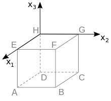

Bayerisches Abitur in Mathematik 2016
-------------------------------------

.. admonition:: Aufgabe

  Betrachtet wird der abgebildete Würfel :math:`ABCDEFGH`.
  
  Die Eckpunkte :math:`D`, :math:`E`, :math:`F` und :math:`H` dieses Würfels
  besitzen in einem kartesischen Koordinatensystem die folgenden Koordinaten:
  :math:`D(0|0|-2)`, :math:`E(2|0|0)`, :math:`F(2|2|0)` und :math:`H(0|0|0)`. 
  
  .. image:: ../figs/wuerfel.png
    :align: center
  
  a) Zeichnen Sie in die Abbildung die Koordinatenachsen ein und bezeichnen Sie diese.
     Geben Sie die Koordinaten des Punkts :math:`A` an. 
  
  b) Der Punkt :math:`P` liegt auf der Kante :math:`[FB]` des Würfels und hat vom
     Punkt :math:`H` den Abstand :math:`3`. Berechnen Sie die Koordinaten des Punkts :math:`P`.
  

**Lösung zu Teil a**

Der Punkt :math:`H` liegt im Ursprung des Koordinatensystems. Des Weiteren befindet sich
der Punkt :math:`E` auf der positiven :math:`x_1`-Achse und :math:`D` auf der negativen
:math:`x_3`-Achse. Da die :math:`x_2`-Koordinate von :math:`F` positiv ist, folgt, dass
:math:`G` sich auf der positiven :math:`x_2`-Achse befindet.
Das Koordinatensystem kann dann wie im folgenden Bild eingezeichnet werden.

Die Koordinaten von :math:`A` ergeben sich somit zu :math:`(2|0|-2)`.

Auf der Basis der Vektoren von :math:`H` nach :math:`D` und :math:`E` erhält man 
diese Ergebnis auch mit Hilfe von Sage.

.. sagecellserver::

  sage: H = vector([0, 0, 0])
  sage: E = vector([2, 0, 0])
  sage: D = vector([0, 0, -2])
  sage: EH = E-H
  sage: DH = D-H
  sage: print "Punkt A:", EH+DH

**Lösung zu Teil b**

Der Punkt :math:`P` kann als Schnittpunkt der Kante :math:`[FB]` mit einer Kugel
um :math:`H` mit Radius :math:`3` bestimmt werden.
Die Kante wird durch die Gleichung

.. math::
  
  [FB]: \vec{X} = \vec{F} + \lambda \cdot \vec{FB} = \begin{pmatrix} 2\\2\\0 \end{pmatrix}+\lambda\cdot \begin{pmatrix}0\\0\\-2\end{pmatrix} = \begin{pmatrix}2\\2\\-2\lambda \end{pmatrix},\quad \lambda\in[0,1]

parametrisiert. Des Weiteren erfüllt die Kugel die Gleichung

.. math::
  
  \left(\vec{X}-\vec{H}\right)^2 = 3^2 \quad\Leftrightarrow\quad {x_1}^2 + {x_2}^2 + {x_3}^2 = 9\,.

Wird die Gleichung der Kante nun in die Kugelgleichung eingesetzt, erhalten wir

.. math::
  
  2^2+2^2+(-2\lambda)^2 = 9,

was sich nach :math:`\lambda^2` auflösen lässt:

.. math::
  
  \lambda^2 = \frac{1}{4}

Formal gibt es für die Gleichung die beiden Lösungen :math:`\lambda_1=+\frac{1}{2}`
und :math:`\lambda_2=-\frac{1}{2}`. Da der zur Kante gehörende Parameter nur Werte zwischen
:math:`0` und :math:`1` annehmen kann, kommt nur die Lösung :math:`\lambda=+\frac{1}{2}` in Frage.
Die Koordinaten von :math:`P` erhalten wir, indem der Parameter in die Kantengleichung eingesetzt wird:

.. math::

  \vec{P} = \begin{pmatrix}2\\2\\-2\cdot \frac{1}{2} \end{pmatrix} = \begin{pmatrix}2\\2\\-1 \end{pmatrix}

Der Punkt :math:`P` hat also die Koordinaten :math:`(2|2|-1)`.

Alternativ können wir den Schnittpunkt auch mit Sage bestimmen:
 
.. sagecellserver::

  sage: var("Lambda")
  sage: H = vector([0,0,0])
  sage: F = vector([2,2,0])
  sage: B = vector([2,2,-2])
  sage: BF = B-F
  sage: Kante = F+Lambda*BF
  sage: loesungen = solve(Kante*Kante == 3^2, Lambda, solution_dict=True)
  sage: if 0 <= loesungen[0][Lambda] <= 1:
  sage:     loesung = loesungen[0]
  sage: else:
  sage:     loesung = loesungen[1]
  sage: print "Punkt P:", Kante.substitute(loesung)
