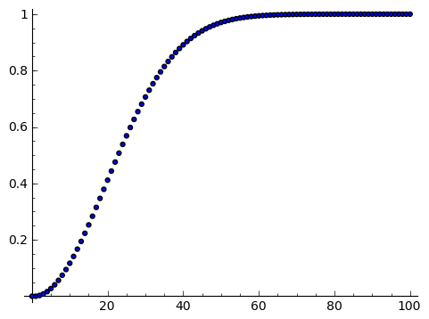

.. -*- coding: utf-8 -*-

Wprowadzenie do SAGE'a -- problem wspólnego dnia urodzin
--------------------------------------------------------

Zapoznanie z podstawowymi elementami SAGEa jako środowiska programowania
========================================================================

Zapoznanie z działaniem funkcji: ``range``, ``len``, ``append``, ``max``
~~~~~~~~~~~~~~~~~~~~~~~~~~~~~~~~~~~~~~~~~~~~~~~~~~~~~~~~~~~~~~~~~~~~~~~~

**Listy** to jeden z podstawowych elementów w programowaniu, szczególnie często wykorzystywany przy symulacjach, gdzie iteracyjnie (krok po kroku) wykonujemy pewne 
obliczenia prowadzące do wyniku końcowego. Niezbędna jest umiejętność tworzenia list, odczytywania ich elementów, odwoływania się do odpowiednich elementów oraz 
modyfikowania tych list. Lista to pewien uporządkowany zbiór obiektów. Obiektami mogą być liczby (wtedy lista jest wektorem), ale jest to tylko szczególny przypadek listy.

.. note:: Pojedynczy znak ``=`` to operator przypisania (podstawienia), w odróżnieniu od podwójnego znaku ``==``, który służy do porównania (tak jak w zadaniu znajdowania pierwiastków wielomianu używaliśmy ``==`` przyrównując wielomian do zera).

Możemy utworzyć nową listę złożoną z liczb korzystając z zapisu ``[1..9]``, co tworzy listę kolejnych liczb całkowitych zaczynając od 1 a kończąc na 9. 
 
.. code-block:: python

    sage: print("Lista 'a':")
    sage: a = [11..19]
    sage: print("oto jak wygląda 'a':")
    sage: print(a)
    
    Lista 'a':
    oto jak wygląda 'a':
    [11, 12, 13, 14, 15, 16, 17, 18, 19]

.. end of output

.. note:: UWAGA!!! Elementy listy są w SAGE'u numerowane od wartości 0!

.. code-block:: python

    sage: print("Pierwszy element listy 'a':")
    sage: print(a[0])
    sage: print("Szósty element listy 'a':")
    sage: print(a[5])
    sage: print("Ostatni element listy 'a':")
    sage: print(a[-1])
    sage: print("Przedostatni element listy 'a':")
    sage: print(a[-2])
    sage: print("Liczba elementów listy 'a':")
    sage: print(len(a))
    
    Pierwszy element listy 'a':
    11
    Szósty element listy 'a':
    16
    Ostatni element listy 'a':
    19
    Przedostatni element listy 'a':
    18
    Liczba elementów listy 'a':
    9

.. end of output

W powyższym przykładzie widać jedną z korzyści numerowania list od 0 -- można łatwo odwołać się do ostatniego elementu listy przez ``a[-1]``.

Operacje na listach. Modyfikowanie listy przez dodawanie (doklejanie) nowych elementów
======================================================================================

Wykorzystamy tu również inny, często używany sposób definiowania listy --  funkcję ``range()``, np. ``range(10)`` tworzy listę kolejnych liczb całkowitych 
zaczynając od 0 i lista będzie zawierała 10 elementów, czyli ostatnim elementem będzie 9. 

.. sagecellserver::

	a = [11..19]
	a.append(10)
	print("Liczba elementów listy 'a' po modyfikacji:")
	print(len(a))
	print("Oto jak wygląda 'a' po modyfikacji:")
	print(a)
	print("Lista 'b':")
	b = range(10)
	print("Liczba elementów listy 'b':")
	print(len(b))
	print("Oto jak wygląda 'b':")
	print(b)
	b = b+[20]
	print("Oto jak wygląda 'b' po modyfikacji:")
	print(b)
	print("Inny sposób modyfikacji (doklejania do listy):")
	b += [50]
	print("Oto jak wygląda 'b' po modyfikacji:")
	print(b)
	b += [3,50,-2]
	print("Lista 'b' po kolejnej modyfikacji:")
	print(b)
	print("Dodajemy, tj. doklejamy listy do siebie 'a+b':")
	print(a+b)

.. end of output

Znajdowanie największego elementu listy
~~~~~~~~~~~~~~~~~~~~~~~~~~~~~~~~~~~~~~~

.. code-block:: python

    sage: print("Maksymalny element listy 'b':")
    sage: print(max(b))

    Maksymalny element listy 'b':
    50

.. end of output

Problem wspólnego dnia urodzin -- wykorzystanie pętli ``for``
=============================================================

Załóżmy, że ktoś nam zaproponował grę, w której możemy wygrać 100 zł, jeśli dobrze obstawimy, albo nic nie wygrać, jeśli źle obstawimy (nie możemy niczego przegrać). 
Zadanie polega na tym, że wchodzimy do pomieszczenia gdzie znajduje się losowo wybrana grupa *N*  osób (liczba *N*  jest nam podana). Naszym zadaniem jest obstawić, 
czy w tej grupie znajdziemy przynajmniej 2 osoby, które obchodzą swoje urodziny tego samego dnia. 

Oczywiście jeśli np. w grupie są zaledwie 4 osoby, 
to pewnie każdy obstawi, że nie ma w tej grupie osób obchodzących urodziny tego samego dnia (wprawdzie może się zdarzyć, że akurat wśród tych 4 osób takie dwie osoby będą, ale jest to mało 
prawdopodobna sytuacja, więc bardziej opłaca się obstawić, że ,,NIE"). Z drugiej strony jeśli grupa liczy 366 osób, to zapewne każdy obstawi, że ,,TAK" 
-- w tej grupie przynajmniej 2 osoby obchodzą swoje urodziny tego samego dnia (bo wydaje się to bardzo pradopodobne -- niemal pewne). Pytanie gdzie jest granica -- 
ile osób musi liczyć grupa żeby bardziej opłacało się obstawić ,,TAK", niż ,,NIE"? Innymi słowy od jakiej liczebności grupy zaczyna być bardziej prawdopodobne, że znajdziemy 
przynajmniej 2 osoby, które obchodzą swoje urodziny tego samego dnia? [prawdopodobieństwo jest zawsze liczbą z przedziału od 0 do 1; prawdopodobieństwo 0,5 oznacza, że szanse 
wygranej i przegranej rozkładają się po równo, czyli po 50%; postawione pytanie można więc sformułować również tak: od jakiej liczebności grupy prawdopodobieństwo, że znajdziemy w niej 
przynajmniej 2 osoby, które obchodzą swoje urodziny tego samego dnia, przekracza wartość 0,5?]

Żeby odpowiedzieć na postawione pytanie najpierw rozwiążemy zadanie obliczenia prawdopodobieństwa, że w danej grupie *N*  osób są przynajmniej dwie takie, 
które obchodzą swoje urodziny tego samego dnia.

**Rozwiązanie:**

Do danego problemu można podejsć przez obliczenie **prawdopodobieństwa zdarzenia przeciwnego**, tj. zdarzenia, że w grupie **nie ma osób, które obchodzą urodziny tego 
samego dnia**, zaś szukane w zadaniu prawdopodobieństwo będzie dopełnieniem do jedynki otrzymanego wyniku.

Jaka jest więc szansa, że w grupie *N*  osób nie ma takich, które obchodzą urodziny tego samego dnia? Na początek rozważmy ten problem dla małych grup, zaczynając od jednoosobowej. 
Załóżmy, że rok ma 365 dni (nie rozważamy lat przestępnych). 

Jeśli *N* = 1 (grupa jednoosobowa), to takie prawdopodobieństwo jest równe :math:`1=\frac{365}{365}` (zdarzenie pewne).

Jeśli *N* = 2, to druga osoba, skoro ma mieć urodziny w innym dniu, niż pierwsza osoba, to ma 355 możliwości na 365 (czyli z wyłączeniem dnia urodzin pierwszej osoby). 
Oznacza to, że prawdopodobieństwo jest równe:

.. MATH::

    \frac{365}{365}\cdot\frac{364}{365}.

Jeśli *N* = 3, to trzecia osoba, skoro ma urodziny w innym dniu niż pierwsza i druga osoba, to (ponieważ dwa dni są już ,,zajęte") ma 354 możliwości na 365 (czyli wszystkie dni 
z wyłączeniem dnia urodzin pierwszej oraz drugiej osoby). To jest jednak warunek tylko dla trzeciej osoby, który musi być połączony z warunkiem dla drugiej osoby. 
Oznacza to, że prawdopodobieństwo jest równe:

.. MATH::

    \frac{365}{365}\cdot\frac{364}{365}\cdot\frac{363}{365}.

    \vdots

Jeśli grupa liczy *N* osób, to **prawdopodobieństwo, że w grupie nie ma osób, które obchodzą urodziny tego samego dnia** jest równe:

.. MATH::

    \frac{365}{365}\cdot\frac{364}{365}\cdot\frac{363}{365}\cdot\ldots\cdot\frac{365-(N-1)}{365}.

To były obliczenia dla zdarzenia przeciwnego niż to, które nas interesuje. Oznacza to, że **prawdopodobieństwo, że w danej grupie N osób 
są przynajmniej dwie takie, które obchodzą swoje urodziny tego samego dnia** jest równe:

.. MATH::

    1-\frac{365}{365}\cdot\frac{364}{365}\cdot\frac{363}{365}\cdot\ldots\cdot\frac{365-(N-1)}{365}.

Policzmy to prawdopodobieństwo dla *N*  = 5 osób:

.. code-block:: python

    sage: print(1-365/365*364/365*363/365*362/365*361/365)
    sage: print(n(1-365/365*364/365*363/365*362/365*361/365, digits=3))

    481626601/17748900625
    0.0271
    
.. end of output

Widzimy, że zgodnie z intuicją, dla pięcioosobowej grupy prawdopodobieństwo, że w takiej grupie osób 
są przynajmniej dwie osoby, które obchodzą swoje urodziny tego samego dnia jest bardzo małe -- około 2,7%.

Gdybyśmy chcieli policzyć to prawdopodobieństwo dla większej grupy np. *N* =40, to mamy do ,,wklepania" w SAGE'a bardzo długie wyrażenie algebraiczne 
(wiele ułamków). Lepiej wykorzystać pętlę.

.. note:: UWAGA! Bardzo ważny sposób zapisu pętli. W SAGE'u bardzo istotne są wcięcia!!! (Wcięcia decydują gdzie pętla się kończy -- to wymusza dyscyplinę zapisu kodu)

.. code-block:: python

    sage: p_przeciwne=1
    sage: for i in range(40):
    ...       p_przeciwne *= (365-i)/365
    ...       
    sage: print("Prawdopodobieństwo, że w danej grupie N=40 osób są przynajmniej dwie takie, 
    ...          które obchodzą swoje urodziny tego samego dnia jest równe:") 
    sage: print(n(1-p_przeciwne, digits=3))

    Prawdopodobieństwo, że w danej grupie N=40 osób są przynajmniej dwie takie, 
    które obchodzą swoje urodziny tego samego dnia jest równe:
    0.891

.. end of output

Tu pierwsze zaskoczenie -- dla grupy czterdziestoosobowej prawdopodobieństwo, że znajdziemy przynajmniej dwie osoby, które obchodzą swoje urodziny tego samego dnia jest 
bardzo duże -- równe ponad 89%, czyli w grupie 40 osobowej zdecydowanie bardziej opłaca się obstawiać na ,,TAK".
 
Zapiszmy powyższe obliczenia w postaci naszej własnej **funkcji** 

.. note:: UWAGA! Przy definiowaniu własnych funkcji również bardzo ważne są wcięcia!

.. sagecellserver::

	def p_wspolnych_urodzin(N):
	    p_przeciwne=1
	    for i in range(N):
	        p_przeciwne *= (365-i)/365
	
	    return 1-p_przeciwne
	
	# Sposób użycia zdefiniowanej przez nas funkcji:
	print("Prawdopodobieństwo, że w danej grupie N=50 osób są przynajmniej dwie takie, które obchodzą swoje urodziny tego samego dnia jest równe:") 
	print(n(p_wspolnych_urodzin(50), digits=3))

Teraz możemy zgrabnie wykorzystać zdefiniowaną funkcję ``p_wspolnych_urodzin``, żeby zobaczyć jak zmienia się to prawdopodobieństwo, kiedy 
liczba osób w grupie rośnie:

.. code-block:: python

    sage: for k in range(101):
    sage: print(k, n(p_wspolnych_urodzin(k), digits=4))

	(0, 0.0000)
	(1, 0.0000)
	(2, 0.002740)
	(3, 0.008204)
	(4, 0.01636)
	(5, 0.02714)
	(6, 0.04046)
	(7, 0.05624)
	(8, 0.07434)
	(9, 0.09462)
	(10, 0.1169)
	(11, 0.1411)
	(12, 0.1670)
	(13, 0.1944)
	(14, 0.2231)
	(15, 0.2529)
	(16, 0.2836)
	(17, 0.3150)
	(18, 0.3469)
	(19, 0.3791)
	(20, 0.4114)
	(21, 0.4437)
	(22, 0.4757)
	(23, 0.5073)
	(24, 0.5383)
	(25, 0.5687)
	(26, 0.5982)
	(27, 0.6269)
	(28, 0.6545)
	(29, 0.6810)
	(30, 0.7063)
	(31, 0.7305)
	(32, 0.7533)
	(33, 0.7750)
	(34, 0.7953)
	(35, 0.8144)
	(36, 0.8322)
	(37, 0.8487)
	(38, 0.8641)
	(39, 0.8782)
	(40, 0.8912)
	(41, 0.9032)
	(42, 0.9140)
	(43, 0.9239)
	(44, 0.9329)
	(45, 0.9410)
	(46, 0.9482)
	(47, 0.9548)
	(48, 0.9606)
	(49, 0.9658)
	(50, 0.9704)
	(51, 0.9744)
	(52, 0.9780)
	(53, 0.9811)
	(54, 0.9839)
	(55, 0.9863)
	(56, 0.9883)
	(57, 0.9901)
	(58, 0.9917)
	(59, 0.9930)
	(60, 0.9941)
	(61, 0.9951)
	(62, 0.9959)
	(63, 0.9966)
	(64, 0.9972)
	(65, 0.9977)
	(66, 0.9981)
	(67, 0.9984)
	(68, 0.9987)
	(69, 0.9990)
	(70, 0.9992)
	(71, 0.9993)
	(72, 0.9995)
	(73, 0.9996)
	(74, 0.9996)
	(75, 0.9997)
	(76, 0.9998)
	(77, 0.9998)
	(78, 0.9999)
	(79, 0.9999)
	(80, 0.9999)
	(81, 0.9999)
	(82, 0.9999)
	(83, 1.000)
	(84, 1.000)
	(85, 1.000)
	(86, 1.000)
	(87, 1.000)
	(88, 1.000)
	(89, 1.000)
	(90, 1.000)
	(91, 1.000)
	(92, 1.000)
	(93, 1.000)
	(94, 1.000)
	(95, 1.000)
	(96, 1.000)
	(97, 1.000)
	(98, 1.000)
	(99, 1.000)
	(100, 1.000)

.. end of output

Otrzymane wyniki możemy również przedstawić na wykresie punktowym: 

.. code-block:: python

    sage: l_osob = 101
    sage: p_dla_N = range(l_osob)
    sage: for n in range(l_osob):
    ...       p_dla_N[n] = p_wspolnych_urodzin(n)
    sage: scatter_plot(zip(range(l_osob), p_dla_N), marker='.', facecolor='blue')

.. end of output
    
Wypiszmy tylko te przypadki, kiedy grupa jest na tyle mała, że bardziej prawdopodobne jest, że nie spotkamy dwóch osób obchodzących urodziny tego samego dnia, 
niż że takie osoby w grupie są (wykorzystamy inny rodzaj pętli -- pętlę ``while``):    
    
.. sagecellserver::

    i=1
    while p_wspolnych_urodzin(i)<0.5:
        print i, n(p_wspolnych_urodzin(i), digits=4)
        i += 1
    print i, n(p_wspolnych_urodzin(i), digits=4)

Widać, że już **począwszy od grupy liczącej 23 osoby bardziej prawdopodobne jest to, że natrafimy na przynajmniej dwie osoby, które obchodzą swoje urodziny tego samego dnia**, 
niż że takich osób nie znajdziemy. Nie oznacza to gwarancji wygranej, ale każdy racjonalnie myślący człowiek będzie obstawiał bardziej prawdopodobny wynik. Zaskakujące jest, 
że ta wartość graniczna to zaledwie **23 osoby** a przy grupie liczącej 83 osoby jest niemal pewne, że natrafimy na przynajmniej dwie osoby, które obchodzą swoje urodziny tego 
samego dnia.

Instrukcje warunkowe
====================

Na zakończenie tej części przedstawmy jeszcze inny ważny element programowania -- **instrukcje warunkowe**, czyli jak należy w SAGEu zapisać kod, jeśli to, co chcemy dalej zrobić (obliczyć lub wypisać), zależy od spełnienia pewnych warunków. 

Dla zilustrowania tej sytuacji napiszemy krótki kod programu, który mając listę osób oraz informacje o ich roku urodzenia, będzie wypisywał, czy dana osoba jest pełnoletnia, czy nie.

W poniższym kodzie wykorzystano również ciekawą funkcję ``zip``, która działa na dwóch listach tak, jak zamek błyskawiczny spinający/łączący odpowiadające sobie elementy 
w każdej z list. W ten sposób stworzono nową listę nazwaną ``dane``. Elementami listy ``dane`` są także listy (dwuelementowe), składające się z imienia oraz roku urodzenia. Oznacza to, że ``dane`` to pewna struktora złożona -- lista list. Odwołanie np. do roku urodzenia trzeciej osoby odbywa się przez wpisanie ``dane[2][1]``. W tym zapisie ``dane[2]`` oznacza, że interesuje nas trzeci element listy dane [pamiętamy, że elementy listy numerowane są od zera dlatego `2` oznacza trzeci element], ale trzeci element listy ``dane``, czyli ``dane[2]`` jest dwuelementową listą składającą się z imienia -- które możemy ,,wyłuskać" przez ``dane[2][0]`` oraz roku urodzenia -- ``dane[2][1]``).

Podobnie jak dla pętli ``for`` albo pętli ``while`` pisząc instrukcję warunkową bardzo ważny jest dwukropek w odpowiednim miejscu oraz wcięcie akapitowe wyznaczające jaki fragment kodu, tj. ile linii kodu ma być wykonane jeśli ``warunek`` jest spełniony. Schemat zapisu instrukcji warunkowej jest następujący: 

.. code-block:: python

    sage: if warunek:
    sage: 	wykonaj to co tu jest napisane, jeśli *warunek* jest spełniony 
    sage: 	wykonaj to co tu jest napisane, jeśli *warunek* jest spełniony 
    sage: 	wykonaj to co tu jest napisane, jeśli *warunek* jest spełniony 
        
.. end of output     

Możemy się również posługiwać nieco bardziej rozbudowaną wersją instrukcji warunkowej, która pozwala oprogramować również przypadek kiedy ``warunek`` nie jest spełniony (instrukcja ``if - else``). Schemat takiej instrukcji jest następujący:

.. code-block:: python

    sage: if warunek:
    sage: 	wykonaj to co tu jest napisane, jeśli *warunek* jest spełniony
    sage: else:
    sage: 	wykonaj to co tu jest napisane, jeśli *warunek* nie jest spełniony

.. end of output     
 
Oto przykład ilustrujący wykorzystanie instrukcji warunkowej:

.. sagecellserver::

	osoby = ['Magda', 'Aneta', 'Patrycja', 'Kasia']
	rok_urodzenia = [1994, 2001, 1992, 1996]
	dane = zip(osoby, rok_urodzenia)
	print(dane)
	for i in range(len(dane)):
	    if 2013-dane[i][1] >= 18:
	        print dane[i][0], "jest pełnoletnia."
	    else:
	        print dane[i][0], "nie jest pełnoletnia."
	        
W ten sposób omówiliśmy podstawowe elementy SAGEa jako środowiska do programowania (takie abecadło). Możemy teraz nieco rozwinąć skrzydła. Zajrzyjcie do pozostałych opublikowanych materiałów, a przede wszystkim zachęcamy -- spróbujcie modyfikować/testować kody programów i podejmijcie próby pisania własnych! Życzymy dobrej zabawy! 