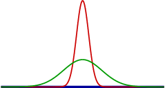

.. -*- coding: utf-8 -*-

.. **0:08\-0:20**

Parrondo's paradox
==================

.. admonition:: Abstract

  Parrondo's paradox is a combination of games which behaves quite
  counterintuively. Beyond its curious behavior, it provides a simple
  illustration of a physical system, the so-called flashing ratchet.
  After giving some background information on Parrondo's paradox, we
  will explore several approaches to a numerical implementation. An
  object-oriented approach will finally allow us to study in some
  detail various aspects of Parrondo's paradox. Readers less
  interested in the programming aspects can skip that part and after
  having read the introduction can go directly to the last section.

  Literature:

  - `J. M. R. Parrondo and Luis Dinís, Contemp. Phys. 45, 147 (2004)
    <http://dx.doi.org/10.1080/00107510310001644836>`_ 
  - `Parrondo's paradox – Wikipedia, The Free Encyclopedia
    <http://en.wikipedia.org/wiki/Parrondo%27s_paradox>`_ 

.. sidebar:: What is Parrondo's paradox?

   .. raw:: html

       <iframe width="420" height="280" src="https://www.youtube.com/embed/TQ31Md9KPRM?start=8&end=585&version=3&loop=1&controls=2" frameborder="0" allowfullscreen></iframe>

In Parrondo's paradox, a flashing ratchet is simulated by two games
representing the situations with the potential switched on and off. In
both cases, the player will loose on average, thereby mimicking a
tilted potential with an average motion to the left as explained
above. The question to be explored in the following is how the
situation changes for the player when one switches between the two
games.

.. **1:20\-4:40**

Parrondo's paradox serves as an illustration of Brownian ratchets by
means of appropriately combining two games where tossing a coin
represents the random Brownian motion.

Brownian motion of particles leads to a broadening of their
distribution. An initially sharp distribution (red curve) will be
significantly broader (green curve) after some time.

.. **4:40\-5:35**

If the potential is slightly tilted to the left, the distribution will
not only broaden but also move to the left in the course of time.

.. **5:35\-7:40**

A specific type of a Brownian ratchet is the so\-called *flashing
ratchet*, where during certain periods of time a sawtooth potential
(see figure below) is switched on. If the sawtooth potential is
permanently switched on, the diffusive motion will not have a
preferential direction. If the potential is tilted to the left,
particles on average will move to the left as was the case in the
absence of an external potential.

.. **7:40\-9:45**

However, in the operational mode of a flashing ratchet, when the
sawtooth potential is switched on and off appropriately, one can
observe an average motion to the right.

.. **12:34\-14:30**

Tossing a coin
--------------

.. sidebar:: Let's play a game!

   .. raw:: html

       <iframe width="420" height="280" src="https://www.youtube.com/embed/TQ31Md9KPRM?start=585&end=1600&version=3&loop=1&controls=2" frameborder="0" allowfullscreen></iframe>

Let us try out the creation of random numbers. The numbers are
generated in a way that they are equally distributed between 0
and 1. For the simplest fair game, we would define a threshold of 0.5
where the player wins if the random number is below the threshold and
looses otherwise.

.. **14:30\-16:00**

.. sagecellserver::

    print random()

.. end of output

.. **16:00\-17:50**

.. sagecellserver::

   for n in range(10):
       print random()

.. end of output

.. admonition:: Note on Python 

  Indentation is used as a syntax markup. As long as the code is indented
  relative to the for :code:`loop` statement (first line above), the code is
  repeated within the loop. Once the indented block terminates, Python knows
  that the following code is no longer part of the loop. The same indentation
  concept holds for example for :code:`if/else` constructs and function and
  class definitions, all of which we will encounter below. Indentation needs to
  be consistent. Make it a rule to always indent by 4 spaces per indentation
  level.

.. **18:00\-19:50**

Let us now toss some coins in a fair game. Since the outcomes are random,
you should not expect to win in exactly half of the cases even though this
may happen. For comparison, you might try the same game with a real coin.

.. sagecellserver::

    sage: for n in range(10):
    ...       if random() < 0.5:
    ...           print "you win"
    ...       else:
    ...           print "you loose"

.. end of output

.. **19:50\-26:40**

Game A
------ 

Now we take a look at the individual games which are part of Parrondo's
paradox and start with game A. The rule is simple: We win if the random
number is below :math:`0.5-\epsilon`, otherwise we loose. For
:math:`\epsilon>0`, we have to face it: We will loose in the long run. For
our numerical runs, let us use :math:`\epsilon=0.005`.

We are not interested in the absolute amount of money which we have after
a certain number of games. Only changes are important, how much money have
we won or lost? Therefore, it is fine to start without any money at the
beginning.

Running the following code several times, you will notice that in some
cases you are lucky and win money for some time. However, if you continue
to play, you will end up loosing money. In order to show this, we have to
play the game often. Setting the number of games to 100000, the code will
run for a couple of seconds. You can try a different number of games by
changing the value of :code:`ngames`, but if :code:`ngames` is too large,
the code might need a long time to terminate.

.. sagecellserver::

    sage: eps = 0.005
    sage: ngames = 100000
    sage: money = 0
    sage: evolution = [money]

    sage: for ngame in range(ngames):
    ...       if random() < 0.5-eps:
    ...           money = money+1
    ...       else:
    ...           money = money-1
    ...       evolution.append(money)

    sage: list_plot(evolution, pointsize=1)

.. end of output

Game B
------ 

The rules of the second game are slightly more complicated because
they depend on the amount of money in our possession at the time the
game is played. There are two rules:

#. Our money is not a multiple of :math:`m`:
   We win if the random number is below :math:`\frac{3}{4}-\epsilon`.
   Otherwise we loose. This sounds extremely good…
#. Our money is a multiple of :math:`m`:
   We win only if the random number is below :math:`\frac{1}{10}-\epsilon`.
   Otherwise we loose. A pretty bad situation…

But: For :math:`\epsilon>0`, we still loose in the long run. While this
statement can be rigorously proven, we will simply try it out numerically.

:math:`m` is an integer which we choose to be 3 in the following.

.. sagecellserver::

    sage: eps = 0.005
    sage: m = 3
    sage: ngames = 100000
    sage: money = 0
    sage: evolution = [money]

    sage: for ngame in range(ngames):
    ...        if money % m:
    ...            if random() < 0.75-eps:
    ...                money = money+1
    ...            else:
    ...                money = money-1
    ...        else:
    ...            if random() < 0.1-eps:
    ...                money = money+1
    ...            else:
    ...                money = money-1
    ...        evolution.append(money)

    sage: list_plot(evolution, pointsize=1)

.. end of output

.. admonition:: Note on Python 

   The character :code:`%` represents the modulo operator. In the previous
   code the :code:`if`-branch is chosen if :code:`money` is not divisible by
   :code:`m` without rest while the :code:`else`-branch is chosen if
   the division is possible without rest.

Combining two loosing games
--------------------------- 

We now play a series of games alternating between two games A and
two games B in a row: A\-A\-B\-B\-A\-A\-B\-B\-…

What do you expect? Will we loose again? Let's try it out.

.. sagecellserver::

    sage: eps = 0.005
    sage: m = 3
    sage: ngames = 100000
    sage: money = 0
    sage: evolution = [money]

    sage: for ngame in range(ngames):
    ...       if ngame % 4 < 2:      
    ...           # game A
    ...           if random() < 0.5-eps:
    ...               money = money+1
    ...           else:
    ...               money = money-1
    ...       else:
    ...           # game B
    ...           if money % m:
    ...               if random() < 0.75-eps:
    ...                   money = money+1
    ...               else:
    ...                   money = money-1
    ...           else:
    ...               if random() < 0.1-eps:
    ...                   money = money+1
    ...               else:
    ...                   money = money-1
    ...       evolution.append(money)

    sage: list_plot(evolution, pointsize=1)

.. end of output

Unless you have been extremely unlucky, the combination of two loosing
game should yield a winning situation.

Object-oriented approach
------------------------ 

By putting together the codes from games A and B, we ended up with code
which is not optimal in two respects. Chaining the :code:`if/else`
constructs results in not very readable code. Furthermore, we have
repeated three times the code for tossing a coin. The three code segments
only differ by the winning threshold. Instead of repeating code, it is
better to follow the DRY principle: Don't Repeat Yourself.

.. admonition:: Important hint

   In the following we will present an object-oriented approach to 
   Parrondo's paradox which will facilitate our further analysis of the
   paradox. Feel free to skip this section if you are not interested in
   the details of the code but *be sure to execute the code cells* so that
   the various classes and their methods are available later on. 
   Executing cells in this section will not yield any visible results.

The object-oriented approach will present a few advantages for exploring
Parrondo's paradox. New sequences of games A and B can be defined in a
simple way. An instance of a game remembers the parameters :math:`\epsilon`
and :math:`m` for which it was defined as well as the money in our
possession during the game. Several instances of games can be played in
parallel, each instance having automatically its own money and game
parameters.

The class :class:`Game` defined in the following code knows how to toss
a coin and to determine a win or loss as a function of the winning threshold.
It also knows how to perform a series of plays. However, a single play
has to be defined by classes derived from :class:`Game`. 

.. sagecellserver::

    sage: class Game(object):
    ...       '''The Game class knows how to toss a coin and how to play a series
    ...          of games. However, there is no definition of a single game. This
    ...          class should be used as a generic parent class for specific games.

    ...       '''
    ...       def __init__(self, money=0):
    ...           self.money = money

    ...       def toss_coin(self, threshold):
    ...           if random() < threshold:
    ...               self.money = self.money+1
    ...           else:
    ...               self.money = self.money-1

    ...       def play(self):
    ...           raise NotImplementedError

    ...       def play_series(self, repetitions):
    ...           evolution = [self.money]
    ...           for r in range(repetitions):
    ...               self.play()
    ...               evolution.append(self.money)
    ...           return evolution

.. end of output

The class :class:`ParrondoGame` is derived from the parent class
:class:`Game` and defines the games A and B. However, it only serves
as a parent class for the classes defined below which are actually able
to do the playing. The class :class:`ParrondoGame` defines the values used
above for the parameters :math:`\epsilon` and :math:`m` as default values.
These values need to be specified only if other values are desired.

.. sagecellserver::

    sage: class ParrondoGame(Game):
    ...       '''This class provides games A and B of Parrondo's paradox.

    ...       '''
    ...       def __init__(self, epsilon=0.005, m=3, **kwargs):
    ...           self.epsilon = epsilon
    ...           self.m = m
    ...           Game.__init__(self, **kwargs)

    ...       def play_a(self):
    ...           self.toss_coin(0.5-self.epsilon)

    ...       def play_b(self):
    ...           if self.money % self.m:
    ...               self.toss_coin(0.75-self.epsilon)
    ...           else:
    ...               self.toss_coin(0.10-self.epsilon)

.. end of output

The class :class:`GameA` plays game A of Parrondo's paradox.

.. sagecellserver::

    sage: class GameA(ParrondoGame):
    ...       '''Game A of Parrondo's paradox

    ...       '''
    ...       def __init__(self, **kwargs):
    ...           ParrondoGame.__init__(self, **kwargs)

    ...       def __repr__(self):
    ...           return 'game A'

    ...       def play(self):
    ...           self.play_a()

.. end of output

Correspondingly, the class :class:`GameB` plays game B of Parrondo's paradox.

.. sagecellserver::

    sage: class GameB(ParrondoGame):
    ...       '''Game B of Parrondo's paradox

    ...       '''
    ...       def __init__(self, **kwargs):
    ...           ParrondoGame.__init__(self, **kwargs)

    ...       def __repr__(self):
    ...           return 'game B'

    ...       def play(self):
    ...           self.play_b()

.. end of output

The class :class:`GameAABB` plays a the sequence of two games A and two
games B as specified above for Parrondo's paradox.

.. sagecellserver::

    sage: import itertools

    sage: class GameAABB(ParrondoGame):
    ...       '''Sequence of games AABB of Parrondo's paraodxon

    ...       '''
    ...       def __init__(self, **kwargs):
    ...           ParrondoGame.__init__(self, **kwargs)
    ...           self.gametype = itertools.cycle((
    ...                               self.play_a, self.play_a,
    ...                               self.play_b, self.play_b))

    ...       def __repr__(self):
    ...           return u'game sequence A-A-B-B'

    ...       def play(self):
    ...           game = self.gametype.next()
    ...           game()

.. end of output

For comparison, we also define a class :class:`GameABRandom` which chooses
at random between games A and B.

.. sagecellserver::

    sage: class GameABRandom(ParrondoGame):
    ...       '''Random sequence of games A and B of Parrondo's paradox

    ...       '''
    ...       def __init__(self, **kwargs):
    ...           ParrondoGame.__init__(self, **kwargs)

    ...       def __repr__(self):
    ...           return u'random sequence of games A and B'

    ...       def play(self):
    ...           game = choice((self.play_a, self.play_b))
    ...           game()

.. end of output

The preceding two classes can be used as templates for the definition of
other sequences of games A and B.

Exploring Parrondo's paradox
----------------------------

Let us first repeat our numerical experiments carried out at the beginning,
but now by using the object-oriented code.

.. sagecellserver::

    sage: games = [(GameA(), 'blue'),
    ...            (GameB(), 'green'),
    ...            (GameAABB(), 'red')]
    sage: plots = [list_plot(game.play_series(30000), pointsize=1, color=color) for game, color in games]
    sage: show(sum(plots))

.. end of output

If everything works as expected, the blue and green curves corresponding to
game A and B, respectively, should end up at a negative value while the red
curve corresponding to a games A-A-B-B-… should end up at a positive value.

However, single realizations of a game can be treacherous as you might have
seen already above by running the simulations several times. Therefore, we
now evaluate the average and standard deviation for 50 realizations of a game
where the coin is tossed only 10000 times.

.. sagecellserver::

    sage: ngames = 10000
    sage: nrealizations = 50
    sage: for game in (GameA, GameB, GameAABB):
    ...       results = [game().play_series(ngames)[-1] for n in range(nrealizations)]
    ...       print game()
    ...       print '   average money:      %8.2f' % N(mean(results))
    ...       print '   standard deviation: %8.2f' % N(std(results))

.. end of output

Do the averages come out with the expected sign?

**Histogram seems to require at least Sage 6.5**

.. sagecellserver::

    sage: from sage.plot.histogram import Histogram
    sage: ngames = 10000
    sage: nrealizations = 200
    sage: results = [GameA().play_series(ngames)[-1] for n in range(nrealizations)]
    sage: Histogram(results)

.. end of output

Suggestions for further numerical experiments
--------------------------------------------- 

- What happens if the number of A and B games is changed in the sequence? 
- What happens for random switching between games A and B? 
- What happens when parameters like :math:`\epsilon` and  :math:`m` are changed? 

       	
..
   [('**0:08\\-0:20**', [8, 20]),
    ('**0:20\\-0:50**', [20, 50]),
    ('**1:20\\-4:40**', [80, 280]),
    ('**4:40\\-5:35**', [280, 335]),
    ('**5:35\\-7:40**', [335, 460]),
    ('**7:40\\-9:45**', [460, 585]),
    ('**12:34\\-14:30**', [754, 870]),
    ('**14:30\\-16:00**', [870, 960]),
    ('**16:00\\-17:50**', [960, 1070]),
    ('**18:00\\-19:50**', [1080, 1190]),
    ('**19:50\\-26:40**', [1190, 1600])]
