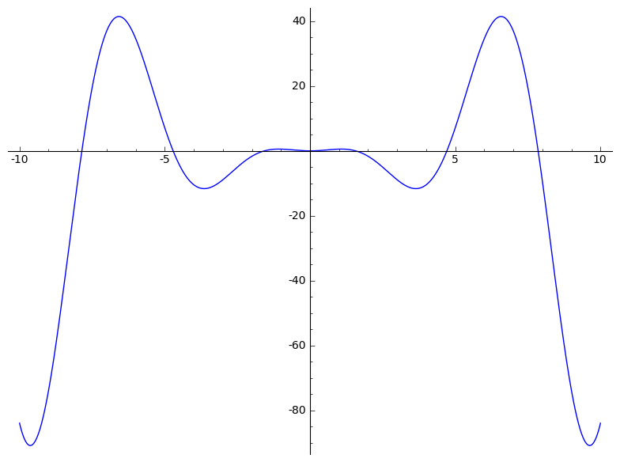
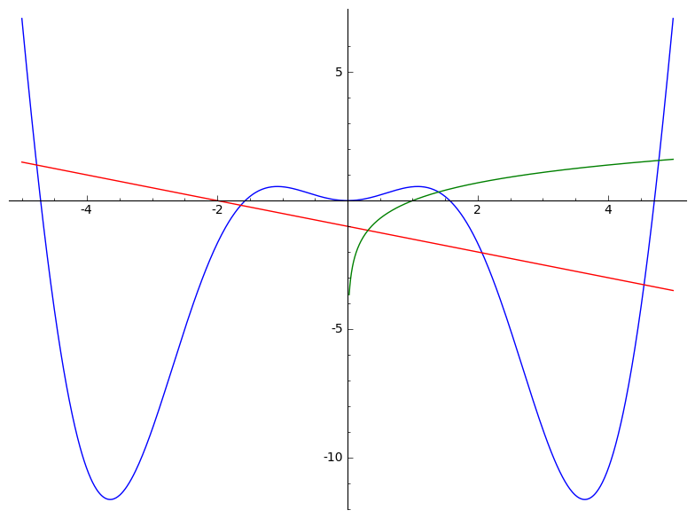
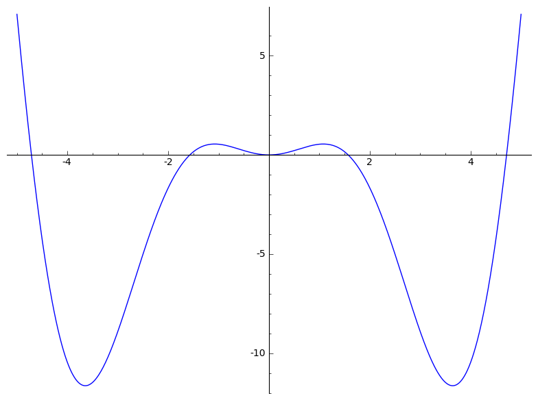
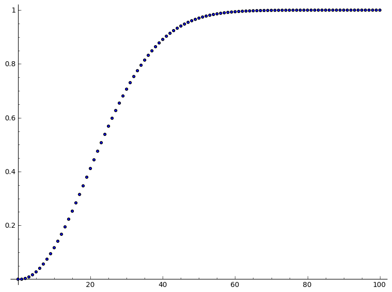

.. -*- coding: utf-8 -*-

Scenariusz warsztatów z informatyki
===================================

**prowadzonych dla uczniów szkół ponadgimnazjalnych**

n.t.
 *Badanie i poznawanie realnych zjawisk w otaczającym nas świecie*

*przez modelowanie matematyczne z wykorzystaniem nowoczesnych narzędzi informatycznych*

**"WPROWADZENIE DO SAGE'A"**

Autor: **** **Artur Trzęsiok** **CubeProject.pl**

Warsztaty prowadzone w ramach projektu iCSE realizowanego przez Uniwersytet Śląski

**Część 1.**

**Wprowadzenie do**  obliczeń w systemie **SAGE** , zapoznanie się z podstawowymi elementami składni programowania oraz sposoby realizowania podstawowych operacji algebraicznych; omówienie działania funkcji: print, range, len, append, max, min:

SAGE jako kalkulator:

.. code-block:: python

    sage: 23 + 12
    35

.. end of output

.. code-block:: python

    sage: 38/12
    19/6

.. end of output

Uwaga! SAGE ma wysokie standardy i nie zaokrągla jeśli tylko nie jest to konieczne, np.:

.. code-block:: python

    sage: 1/7 + 12/13
    97/91

.. end of output

Żeby SAGE pokazał nam przybliżoną wartość w zapisie dziesiętnym, to trzeba o to poprosić:

.. code-block:: python

    sage: n(1/7 + 12/13)
    1.06593

.. end of output

.. code-block:: python

    sage: print(sqrt(32))
    sage: print(n(sqrt(32), digits=6))
    4*sqrt(2)
    5.65685

.. end of output

.. code-block:: python

    sage: print(pi)
    sage: print(n(pi, digits=50))
    pi
    3.1415926535897932384626433832795028841971693993751

.. end of output

Pomoc SAGE'a:

.. code-block:: python

    sage: sqrt?
    ...

.. end of output

.. code-block:: python

    sage: cos(pi)
    -1

.. end of output

.. code-block:: python

    sage: sin(pi/3)
    1/2*sqrt(3)

.. end of output

Inne działania a liczbach:

.. code-block:: python

    sage: print(2^3)
    sage: print(8%3)
    8
    2

.. end of output

Operacje porówniania (operacje logiczne):

.. code-block:: python

    sage: print(2 == 5)
    sage: print(2 < 5)
    sage: print(5 != 10/3)
    sage: print(6/7 <= 14/17)
    False
    True
    True
    False

.. end of output

SAGE jako narzędzie do operacji na funkcjach, w tym do rysowania wykresow funkcji (wykorzystamy tu bardzo ważną cechę SAGE'a \- wykorzystuje on zapis
 **symboliczny** , przez co możemy się nim posługiwać bardzo podobnie jak to robimy rozwiązując problemy matematyczne na kartce papieru ):

.. code-block:: python

    sage: f(x) = -2*x^2-11*x+6
    sage: plot(f(x), (x,-10,10))

.. image:: iCSE_1_media/cell_71_sage0.png
    :align: center

.. end of output

Na pytanie jak rozwiązać analityczne równanie kwadratowe z wykorzystaniem SAGE'a odpowiemy w dalszej części.

Możemy spróbować narysować wykres nieco bardziej złożonej funkcji:

.. code-block:: python

    sage: f(x) = x^2 * cos(x)
    sage: plot(f(x), (x,-10, 10))

.. end of output

Możemy w łatwy sposób zamieścić wykresy kilku funkcji na jednym rysunku. W SAGE'u realizuje się to w bardzo intuicyjny sposób \- poprzez dodawanie wykresów do siebie (dodawanie "plot'ów").

.. code-block:: python

    sage: g(x) = -1/2*x - 1
    sage: h(x) = log(x)
    sage: plot(f(x), -5, 5) + plot(g(x), -5, 5, color='red') + plot(h(x), 0, 5, color='green')

.. end of output

Inny sposób wywołania wykresu funkcji:

.. code-block:: python

    sage: f(x).plot(-5, 5)

.. end of output

Co jeszcze możemy zrobić ze zdefiniowaną funkcją? Można podejżeć możliwości pisząc f. i naciskając klawisz TAB. Na przykład możemy policzyć pochodną funkcji f (Ups! ale Wy jeszcze chyba nie wiecie co to jest pochodna \- no nic, ale wiedzcie, że SAGE wie jak je liczyć).

.. code-block:: python

    sage: f.diff()
    x |--> -x^2*sin(x) + 2*x*cos(x)

.. end of output

.. code-block:: python

    sage: var('x,y')
    sage: plot3d(2^(-(x^2+y^2))*cos(x^2+y^2), (x,-pi,pi), (y,-pi,pi))

.. end of output

W SAGE'u jest dostępnych bardzo wiele ciekawych funkcji. Nie czas i miejsce, żeby przedstawiać ich wiele... ale jeszcze jedna \- zupełnie inna:

.. code-block:: python

    sage: factor(2013)
    3 * 11 * 61

.. end of output

SAGE jako sprytna maszynka do rozwiązywania zadań (sprawdzania wyników). Można łatwo  **rozwiązać równanie lub układ równań** :

.. code-block:: python

    sage: rownanie = -2*x^2-11*x+6==0
    sage: show(rownanie)
    sage: rozwiazanie = solve(rownanie, x)
    sage: print("Rozwiązania powyższego równiania:")
    sage: show(rozwiazanie)
    ...
    Rozwiązania powyższego równiania:
    ...

.. end of output

Gdyby ktoś zapomniał jak wygladają wzory na rozwiązania równania kwadratowego,, to możemy poprosić SAGE'a o symboliczne rozwiązanie równiania w ogolnej postaci:

.. code-block:: python

    sage: var('x,a,b,c')
    sage: rownanie = a*x^2+b*x+c==0
    sage: show(rownanie)
    sage: rozwiazanie = solve(rownanie, x)
    sage: print("Rozwiązania powyższego równiania:")
    sage: show(rozwiazanie)
    ...
    Rozwiązania powyższego równiania:
    ...

.. end of output

.. code-block:: python

    sage: rownanie = x^3-6*x^2-19*x+84==0
    sage: show(rownanie)
    sage: rozwiazanie = solve(rownanie, x)
    sage: show(rozwiazanie)
    sage: print(rozwiazanie)
    sage: print(rownanie.lhs())
    sage: f(x) = rownanie.lhs()
    sage: show(plot(f(x), (x,-10,10)))
    sage: #####
    sage: assume(x>0)    # można wprowadzić dodatkowe założenie
    sage: print("Wyznaczamy tylko pierwiastki dodatnie:")
    sage: rozwiazanie = solve(rownanie, x)
    sage: show(rozwiazanie)
    sage: forget()       # anulowanie wcześniej postawionego założenia, które jest aktywne dopóki 
    ...                  # nie zostanie "zapomniane" wywołaniem 'forget()'
    ...
    ...
    [
    x == 7,
    x == -4,
    x == 3
    ]
    x^3 - 6*x^2 - 19*x + 84
    Wyznaczamy tylko pierwiastki dodatnie:
    ...

.. image:: iCSE_1_media/cell_54_sage0.png
    :align: center

.. end of output

.. code-block:: python

    sage: var('y')
    sage: rozwiazanie_ukladu = solve([3*x+y==3, x^2-2*x-3+y==0], x, y)
    sage: show(rozwiazanie_ukladu
    ...

.. end of output

**SAGE jako środowisko do programowania:**

.. code-block:: python

    sage: print("Pojedynczy znak = to operator przypisania.")
    sage: print("Lista 'a':")
    sage: a = [1..9]
    sage: print("oto jak wygląda 'a':")
    sage: print(a)
    Pojedynczy znak = to operator przypisania.
    Lista 'a':
    oto jak wygląda 'a':
    [1, 2, 3, 4, 5, 6, 7, 8, 9]

.. end of output

.. code-block:: python

    sage: print("UWAGA!!! Elementy listy są w SAGE'u numerowane od wartości 0 !")
    sage: print("Pierwszy element listy 'a':")
    sage: print(a[0])
    sage: print("Szósty element listy 'a':")
    sage: print(a[5])
    sage: print("Ostatni element listy 'a':")
    sage: print(a[-1])
    sage: print("Przedostatni element listy 'a':")
    sage: print(a[-2])
    sage: print("Liczba elementów listy 'a':")
    sage: print(len(a))
    UWAGA!!! Elementy listy są w SAGE'u numerowane od wartości 0.
    Pierwszy element listy 'a':
    1
    Szósty element listy 'a':
    6
    Ostatni element listy 'a':
    9
    Przedostatni element listy 'a':
    8
    Liczba elementów listy 'a':
    9

.. end of output

Operacje na listach. Modyfikowanie listy przez dodawanie (doklejanie) nowych elementów:

.. code-block:: python

    sage: a.append(10)
    sage: print("Liczba elementów listy 'a' po modyfikacji:")
    sage: print(len(a))
    sage: print("Oto jak wygląda 'a' po modyfikacji:")
    sage: print(a)
    sage: print("Lista 'b':")
    sage: b = range(10)
    sage: print("Liczba elementów listy 'b':")
    sage: print(len(b))
    sage: print("Oto jak wygląda 'b':")
    sage: print(b)
    sage: b = b+[20]
    sage: print("Oto jak wygląda 'b' po modyfikacji:")
    sage: print(b)
    sage: print("Inny sposób modyfikacji (doklejania do listy):")
    sage: b += [50]
    sage: print("Oto jak wygląda 'b' po modyfikacji:")
    sage: print(b)
    sage: print("Dodajemy, tj. doklejamy listy do siebie 'a+b':")
    sage: print(a+b)
    Liczba elementów listy 'a' po modyfikacji:
    10
    Oto jak wygląda 'a' po modyfikacji:
    [1, 2, 3, 4, 5, 6, 7, 8, 9, 10]
    Lista 'b':
    Liczba elementów listy 'b':
    10
    Oto jak wygląda 'b':
    [0, 1, 2, 3, 4, 5, 6, 7, 8, 9]
    Oto jak wygląda 'b' po modyfikacji:
    [0, 1, 2, 3, 4, 5, 6, 7, 8, 9, 20]
    Inny sposób modyfikacji (doklejania do listy):
    Oto jak wygląda 'b' po modyfikacji:
    [0, 1, 2, 3, 4, 5, 6, 7, 8, 9, 20, 50]
    Dodajemy, tj. doklejamy listy do siebie 'a+b':
    [1, 2, 3, 4, 5, 6, 7, 8, 9, 10, 0, 1, 2, 3, 4, 5, 6, 7, 8, 9, 20, 50]

.. end of output

.. code-block:: python

    sage: print("Maksymalny element listy 'b':")
    sage: print(max(b))
    sage: b += [3,50,1]
    sage: print(b)
    sage: print(max(b))
    Maksymalny element listy 'b':
    50
    [0, 1, 2, 3, 4, 5, 6, 7, 8, 9, 20, 50, 3, 50, 1]
    50

.. end of output

**Zagadnienie nr 1.**

**Jakie jest prawdopodobieństwo, że w danej grupie N osób są przynajmniej dwie takie, które obchodzą swoje urodziny tego samego dnia?**

**Rozwiązanie:**

Do danego problemu można podejsć przez obliczenie prawdopodobieństwa zdarzenia przeciwnego, tj. zdarzenia, że w grupie nie ma osób, które obchodzą urodziny tego samego dnia, zaś szukane w zadaniu prawdopodobieństwo będzie dopełnieniem do jedynki otrzymanego wyniku.

Jaka jest więc szansa, że w grupie N osób nie ma takich, które obchodzą urodziny tego samego dnia?

Jeśli N=1 (grupa jednoosobowa), to takie prawdopodobieństwo jest równe :math:`1=\frac{365}{365}` (zdarzenie pewne).

Jeśli N=2, to druga osoba, skoro ma urodziny w innym dniu niż pierwsza osoba to ma 355 możliwości na 365 możliwych (czyli z wyłączeniem dnia urodzin pierwszej osoby). Oznacza to, że prawdopodobieństwo jest równe:

.. MATH::

    \frac{365}{365}\cdot\frac{364}{365}.

Jeśli N=3, to trzecia osoba, skoro ma urodziny w innym dniu niż pierwsza i druga osoba to ma 354 możliwości na 365 możliwych (czyli z wyłączeniem dnia urodzin pierwszej  oraz drugiej osoby). Oznacza to, że prawdopodobieństwo jest równe:

.. MATH::

    \frac{365}{365}\cdot\frac{364}{365}\cdot\frac{363}{365}.

.. MATH::

    \ldots

Jeśli grupa liczy N osób, prawdopodobieństwo, że w grupie nie ma osób, które obchodzą urodziny tego samego dnia jest równe:

.. MATH::

    \frac{365}{365}\cdot\frac{364}{365}\cdot\frac{363}{365}\cdot\ldots\cdot\frac{365-(N-1)}{365}.

Oznacza to, że prawdopodobieństwo, że w danej grupie N osób są przynajmniej dwie takie, które obchodzą swoje urodziny tego samego dnia jest równe:

.. MATH::

    1-\frac{365}{365}\cdot\frac{364}{365}\cdot\frac{363}{365}\cdot\ldots\cdot\frac{365-(N-1)}{365}.

Policzmy to prawdopodobieństwo dla N=5 osób:

.. code-block:: python

    sage: 1-365/365*364/365*363/365*362/365*361/365
    481626601/17748900625

.. end of output

.. code-block:: python

    sage: print(n(1-365/365*364/365*363/365*362/365*361/365, digits=3))
    0.0271

.. end of output

Gdybyśmy chcieli policzyć to prawdopodobieństwo dla dużej grupy np. N=40, to mamy do "wklepania" bardzo długie wyrażenie algebraiczne (wiele ułamków). Lepiej wykorzystać pętlę.

Uwaga! Bardzo ważny sposób zapisu tej pętli. W SAGE'u bardzo istotne są wcięcia!!!

.. code-block:: python

    sage: p_przeciwne=1
    sage: for i in range(40):
    ...       p_przeciwne *= (365-i)/365
    ...       
    sage: print("Prawdopodobieństwo, że w danej grupie N=40 osób są przynajmniej dwie takie, które obchodzą swoje urodziny tego samego dnia jest równe:") 
    sage: print(n(1-p_przeciwne, digits=3))
    Prawdopodobieństwo, że w danej grupie N=40 osób są przynajmniej dwie takie, które obchodzą swoje urodziny tego samego dnia jest równe:
    0.891

.. end of output

Zapiszmy powyższe obliczenia w postaci naszej własnej "funkcji" [tu również ważne są wcięcia!]

.. code-block:: python

    sage: def p_wspolnych_urodzin(N):
    ...       p_przeciwne=1
    ...       for i in range(N):
    ...           p_przeciwne *= (365-i)/365
    ...       return 1-p_przeciwne
    sage: # Sposób użycia zdefiniowanej przez nas funkcji:
    sage: print("Prawdopodobieństwo, że w danej grupie N=50 osób są przynajmniej dwie takie, które obchodzą swoje urodziny tego samego dnia jest równe:") 
    sage: print(n(p_wspolnych_urodzin(50), digits=3))
    Prawdopodobieństwo, że w danej grupie N=50 osób są przynajmniej dwie takie, które obchodzą swoje urodziny tego samego dnia jest równe:
    0.970

.. end of output

Teraz możemy zgrabnie wykorzystać zdefiniowaną funkcję, żeby zobaczyć na wykresie jak zmienia się to prawdopodobieństwo, kiedy liczba osób w grupie rośnie:

.. code-block:: python

    sage: i=0
    sage: while p_wspolnych_urodzin(i)<0.5:
    ...       print i, N(p_wspolnych_urodzin(i), digits=4)
    ...       i += 1
    sage: print i, N(p_wspolnych_urodzin(i), digits=4)
    0 0.0000
    1 0.0000
    2 0.002740
    3 0.008204
    4 0.01636
    5 0.02714
    6 0.04046
    7 0.05624
    8 0.07434
    9 0.09462
    10 0.1169
    11 0.1411
    12 0.1670
    13 0.1944
    14 0.2231
    15 0.2529
    16 0.2836
    17 0.3150
    18 0.3469
    19 0.3791
    20 0.4114
    21 0.4437
    22 0.4757
    23 0.5073

.. end of output

.. code-block:: python

    sage: # Do końcowej ewaluacji umiejętności uczestnika warsztatów:
    sage: l_osob = 101
    sage: p_dla_N = range(l_osob)
    sage: for n in range(l_osob):
    ...       p_dla_N[n] = p_wspolnych_urodzin(n)
    sage: # bar_chart(p_dla_N, figsize=10)
    sage: scatter_plot(zip(range(l_osob), p_dla_N), marker='.', facecolor='blue')

.. end of output

.. code-block:: python

    sage: line3d([(1,2,3), (1,0,-2), (3,1,4), (2,1,-2)], color='red')

.. end of output
