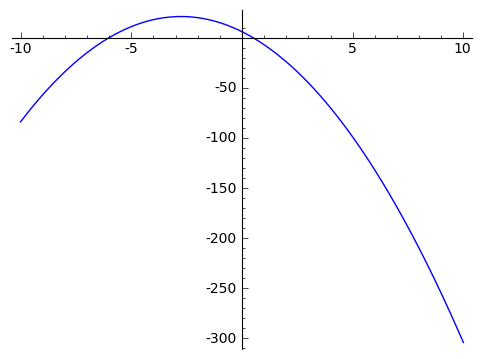
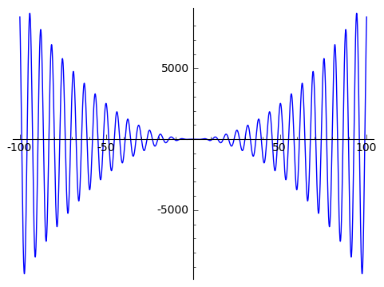

.. -*- coding: utf-8 -*-

Wprowadzenie do SAGE'a -- matematyka bez bólu, obliczenia, wykresy
------------------------------------------------------------------

Wprowadzenie do obliczeń w systemie **SAGE**
++++++++++++++++++++++++++++++++++++++++++++
   
.. image:: http://www.math.washington.edu/newsletter/2006/Stein.jpg
   :alt: William Stein
   :align: right
   :height: 160
   
.. image:: Warsztaty_iCSE_1_Wprowadzenie_CubeProject_media/sage_logo_new.png
   :alt: William Stein
   :align: right
   :height: 52

**SAGE** jest dosyć młodym przedsięwzięciem -- został udostępniony w 2005 roku. Głównym twórcą tego pakietu jest dr William Stein (na zdjęciu obok) z University of Washington w Seattle. 

**SAGE** to pakiet darmowy i w pełni otwarty nie tylko pod względem kodu, ale i metodologii rozwoju. **SAGE** nie wyważa otwartych drzwi -- korzysta pełnymi garściami 
z tego, co ktoś już kiedyś dobrze wymyślił i co się sprawdziło. Pakiet nie bazuje na własnym języku, lecz wykorzystuje język programowania **Python**. Jest to język 
stosunkowo prosty i umożliwiający wykonywanie **działań symbolicznych**. Możliwe jest jednak używanie wielu innych języków, które można łączyć.

My będziemy pracować w **notatniku SAGE'a**, czyli w wygodnym środowisku o określonych elementach graficznych ułatwiających programowanie.

Komunikacja z pakietem obejmuje 3 typy komórek:

#) **Komórki wejścia** (gdzie wpisujemy nasze komendy, które SAGE będzie wykonywał); żeby otworzyć taką nową komórkę wystarczy przesunąć kursor myszki w odpowiednie miejsce i kliknąć kiedy na ekranie pojawi się długi, poziomy niebieski pasek;

#) **Komórki wyjścia** (gdzie SAGE umieszcza rezultaty wykonania naszych poleceń); żeby nakazać SAGE'owi wykonanie naszych komend/poleceń, należy kliknąć w przycisk ``Wykonaj``, znajdujący się pod komórką wejścia, lub użyć skrótu klawiszowego ``SHIFT`` + ``ENTER`` (przy czym kursor musi znajdować się wewnątrz komórki do wykonania);

#) **Komórki tekstowe** zawierające komentarze (takie jak ten), notatki, uwagi itp.; żeby otworzyć komórkę tekstową należy w wybranym miejscu ruchem kursora myszki wymusić pojawienie się wspomnianego niebieskiego paska, lecz w porównaniu do tworzenia nowej komórki wejścia należy przed kliknięciem w pasek nacisnąć i przytrzymać ``SHIFT``; 

Dodatkowe komentarze w kodzie (w komórkach wejścia) możemy umieszczać za znakiem ``#``.

Zapoznanie ze sposobami realizowania podstawowych operacji algebraicznych 
=========================================================================

Rozpocznijmy przygodę z SAGEm!

Otwieramy w notatniku SAGE'a nowy arkusz i nadajemy mu jakąś własną nazwę. 

SAGE jako kalkulator (na początek)
++++++++++++++++++++++++++++++++++++

W okienku wejścia wpisujemy działanie do wykonania, np.:
 
.. code-block:: python

	sage:	23 + 12 

.. end of output

Jako wynik otrzymujemy oczywiście:

.. code-block:: python

	25 

.. end of output

Spróbujmy jednak czegoś nieco bardziej wymagającego niż dodawanie:

.. code-block:: python

	sage:	38/12
	19/6 

.. end of output

Od razu zwracamy uwagę, że SAGE nie zachowuje się jak zwyczajny kalkulator, gdyż podał dokładną wartość będącą wynikiem dzielenia.

.. note:: UWAGA! SAGE ma wysokie standardy i nie zaokrągla, jeśli tylko nie jest mu to polecone, np.:

.. code-block:: python

	sage:	1/9+5/12
	19/36 

.. end of output

Widać, że SAGE wykonuje obliczenia dokładnie -- sprowadzając do wspólnego mianownika i wypisując wynik w możliwie najprostszej postaci (po skróceniu).

Żeby SAGE pokazał nam przybliżoną wartość w zapisie dziesiętnym, trzeba o to poprosić [używamy odpowiedniej funkcji -- tu funkcji ``n(...)``, która jest odpowiedzialna za obliczenia numeryczne]:

.. code-block:: python

	sage:	n(1/9+5/12)	
	0.527777777777778

.. end of output
 
Możemy SAGE'a zapytać ile dokładnie jest równe :math:`\pi`, a przy okazji zapytajmy również, jaka jest wartość :math:`\pi` z dokładnością do 30 cyfr znaczących. 
Należy zwrócić uwagę, że SAGE wypisuje wynik tylko ostatniej operacji, jeśli kod poleceń zawiera więcej niż jedną linijkę (SAGE wykona wszystkie polecenia, 
ale domyślnie wypisze wynik tylko ostatniej). Żeby wymusić wypisanie wyników pośrednich należy użyć funkcji ``print`` lub ``show``:  
    
.. sagecellserver:: 
	
	print(pi)
	print(n(pi, digits=30))

W odpowiedzi SAGE nas poinformował, że dokładna wartość :math:`\pi` jest równa :math:`\pi` :) [trudno go za to winić -- w końcu ma rację].

Możemy, korzystając ze znanych SAGE'owi stałych, policzyć dokładne wartości funkcji trygonometrycznych:

.. code-block:: python

	sage:	print(cos(pi))
	sage:	print(sin(pi/3))
	-1
	1/2*sqrt(3)

.. end of output
 	
W odpowiedzi na prośbę o obliczenie :math:`\sin\frac{\pi}{3}` SAGE podał wynik dokładny równy :math:`\frac{\sqrt{3}}{2}`. Dowiedzieliśmy się przy okazji, że pierwiastek kwadratowy
realizuje funkcja o nazwie ``sqrt``. Spróbujmy policzyć wartość jakiegoś pierwiastka kwadratowego:

.. code-block:: python

	sage:	print(sqrt(32))
	sage:	print(n(sqrt(32), digits=6))
	4*sqrt(2)
	5.65685

.. end of output

Kolejny raz przekonaliśmy się, że SAGE podaje dokładne wyniki (upraszaczając o ile tylko to możliwe: :math:`\sqrt{32}=4 \, \sqrt{2}`).

.. note:: Chcąc uzyskać szczegółowe informacje nt. działania różnych funkcji w SAGE'u (aby skorzystać z pomocy) wystarczy wpisać nazwę funkcji i znak zapytania

.. code-block:: python

	sage:	sqrt?
	
	File: /usr/lib/sagemath/local/lib/python2.7/site-packages/sage/functions/other.py
	
	Type: <type ‘function’>
	
	Definition: sqrt(x, *args, **kwds)
	
	Docstring:
	
	INPUT:
	
	x - a number
	prec - integer (default: None): if None, returns an exact square root; otherwise returns a numerical square root if necessary, to the given bits of precision.
	extend - bool (default: True); this is a place holder, and is always ignored or passed to the sqrt function for x, since in the symbolic ring everything has a square root.
	all - bool (default: False); if True, return all square roots of self, instead of just one.
	EXAMPLES:
	
	sage: sqrt(-1)
	I
	sage: sqrt(2)
	sqrt(2)
	sage: sqrt(2)^2
	2
	sage: sqrt(4)
	2
	sage: sqrt(4,all=True)
	[2, -2]
	sage: sqrt(x^2)
	sqrt(x^2)
	sage: sqrt(2).n()
	1.41421356237310
	To prevent automatic evaluation, one can use the hold parameter after coercing to the symbolic ring:
	
	sage: sqrt(SR(4),hold=True)
	sqrt(4)
	sage: sqrt(4,hold=True)
	Traceback (click to the left of this block for traceback)
	...
	                                         
.. end of output	

Przy okazji dowiedzieliśmy się z przykładów z dokumentacji, że SAGE potrafi również liczyć pierwiastki z liczb ujemnych, co jest kolejnym elementem wychodzącym poza standardy 
zwykłych kalkulatorów. Żeby zrozumieć wynik  pierwiastkowania liczb ujemnych trzeba znać pojęcie **liczb zespolonych**, jednak nie czas i miejsce, żeby wyjaśniać, 
czym one są. Liczby zespolone są na ogół omawiane w pierwszym semestrze studiów, ale nie jest zabronione poszukanie informacji i zapoznanie się z liczbami zespolonymi wcześniej, 
jeśli tylko ktoś ma ochotę...

Przedstawmy jeszcze tylko dwa inne użyteczne działania na liczbach -- potęgowanie oraz dzielenie z resztą:

.. code-block:: python

	sage:	print(2^3)
	sage:	print(13%5)
	8
	3

.. end of output

Oprócz działań na liczbach możemy wykonywać operacje porównania (operacje logiczne):

.. code-block:: python

	sage:	print(2 == 5)
	sage:	print(2 < 5)
	sage:	print(5 != 10/3)
	sage:	print(6/7 <= 14/17)
	False
	True
	True
	False

.. end of output

SAGE jako narzędzie do operacji na funkcjach, w tym do rysowania wykresów funkcji 
+++++++++++++++++++++++++++++++++++++++++++++++++++++++++++++++++++++++++++++++++

Wykorzystamy tu bardzo ważną cechę SAGE'a, który świetnie radzi sobie z zapisem symbolicznym, przez co możemy się nim posługiwać bardzo podobnie, jak to robimy rozwiązując 
problemy matematyczne na kartce papieru. Na przykład zdefiniowanie funkcji odbywa się niemal tak samo jak na tablicy w szkole (należy jednak pamiętać, że każde mnożenie 
trzeba zaznaczyć symbolem '*'):

.. code-block:: python

	sage:	f(x) = -2*x^2-11*x+6
	sage:	plot(f(x), (x,-10,10))
	

.. end of output

Z wykresu widać mniej więcej jakie są miejsca zerowe tego wielomianu, ale na pytanie jak rozwiązać analityczne równanie kwadratowe z wykorzystaniem SAGE'a odpowiemy 
w dalszej części. 

Możemy rysować wykresy nie tylko dla funkcji elementarnych, ale również dla bardziej skomplikowanych funkcji, np.:

.. code-block:: python

	sage:	f(x) = x^2 * cos(x)
	sage:	plot(f(x), (x,-100,100), figsize=5)
	

.. end of output

Alternatywny sposób wywołania wykresu funkcji:

.. code-block:: python

	sage:	f(x).plot(-5, 5, figsize=5)

.. end of output

.. note:: Możemy w łatwy sposób zamieścić wykresy kilku funkcji na jednym rysunku. W SAGE'u realizuje się to w bardzo intuicyjny sposób -- poprzez dodawanie wykresów do siebie (dodawanie ,,plot'ów"). 

Jednocześnie możemy się zastanownić co jeszcze możemy zrobić ze zdefiniowaną funkcją? Można podejrzeć możliwości pisząc ``f.`` i naciskając 
klawisz ``TAB``. Na przykład możemy policzyć pochodną funkcji ``f`` (Ups! ale ze szkoły średniej został wycofany rachunek różniczkowy, więc chyba jeszcze nie wiecie, 
co to jest pochodna... No nic, ale wiedzcie, że SAGE potafi je liczyć).
To może się przydać w przyszłości.

.. sagecellserver:: 

	f(x) = x^2 * cos(x)
	g(x) = -1/2*x - 1
	h(x) = log(x)
	show(plot(f(x), -5, 5) + plot(g(x), -5, 5, color='red') + plot(h(x), 0, 5, color='green', figsize=5))
	f.diff()
	print(f.diff())
	show(f.diff())		

Przy okazji zaprezentowano różnice między sposobami wypisywania (formatowaniem) wyniku przez ``print`` oraz ``show``.

Mała próbka tworzenia wykresów 3D:

.. code-block:: python

	sage:	var('x,y')
	sage:	plot3d(2^(-(x^2+y^2))*cos(x^2+y^2), (x,-pi,pi), (y,-pi,pi), figsize=5)
	
.. image:: Warsztaty_iCSE_1_Wprowadzenie_CubeProject_media/sage0-size500_jmol.png
    :align: center

.. end of output

SAGE jako ,,maszynka" do rozwiązywania zadań (sprawdzania wyników) 
++++++++++++++++++++++++++++++++++++++++++++++++++++++++++++++++++

Można łatwo rozwiązać równanie lub układ równań:

.. code-block:: python

	sage:	rownanie = -2*x^2-11*x+6==0
	sage:	show(rownanie)
	sage:	rozwiazanie = solve(rownanie, x)
	sage:	print("Rozwiązania powyższego równiania:")
	sage:	show(rozwiazanie)
	
.. MATH::
	-2 \, x^{2} - 11 \, x + 6 = 0
	
	\text{Rozwiązania powyższego równiania:}

	\left[x = \left(-6\right), x = \left(\frac{1}{2}\right)\right]
	
.. end of output

Gdyby ktoś zapomniał jak wygladają wzory na rozwiązania równania kwadratowego, to możemy poprosić SAGE'a o symboliczne rozwiązanie równiania kwadratowego w ogólnej postaci:

.. code-block:: python

	sage:	var('x,a,b,c')
	sage:	rownanie = a*x^2+b*x+c==0
	sage:	show(rownanie)
	sage:	rozwiazanie = solve(rownanie, x)
	sage:	print("Rozwiązania powyższego równiania:")
	sage:	show(rozwiazanie)
	
.. MATH::
	a \, x^{2} + b \, x + c = 0
	
	\text{Rozwiązania powyższego równiania:}

	\left[x = -\frac{b + \sqrt{-4 \, a c + b^{2}}}{2 \, a}, x = -\frac{b - \sqrt{-4 \, a c + b^{2}}}{2 \, a}\right]
	
.. end of output

Podkreślić należy, że powyższe wzory, to nie są informacje wyświetlone z jakiejś bazy danych, tylko SAGE rozwiązał, wykorzystując zapis symboliczny, podane równanie z parametrami.

Oczywiście każdy potrafi w miarę szybko znaleźć pierwiastki trójmianów kwadratowych. Sprawa nie jest już taka prosta kiedy mamy znaleźć pierwiastki wielomianu 
stopnia trzeciego. Dla SAGE'a nie stanowi to problemu, podobnie jak narysowanie wykresu takiego wielomianu, czy rozwiązanie równania przy dodatkowym założeniu, 
np. że interesują nas tylko dodatnie wartości :math:`x>0` [funkcja ``lhs`` w poniższym kodzie zwraca wyrażenie występujące po lewej stronie równiania (lhs = left hand side)]:

.. sagecellserver::
	
	rownanie = x^3-6*x^2-19*x+84 == 0
	show(rownanie)
	rozwiazanie = solve(rownanie, x)
	print("Rozwiązania powyższego równiania:")
	show(rozwiazanie)
	f(x) = rownanie.lhs()
	show(plot(f(x), (x,-10,10), figsize=5))

	assume(x>0)    # wprowadzamy dodatkowe założenie
	print("Wyznaczamy tylko pierwiastki dodatnie:")
	rozwiazanie = solve(rownanie, x)
	show(rozwiazanie)
	forget()   # anulowanie dodatkowego założenia, które jest aktywne dopóki nie użyjemy 'forget()'

W SAGE'u możemy również szybko rozwiązać układy równań (w tym również układy równań nieliniowych):

.. code-block:: python

	sage:	var('x,y')
	sage:	rozwiazanie_ukladu = solve([3*x+y==3, x^2-2*x-3+y==0], x, y)
	sage:	show(rozwiazanie_ukladu)

.. MATH::
		
	\left[\left[x = 5, y = \left(-12\right)\right], \left[x = 0, y = 3\right]\right]

.. end of output

To oczywiście tylko namiastka możliwości SAGEa, ale już ta namiastka pokazuje jak duże są możliwości tej platformy. Tylko korzystać! Zachęcamy!