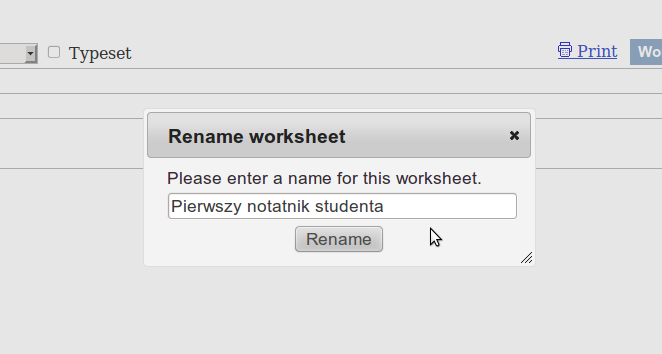
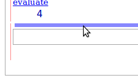

.. -*- coding: utf-8 -*-

Środowisko Sage
---------------

Pakiet SAGE, notatnik Sage
~~~~~~~~~~~~~~~~~~~~~~~~~~

Po zalogowaniu do serwisu `sage.phys.us.edu.pl <http://sage.phys.us.edu.pl>`_  dostaniemy taki obraz

.. image:: iCSE_ITechninf01_z6_media/scr001.png
    :align: center
    :width: 600px

*Rysunek 1: Okno Sage po pierwszym zalogowaniu.*

Kiedy już chwilę popracujemy w Sage, tworząc lub współtworząc notatniki, pojawią się one w katalogu domowym. Co widzimy na stronie domowej (patrz rysunek 2)?

#. **SAGE**
   The  Sage  Notebook  Logo   SAGE   i   jednocześnie   link   do  `nb.sagemath.org <http://nb.sagemath.org>`_ , strony projektu  The Sage Notebook. 
#. **login**
   Twój login (nazwa Twojego konta na serwerze Sage). 
#. **Home**
   Odnośnik do katalogu domowego (Twojej strony domowej na danym serwerze Sage). 
#. **Published**
   Odnośnik  do  dokumentów  opublikowanych  na  tym  serwerze  Sage (mogą być one Twoje własne lub innych użytkowników). O tym czym różnią się notatniki od takich dokumentów będzie za chwilę. 
#. **Log**
   Odnośnik do strony zawierającej historię zmian jakie wykonałeś na  swoim koncie. 
#. **Settings**
   Odnośnik do strony zawierającej ustawienia Twojego konta. 
#. **Help**
   Pomoc (w tym  `samouczek Sage po polsku <https://sage2.icse.us.edu.pl/doc/live/pl_tutorial/>`_ ). 
#. **Report  a  Problem**
   Odnośnik  do  formularza   docs.google służący  do  zgłaszania błędów i problemów z Sage. 
#. **Sign out**
   Odnośnik, dzięki któremu wylogujesz się z tego serwisu. 
#. **New Worksheet**
   Odnośnik, którym stworzymy nowy notatnik Sage. 
#. **Upload**
   Odnośnik służący do przesyłania notatników na serwer. 
#. **Download All Active**
   Po naciśnięciu tego odnośnika, możemy na lokalny      dysk zapisać wszystkie  aktywne notatniki (notatniki widoczne w katalogu  Active). 
#. **Search Worksheets**
   Okno przeszukiwania notatników. 
#. **Archive**
   Przycisk   służący   do   archiwizowania   niepotrzebnych   już  notatników.  Dostęp  do  zarchiwizowanych  notatników  dostajemy  po  przejściu do katalogu  Archived. 
#. **Delete**
   Przycisk służący do archiwizowania niepotrzebnych już notatników. 
#. **Stop**
   Przycisk  służący  do  zatrzymywania  działających  (wykonujących  obliczenia,   niezamkniętych)   notatników.   Zatrzymywanie   notatników  zwalnia zasoby maszyny na której postawiono serwer Sage. 
#. **Download**
   Przycisk służący do zapisania na dysku lokalnym wybranego  notatnika. 
#. **Current Folder**
   Lista trzech odnośników do poszczególnych katalogów w ramach naszego konta:

   - **Active**
     Katalog zawierający aktywne notatniki. Te notatniki mogą być  aktywnie  rozszerzane  i  zmieniane  przez  użytkownika  i  wszystkich  współużytkowników notatników.
   - **Archived**
     Katalog  zawierający  notatniki  zarchiwizowane.  W  trybie podstawowym dostępne są one tylko jako strony statyczne, a nie jako  notatniki Sage. Możemy je uaktywnić poprzez zaznaczenie żądanego          notatnika i wciśnięcie przycisku **Unarchive**.
   - **Trash**
     Katalog zawierający usunięte przez użytkownika notatniki. Te notatniki mogą być:

        - aktywnie  rozszerzane  \-  wystarczy  kliknąć  na  nazwę  żądanego notatnika i zacząć go normalnie używać (notatnik po zapisaniu znajdzie  się  automatycznie  w  katalogo  **Active**);  można  też najpierw zaznaczyć żądany notatniki i kliknąć później **Undelete** a żądany notatnik wróci do katalogu **Active**.
        - zarchiwizowane \- służy do tego przycisk **Archive**
        - tradycyjnie zatrzymywane  (**Stop**) lub   ściągane  na dysk (**Download**)

#. **Active/Archived/Deleted Worksheets**
   Lista aktywnych, zarchiwizowanych lub  usuniętych notatników. 
#. **Owner / Collaborators**
   Pole zawiera nazwę właściciela notatnika oraz listę  użytkowników (patrz punkt 24). 
#. **Last Edited**
   Pole informujące o tym kto i kiedy po raz ostatni edytował dany  notatnik. 
#. Odnośnik do notatnika. 
#. Odnośnik do aktywnego (działającego) arkusza. 
#. Lista użytkowników dzielących dany notatnik w formacie "właściciel notatnika/użytkownik 1, użytkownik 2, użytkownik 3, ..."
#. Jak powyżej, ale w przypadku, gdy dany notatnik ma tylko jednego  użytkownika.

.. image:: iCSE_ITechninf01_z6_media/scr002.png
    :align: center
    :width: 600px

*Rysunek 2: Sage w punktach.*

Zaczynamy pracę
~~~~~~~~~~~~~~~~~~

Aby rozpocząć pracę z Sage musimy stworzyć nasz pierwszy notatnik [1]_.

**Zadanie 1: Stwórz pierwszy notatnik**

czas: 1 min.

Rozwiązanie: Kliknij na napis **New Worksheet** (punkt 10). Pojawi się okno żądające wprowadzenia nazwy nowego notatnika. Wprowadź nazwę i naciśnij **Rename**.
             

*Rysunek 3: Zmiana nazwy notatnika.*

Arkusz powinien wyglądać jak na rysunku 2.

.. image:: iCSE_ITechninf01_z6_media/scr004.png
    :align: center
    :width: 600px

*Rysunek 4: Widok notatnika Sage.*

#. Pierwszy notatnik studenta.
   Nazwa edytowanego notatnika. Pod nazwą  dostaniemy  informację  o  dacie  i  użytkowniku  który  dokonał  ostatnich  zmian dokumentu. 
#. **file...**
   Rozwijalna lista służąca do obsługi notatnika. Możemy wybrać **Load worksheet from a file** Sage ładuje notatnik zapisany uprzednio  w pliku (operacja tworzy nowy notatnik) a następnie przechodzi do          niego.

   - **New worksheet** Tworzy nowy notatnik, patrz 10.
   - **Save worksheet to a file** Zapisuje  notatnik  do  pliku  o  rozszerzeniu **sws**. Domyślna nazwa pliku to nazwa edytowanego notatnika.
   - **Print** Otwiera odpowiednią do wydruku, statyczną wersję notatnika.
   - **Rename worksheet** Zmiana nazwy edytowanego notatnika.
   - **Copy worksheet** Kopiuje zawartość notatnika do innego o podawanej później nazwie.
   - **Delete worksheet** Usuwa edytowany notatnik.

#. **Action...**

   - **Interrupt** Przerywa aktywne obliczenia w edytowanym notatniku.
   - **Restart worksheet** Uruchamia   automatyczne   polecenia   zawarte  w  notatnik uprzednio zatrzymując uruchomione obliczenia.
   - **Save and quit worksheet** Zapisuje  zmiany,  zatrzymuje  obliczenia  i opuszcza edytowany notatnik.
   - **Evaluate all** Wywołuje  po  kolei  wszystkie  komórki  w  edytowanym  notatniku.
   - **Hide all output** Ukrywa  wyniki  obliczeń  z  wszystkich  komórek  w  edytowanym notatniku.
   - **Show all output** Pokazuje  wyniki  obliczeń  z  wszystkich  komórek  w  edytowanym notatniku.
   - **Delete all output** Usuwa  wyniki  obliczeń  z  wszystkich  komórek  w  edytowanym notatniku.
   - **One cell mode** Tryb jednej komórki. W tym trybie nie będą tworzone kolejne komórki po wywołaniu komórki.
   - **Multi cell mode** Tryb  wielu  komórek.  W  tym  trybie  po  wywołaniu  komórki tworzona jest kolejna. Jest to tryb domyślny.

#. **Data...**

   - **Upload or create file** Po wybraniu przejdziemy do formularza, dzięki  któremu będziemy w stanie przesłać plik (obrazek, arkusz CSV, ...) na  serwer.

   Uwaga: Gdy dla konkretnego arkusza dostępny będzie jakiś plik, będzie on   uwidoczniony i dostępny tutaj. Dostęp do plików w notatniku dostajemy   po wpisaniu  **DATA\+’nazwa_pliku’**

#. **sage**
   Lista dostępnych środowisk w Sage. Tu możemy zmienić domyślny      interpreter w edytowanym notatniku. 
#. **Typeset**
   Odznaczenie tego pola wyboru spowoduje formatowanie  L A T E X \-a  wyników obliczeń komórek. 
#. **Save**
   Zapisuje zmiany. 
#. **Save & quit**
   Zapisuje zmiany i wychodzi z notatnika. 
   Uwaga: proszę używać tej opcji wychodząc z danego notatnika. Niezwykle rzadko
   będziemy potrzebowali uruchamiania obliczeń na dłuższy czas (będzie to
   wówczas sygnalizowane). Wyjście poprzez ’x’ w prawym górnym rogu
   (zamknięcie okna przeglądarki) pozostawi działający na serwerze proces, co
   spowoduje jego niepotrzebne obciążenie. Proszę pamiętać – działamy w `chmurze obliczeniowej
   <http://pl.wikipedia.org/wiki/Chmura_obliczeniowa>`_ .
#. **Discard & quit**
   Odrzuca zmiany i wychodzi z notatnika. 
#. **Print**
   Otwiera odpowiednią do wydruku, statyczną wersję notatnika. 
#. **Worksheet**
   Przejście do interaktywnego używania notatnika (stan domyślny). 
#. **Edit**
   Otwiera źródło notatnika. 
#. **Text**
   Otwiera tekstową wersję notatnika (bez możliwości edycji). 
#. **Undo**
   Udostępnia historię zmian i możliwość powrotu do jednej z wcześniejszych  wersji notatnika. 
#. **Share**
   Po naciśnięciu odnośnika możemy dany notatnik udostępnić innym  użytkownikom do edycji. Zatwierdzenie listy odbywa się po naciśnięciu  **Invite collaborators**. Proszę zauważyć, że system podaje nam listę użytkowników na  dole formularza. 
#. **Publish**
   Opcja opublikowania notatnika. 
#. **jsMath**
   Opcje  jsMath,  `jsMath na math.union.edu <http://www.math.union.edu/~dpvc/jsMath>`_

Pierwsze kroki w Sage
~~~~~~~~~~~~~~~~~~~~~

Sage (Software for Algebra and Geometry Experimentation) \- system algebry komputerowej napisanego w Pythonie i Cythonie. Do podstawowych ale i tych bardzo zaawansowanych obliczeń język Python nie będzie niezbędny, choć jeżeli ktoś go zna, na pewno ułatwi to naukę samego Sage.

Zanim zaczniemy, potrzeba nam jeszcze tylko kilka informacji:

- komórki  wywołujemy  za  pomocą   SHIFT \+ Enter (Return)  (zupełnie jak w Mathematica). Naciśnięcie po prostu  Enter (Return)  spowoduje  dodanie kolejnej linii do komórki. 
- Aby dodać nową komórkę należy najechać wskaźnikiem myszy lekko  powyżej lub poniżej dowolnej komórki i gdy pojawi się niebieski pasek  nacisnąć lewy przycisk myszy (LPM). Jeżeli w tym momencie naciśniemy i   przytrzymamy  SHIFT  dostaniemy komórkę tekstową (o niej później).

*Rysunek 5: Dodawanie nowej komórki.*

Proste obliczenia w Sage
""""""""""""""""""""""""

Sage bez problemu potrafi obsłużyć najprostsze operacja arytmetyczne. 

Dodawanie

.. code-block:: python

    sage: 3 + 4
    7

.. end of output

Odejmowanie

.. code-block:: python

    sage: 12 - 22

.. end of output

Mnożenie

.. code-block:: python

    sage: 3 * 7

.. end of output

Dzielenie

.. code-block:: python

    sage: 36 / 4

.. end of output

Operacja  modulo (zwraca resztę z dzielenia).

.. code-block:: python

    sage: 27%7

.. end of output

Potęgowanie

.. code-block:: python

    sage: 2^3

.. end of output

Nie jest to może jakaś zaawansowane matematyka, ale z pomocą tych prostych działań możemy rozwiązać niemal każdy problem np. z mechaniki. Operacje możemy oczywiście łączyć. Proszę jednak uważać na to co każemy Sage\-owi obliczać, gdyż obowiązuje nas tzw.  pierszeństwo operatorów.

Ile wynosi?

-------------

3^2\*4 \+ 2%5

-------------

Oczywiście najprościej sprawdzić w notatniku:

.. code-block:: python

    sage: 3^2*4 + 2%5

.. end of output

Zadania
"""""""

**Zadanie 2: Ruch pionowy w polu grawitacyjnym Ziemi**

czas: 5 min.

W górę rzucono piłkę. Zaniedbując siły oporu, oblicz na jaką wysokość wzniesie się piłka po 0.54 sekundy, jeżeli wartość początkowa prędkości wynosiła  3.44 m/s.

**Rozwiązanie**

Znając rozwiązanie równań ruchu, mamy

.. math::

   h(t) = {v}_{0}t - {1\over 2}g t^2

Jeżeli :math:`{v}_{0} = 3.44` m/s,  a :math:`t = 0.54` s, to łatwo obliczyć, że

.. math::

   h(t) = 3.44 \cdot 0.54 - {1\over 2}\cdot 9.81 \cdot  {0.54}^{2}

i  w  Sage

.. code-block:: python

    sage: 3.44 * 0.54 - 9.81 * 0.54^2 / 2
    0.427302000000000

.. end of output

**Zadanie 3: Ruch pionowy w polu grawitacyjnym**

czas: 5 min.

Proszę policzyć to samo zagadnienie na równikach:

- Księżyca, 
- Marsa, 
- Jowisza.

**Zadanie 4: Ile minut minęło od 6:15 dziś rano?**

czas: 10 min.

**Zadanie 5: Oblicz swoją liczbę urodzenia.**

czas: 5 min.

Sprawdź później, co o tobie myślą `numerolodzy <http://pl.wikipedia.org/wiki/Numerologia>`_.

**Zadanie 6: Oblicz ile dni minęło od Bitwy pod Chojnicami (1657).**

czas: 20 min.

Pomoc: `Data Juliańska <http://pl.wikipedia.org/wiki/Data_Julia%C5%84ska>`_

Zmienne
~~~~~~~

Ostatnie zadanie jest lekko karkołomne jeżeli obliczać podane wartości osobno. Znacznie lepiej byłoby przypisywać konkretne wartości do zmiennych (zupełnie jak w podanym algorytmie na wikipedii). Nic prostszego! Sage (zupełnie jak python) pozwala na (prawie) dowolne przypisanie wartości do zmiennych bez konieczności określania ich typów

.. code-block:: python

    sage: x = 13
    sage: y = 15
    sage: z = 0

.. end of output

Teraz korzystając z tych  definicji możemy obliczyć np: sumę wszystkich zmiennych x, y i z.

.. code-block:: python

    sage: x + y + z
    28

.. end of output

Spróbujmy obliczyć jeszcze raz na jaką wysokość doleci piłka rzucona na równiku Ziemskim z prędkością początkową :math:`{v}_{0} = 3.44` m/s po czasie :math:`t = 0.54` s (patrz zadanie 2). Tym razem wykorzystamy zmienne \- zobaczycie, że późniejsze zmiany dowolnych parametrów układu (jak np: grawitacja) będą już znacznie łatwiejsze.

.. code-block:: python

    sage: g = 9.81
    sage: t = 0.54
    sage: v0 = 3.44
    sage: h = v0 * t - 0.5 * g * t ^2

.. end of output

No tak, ale gdzie jest wynik? Wynik Sage przechowuje w zmiennej h. Aby się do niej dostać (aby zobaczyć jaką wartość trzymazmienna h) należy po prostu wpisać jej nazwę i wywołać komórkę

.. code-block:: python

    sage: h
    0.427302000000000

.. end of output

.. code-block:: python

    sage: print h
    sage: #show(H)
    0.427302000000000

.. end of output

Pułapki:

- Należy pamiętać, że Sage, podobnie jak Python odróżnia wielkość liter, zatem  h i  H to dla Sage dwie różne zmienne.

Zadania
"""""""

**Zadanie 7: Bitwa pod Chojnicami (1657).**

czas: 10 min.

Przepisz poprzednie zadanie o Bitwie pod Chojnicami lecz tym razem wykorzystaj zmienne.

**Zadanie 8: Jednostki.**

czas: 15 min.

Napisz prosty program (tak, tak, już programujemy!) zamieniający długość z metrów na jednostki z wysp Brytyjskich (stopy, cale, jardy i  mile).

- 1 cal = 2.54 cm
- 1 stopa = 12 cali
- 1 jard = 3 stopy
- 1 mila = 1760 jardów

**Uwaga:** 640 m = 25196.85 cali = 2099.74 stóp = 699.91 jardów = 0.3977 mili (użyj tej wielkości do testów). Do wyświetlenia może przydać się funkcja **show()**. Jeżeli mamy zadeklarowaną zmienną **x=3**, to **show(x)** zwróci nam  wartość zmiennej na ekran (w tym przypadku liczbę 3).

**Zadanie 8: Temperatura pokojowa.**

czas: 10 min.

Przelicz temperaturę pokojową (r.t.) na stopnie Kelwina i Fahrenheita.

**Zadanie 9: Równanie kwadratowe**

czas: 10 min.

Rozwiąż równanie

.. math::

   x^2 + 3x + 2 = 0

-----

.. [1] Od tej pory będziemy posługiwać się użytkownikiem student

