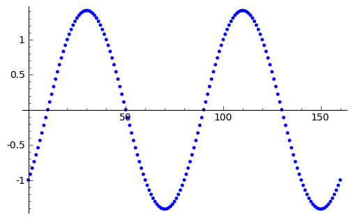
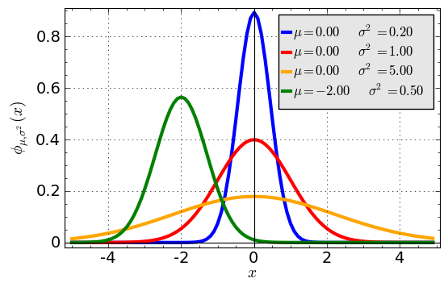

.. -*- coding: utf-8 -*-

Listy i funkcje 
---------------

Zadanie 1
~~~~~~~~~

.. code-block:: python

    sage: lp = list(primes(30))
    sage: odw_lp = []
    sage: i = 1
    sage: while i <= len(lp):
    ...       odw_lp.append(lp[-i])
    ...       i += 1
    sage: lp; odw_lp

| [2, 3, 5, 7, 11, 13, 17, 19, 23, 29]
| [29, 23, 19, 17, 13, 11, 7, 5, 3, 2]

.. end of output

Zadanie 2
~~~~~~~~~

.. code-block:: python

    sage: l1 = [-18, -9, 1, -14, -2, 7, 5, -11, 16, 4, 18, 7, -18, 19, 
    ...      -10, 11, 7, -18, -3, -6]
    sage: l1.sort()
    sage: l1a = l1[:len(l1)/2]
    sage: l1b = l1[len(l1)/2:]
    sage: l1a; l1b

| [-18, -18, -18, -14, -11, -10, -9, -6, -3, -2]
| [1, 4, 5, 7, 7, 7, 11, 16, 18, 19]

.. end of output

Zadanie 3
~~~~~~~~~

.. code-block:: python

    sage: # punkt 1
    sage: punkt1 = [i^2 for i in xrange(1,300,2)]; print punkt1

[1, 9, 25, 49, 81, 121, 169, 225, 289, 361, 441, 529, 625, 729, 841, 961, 1089, 1225, 1369, 1521, 1681, 1849, 2025, 2209, 2401, 2601, 2809, 3025, 3249, 3481, 3721, 3969, 4225, 4489, 4761, 5041, 5329, 5625, 5929, 6241, 6561, 6889, 7225, 7569, 7921, 8281, 8649, 9025, 9409, 9801, 10201, 10609, 11025, 11449, 11881, 12321, 12769, 13225, 13689, 14161, 14641, 15129, 15625, 16129, 16641, 17161, 17689, 18225, 18769, 19321, 19881, 20449, 21025, 21609, 22201, 22801, 23409, 24025, 24649, 25281, 25921, 26569, 27225, 27889, 28561, 29241, 29929, 30625, 31329, 32041, 32761, 33489, 34225, 34969, 35721, 36481, 37249, 38025, 38809, 39601, 40401, 41209, 42025, 42849, 43681, 44521, 45369, 46225, 47089, 47961, 48841, 49729, 50625, 51529, 52441, 53361, 54289, 55225, 56169, 57121, 58081, 59049, 60025, 61009, 62001, 63001, 64009, 65025, 66049, 67081, 68121, 69169, 70225, 71289, 72361, 73441, 74529, 75625, 76729, 77841, 78961, 80089, 81225, 82369, 83521, 84681, 85849, 87025, 88209, 89401]

.. end of output

.. code-block:: python

    sage: # punkt 1
    sage: v_0 = 3.44
    sage: h_0 = 0
    sage: g = 9.81
    sage: h = [h_0 + v_0 * t - g * t^2 /2. for t in 
    ...      srange(0,0.7,0.01, include_endpoint=True)]
    sage: print h
    sage: list_plot(h)

[0.000000000000000, 0.0339095000000000, 0.0668380000000000, 0.0987855000000000, 0.129752000000000, 0.159737500000000, 0.188742000000000, 0.216765500000000, 0.243808000000000, 0.269869500000000, 0.294950000000000, 0.319049500000000, 0.342168000000000, 0.364305500000000, 0.385462000000000, 0.405637500000000, 0.424832000000000, 0.443045500000000, 0.460278000000000, 0.476529500000000, 0.491800000000000, 0.506089500000000, 0.519398000000000, 0.531725500000000, 0.543072000000000, 0.553437500000000, 0.562822000000000, 0.571225500000000, 0.578648000000000, 0.585089500000000, 0.590550000000000, 0.595029500000000, 0.598528000000000, 0.601045500000000, 0.602582000000000, 0.603137500000000, 0.602712000000000, 0.601305500000000, 0.598918000000000, 0.595549500000000, 0.591200000000000, 0.585869500000000, 0.579558000000000, 0.572265500000000, 0.563992000000000, 0.554737500000000, 0.544502000000000, 0.533285500000000, 0.521088000000000, 0.507909500000000, 0.493749999999999, 0.478609500000000, 0.462488000000000, 0.445385500000000, 0.427301999999999, 0.408237499999999, 0.388191999999999, 0.367165499999999, 0.345157999999999, 0.322169499999999, 0.298199999999999, 0.273249499999999, 0.247317999999999, 0.220405499999999, 0.192511999999999, 0.163637499999999, 0.133781999999999, 0.102945499999998, 0.0711279999999985, 0.0383294999999988, 0.00455000000000005]

.. image:: iCSE_ITechninf03_z77_listy_funkcje_ROZWIAZANIA_ZADAN_media/cell_9_sage0.png
    :align: center

.. end of output

.. code-block:: python

    sage: # punkt 3
    sage: sin_cos = [sin(a) - cos(a) for a in [a * n(pi) for a in 
    ...      srange(-2,2,0.025,include_endpoint=True)]]
    sage: list_plot(sin_cos)

.. end of output

Zadanie 4
~~~~~~~~~~~~~

.. code-block:: python

    sage: r=var('r')
    sage: d  = sin(r^2)
    sage: dd = d.derivative(r); print dd
    sage: idd = dd.integrate(r); print idd
    sage: print d == idd
    sage: bool(d == idd)

| 2*r*cos(r^2)
| sin(r^2)
| sin(r^2) == sin(r^2)
| True

.. end of output

Zadanie 5
~~~~~~~~~

.. code-block:: python

    sage: def H(x):
    ...       """Funkcja theta Heaviside'a"""
    ...       if x < 0:
    ...           return -1
    ...       else:
    ...           return 1

.. end of output

.. code-block:: python

    sage: plot(H)

.. image:: iCSE_ITechninf03_z77_listy_funkcje_ROZWIAZANIA_ZADAN_media/cell_34_sage0.png
    :align: center

.. end of output

Zadanie 6
~~~~~~~~~

.. code-block:: python

    sage: czy_parzysta = lambda n: n%2 == 0
    sage: print czy_parzysta(2)
    sage: print czy_parzysta(3)

| True
| False

.. end of output

Zadanie 7
~~~~~~~~~

.. code-block:: python

    sage: oddn = lambda n: [z for z in range(1,n+1,2)]
    sage: oddn(30)

[1, 3, 5, 7, 9, 11, 13, 15, 17, 19, 21, 23, 25, 27, 29]

.. end of output

Zadanie 8
~~~~~~~~~

.. code-block:: python

    sage: def hw1():
    ...       return "Hello, World!"
    ...       
    sage: def hw2():
    ...       print "Hello, World!"
    sage: def hw3(tekst1, tekst2):
    ...       print "%s, %s" %(tekst1, tekst2)
    ...       
    sage: print hw1()
    sage: hw2()
    sage: hw3('Hello', 'World!')

| Hello, World!
| Hello, World!
| Hello, World!

.. end of output

Zadanie 9
~~~~~~~~~

.. code-block:: python

    sage: def mygauss(x, mu=0, sigma=1):
    ...       """Funkcja zwracajaca wartosc rozkladu normalnego Gaussa 
    ...       o sredniej mu i odchyleniu sigma w punkcie x    
    ...       np:
    ...       mygauss(0.1)
    ...       mygauss(0.1, 0, 4)"""
    ...       return exp(-(x-mu)^2/(2*sigma^2)) / (sigma*sqrt(2*pi))

.. end of output

.. code-block:: python

    sage: # http://upload.wikimedia.org/wikipedia/commons/7/74/
    sage: # Normal_Distribution_PDF.svg
    sage: xmin, xmax, step = -5, 5, 0.1
    sage: iks = srange(xmin, xmax, step)
    sage: sum([list_plot(zip(iks,[mygauss(x,mu,sqrt(sigma)) for x in iks]), 
    ...      legend_label=r"$\mu=%.2f\quad\sigma^2=%.2f$" % (mu,sigma), 
    ...      thickness=3, plotjoined=True, color=["blue","red","orange",
    ...      "green"][i]) for mu, sigma, i in [[0,0.2,0],[0,1,1],[0,5,2],
    ...      [-2,0.5,3]]]).show(frame=True,axes_labels=
    ...      [r'$x$',r'$\phi_{\mu,\sigma^2}(x)$'], fontsize=14, gridlines=True)

.. end of output

Zadanie 10
~~~~~~~~~~

.. code-block:: python

    sage: def suma(lista):
    ...       suma = 0
    ...       for element in lista:
    ...           suma += element
    ...       return suma
    sage: suma([3,6,-3,4]) == sum([3,6,-3,4])
    sage: # sum to wbudowana funkcja Sage do obliczania sum elementów list

True

.. end of output

Zadanie 11
~~~~~~~~~~

.. code-block:: python

    sage: numery = range(10)
    sage: print numery
    sage: for n in numery:
    ...       i = int(len(numery)/2)
    ...       del numery[i]
    ...       print 'n=%d, del %d' % (n, i), numery

| [0, 1, 2, 3, 4, 5, 6, 7, 8, 9]
| n=0, del 5 [0, 1, 2, 3, 4, 6, 7, 8, 9]
| n=1, del 4 [0, 1, 2, 3, 6, 7, 8, 9]
| n=2, del 4 [0, 1, 2, 3, 7, 8, 9]
| n=3, del 3 [0, 1, 2, 7, 8, 9]
| n=8, del 3 [0, 1, 2, 8, 9]

.. end of output

Jak widać, przy każdym obrocie pętli usuwana jest jedna wartość (środkowa\*) z listy, po której przebiega pętla  ``for`` , powodując za każdym razem skracanie listy.

\* \- rzutowana na typ ``int``, dla nieparzystej ilości elementów listy będzie to podłoga połowy długości listy

Zadania domowe
==============

Zadanie ZD5.1
~~~~~~~~~~~~~

.. code-block:: python

    sage: # dokładnie w/g zadania
    sage: def kostka(n=1):
    ...       lista = []
    ...       for rzut in xrange(n):
    ...           liczba_losowa = random()
    ...           for k in [1 .. 6]: # trochę inny range(1,7)
    ...               if liczba_losowa > (k-1)/6. and liczba_losowa < k/6.:
    ...                   lista.append(k)
    ...       return lista

.. end of output

.. code-block:: python

    sage: # wersja 2 (dla szukających)
    sage: def kostka2(n=1):
    ...       return [randint(1,6) for k in xrange(n)]

.. end of output

Zadanie ZD5.2
~~~~~~~~~~~~~

.. code-block:: python

    sage: # zwykłe przypisanie, x trzyma wartość 1 i ma typ int (python) 
    sage: # i sage.rings.integer.Integer (Sage)
    sage: x = 1

<type 'sage.rings.integer.Integer'>

.. end of output

.. code-block:: python

    sage: # zwykłe przypisanie, x trzyma zmiennoprzecinkową wartość 1.0 i ma 
    sage: # typ float (python) i sage.rings.real_mpfr.RealLiteral (Sage)
    sage: x = 1.

.. end of output

.. code-block:: python

    sage: # zwykłe przypisanie, x trzyma wartość 1 i ma typ int (python) 
    sage: # i sage.rings.integer.Integer (Sage)
    sage: x = 1;
    sage: type(x)

<type 'sage.rings.integer.Integer'>

.. end of output

.. code-block:: python

    sage: # przypisanie nie działa, w Sage (i Pythonie) 
    sage: # nie występuje operator "!", 
    sage: # x jest niezdefiniowane więc nie trzyma żadnej wartości
    sage: xa = 1!

| Traceback (most recent call last):
| ...
| SyntaxError: invalid syntax

.. end of output

.. code-block:: python

    sage: # przypisanie nie działa, w Sage odniesiemy się do podręcznej pomocy, 
    sage: # w Pythonie dostaniemy SyntaxError, 
    sage: # x jest niezdefiniowane więc nie trzyma żadnej wartości
    sage: x = 1?

.. end of output

.. code-block:: python

    sage: # przypisanie nie działa, znak ":" występuje przy 
    sage: # rozpoczęciach bloku instrukcji, 
    sage: # x jest niezdefiniowane więc nie trzyma żadnej wartości
    sage: x = 1:

| Traceback (most recent call last):
| ...
| SyntaxError: invalid syntax

.. end of output

.. code-block:: python

    sage: # do x przypisana jest jednoelementowa krotka, 
    sage: # typ w Sage (i Pythonie) to tuple, x trzyma krotkę (1)
    sage: x = 1,

.. end of output

Zadanie ZD5.3
~~~~~~~~~~~~~

.. code-block:: python

    sage: for n in range(60):
    ...       r = 2.0
    ...       for i in range(n):
    ...           r = sqrt(r)
    ...       for i in range(n):
    ...           r = r^2
    ...       print "%d razy spierwiastkowane i podniesione do kwadratu: %.16f" 
    ...       % (n, r)

| 0 razy spierwiastkowane i podniesione do kwadratu: 2.0000000000000000
| 1 razy spierwiastkowane i podniesione do kwadratu: 2.0000000000000004
| 2 razy spierwiastkowane i podniesione do kwadratu: 1.9999999999999996
| 3 razy spierwiastkowane i podniesione do kwadratu: 1.9999999999999996
| 4 razy spierwiastkowane i podniesione do kwadratu: 1.9999999999999964
| 5 razy spierwiastkowane i podniesione do kwadratu: 1.9999999999999964
| 6 razy spierwiastkowane i podniesione do kwadratu: 1.9999999999999964
| 7 razy spierwiastkowane i podniesione do kwadratu: 1.9999999999999714
| 8 razy spierwiastkowane i podniesione do kwadratu: 2.0000000000000235
| 9 razy spierwiastkowane i podniesione do kwadratu: 2.0000000000000235
| 10 razy spierwiastkowane i podniesione do kwadratu: 2.0000000000000235
| 11 razy spierwiastkowane i podniesione do kwadratu: 2.0000000000000235
| 12 razy spierwiastkowane i podniesione do kwadratu: 1.9999999999991336
| 13 razy spierwiastkowane i podniesione do kwadratu: 1.9999999999973292
| 14 razy spierwiastkowane i podniesione do kwadratu: 1.9999999999973292
| 15 razy spierwiastkowane i podniesione do kwadratu: 1.9999999999973292
| 16 razy spierwiastkowane i podniesione do kwadratu: 2.0000000000117746
| 17 razy spierwiastkowane i podniesione do kwadratu: 2.0000000000408580
| 18 razy spierwiastkowane i podniesione do kwadratu: 2.0000000000408580
| 19 razy spierwiastkowane i podniesione do kwadratu: 2.0000000001573586
| 20 razy spierwiastkowane i podniesione do kwadratu: 2.0000000001573586
| 21 razy spierwiastkowane i podniesione do kwadratu: 2.0000000001573586
| 22 razy spierwiastkowane i podniesione do kwadratu: 2.0000000010885857
| 23 razy spierwiastkowane i podniesione do kwadratu: 2.0000000029511749
| 24 razy spierwiastkowane i podniesione do kwadratu: 2.0000000066771721
| 25 razy spierwiastkowane i podniesione do kwadratu: 2.0000000066771721
| 26 razy spierwiastkowane i podniesione do kwadratu: 1.9999999917775542
| 27 razy spierwiastkowane i podniesione do kwadratu: 1.9999999917775542
| 28 razy spierwiastkowane i podniesione do kwadratu: 1.9999999917775542
| 29 razy spierwiastkowane i podniesione do kwadratu: 1.9999999917775542
| 30 razy spierwiastkowane i podniesione do kwadratu: 1.9999999917775542
| 31 razy spierwiastkowane i podniesione do kwadratu: 1.9999999917775542
| 32 razy spierwiastkowane i podniesione do kwadratu: 1.9999990380770896
| 33 razy spierwiastkowane i podniesione do kwadratu: 1.9999971307544144
| 34 razy spierwiastkowane i podniesione do kwadratu: 1.9999971307544144
| 35 razy spierwiastkowane i podniesione do kwadratu: 1.9999971307544144
| 36 razy spierwiastkowane i podniesione do kwadratu: 1.9999971307544144
| 37 razy spierwiastkowane i podniesione do kwadratu: 1.9999971307544144
| 38 razy spierwiastkowane i podniesione do kwadratu: 1.9999360966436217
| 39 razy spierwiastkowane i podniesione do kwadratu: 1.9999360966436217
| 40 razy spierwiastkowane i podniesione do kwadratu: 1.9999360966436217
| 41 razy spierwiastkowane i podniesione do kwadratu: 1.9994478907329654
| 42 razy spierwiastkowane i podniesione do kwadratu: 1.9984718365144798
| 43 razy spierwiastkowane i podniesione do kwadratu: 1.9965211562778555
| 44 razy spierwiastkowane i podniesione do kwadratu: 1.9965211562778555
| 45 razy spierwiastkowane i podniesione do kwadratu: 1.9887374575497223
| 46 razy spierwiastkowane i podniesione do kwadratu: 1.9887374575497223
| 47 razy spierwiastkowane i podniesione do kwadratu: 1.9887374575497223
| 48 razy spierwiastkowane i podniesione do kwadratu: 1.9887374575497223
| 49 razy spierwiastkowane i podniesione do kwadratu: 1.8682459487159784
| 50 razy spierwiastkowane i podniesione do kwadratu: 1.6487212645509468
| 51 razy spierwiastkowane i podniesione do kwadratu: 1.6487212645509468
| 52 razy spierwiastkowane i podniesione do kwadratu: 1.0000000000000000
| 53 razy spierwiastkowane i podniesione do kwadratu: 1.0000000000000000
| 54 razy spierwiastkowane i podniesione do kwadratu: 1.0000000000000000
| 55 razy spierwiastkowane i podniesione do kwadratu: 1.0000000000000000
| 56 razy spierwiastkowane i podniesione do kwadratu: 1.0000000000000000
| 57 razy spierwiastkowane i podniesione do kwadratu: 1.0000000000000000
| 58 razy spierwiastkowane i podniesione do kwadratu: 1.0000000000000000
| 59 razy spierwiastkowane i podniesione do kwadratu: 1.0000000000000000

.. end of output

.. code-block:: python

    sage: # lekka modyfikacja (będzie łatwiej badać)
    sage: def pierw_kwa(r, n):
    ...       for a in range(n):
    ...           r = sqrt(r)
    ...           print a, r
    ...       for a in range(n):
    ...           r = r^2
    ...           print a, r        
    sage: n = 1
    sage: pierw_kwa(2., n)

| 0 1.41421356237310
| 0 2.00000000000000

.. end of output

 - **Wniosek 1** : podnieść dokładność obliczeń

 - **Wniosek 2** : sprawdzać co numerycznie zwracają obliczenia w przypadku dziwnych wyników

Zadanie ZD5.4
~~~~~~~~~~~~~

.. code-block:: python

    sage: eps = 1.0
    sage: while 1.0 != 1.0 + eps:
    ...       print '............', eps
    ...       eps = eps/2.0
    sage: print 'koncowe eps:', eps

| ............ 1.00000000000000
| ............ 0.500000000000000
| ............ 0.250000000000000
| ............ 0.125000000000000
| ............ 0.0625000000000000
| ............ 0.0312500000000000
| ............ 0.0156250000000000
| ............ 0.00781250000000000
| ............ 0.00390625000000000
| ............ 0.00195312500000000
| ............ 0.000976562500000000
| ............ 0.000488281250000000
| ............ 0.000244140625000000
| ............ 0.000122070312500000
| ............ 0.0000610351562500000
| ............ 0.0000305175781250000
| ............ 0.0000152587890625000
| ............ 7.62939453125000e-6
| ............ 3.81469726562500e-6
| ............ 1.90734863281250e-6
| ............ 9.53674316406250e-7
| ............ 4.76837158203125e-7
| ............ 2.38418579101562e-7
| ............ 1.19209289550781e-7
| ............ 5.96046447753906e-8
| ............ 2.98023223876953e-8
| ............ 1.49011611938477e-8
| ............ 7.45058059692383e-9
| ............ 3.72529029846191e-9
| ............ 1.86264514923096e-9
| ............ 9.31322574615479e-10
| ............ 4.65661287307739e-10
| ............ 2.32830643653870e-10
| ............ 1.16415321826935e-10
| ............ 5.82076609134674e-11
| ............ 2.91038304567337e-11
| ............ 1.45519152283669e-11
| ............ 7.27595761418343e-12
| ............ 3.63797880709171e-12
| ............ 1.81898940354586e-12
| ............ 9.09494701772928e-13
| ............ 4.54747350886464e-13
| ............ 2.27373675443232e-13
| ............ 1.13686837721616e-13
| ............ 5.68434188608080e-14
| ............ 2.84217094304040e-14
| ............ 1.42108547152020e-14
| ............ 7.10542735760100e-15
| ............ 3.55271367880050e-15
| ............ 1.77635683940025e-15
| ............ 8.88178419700125e-16
| ............ 4.44089209850063e-16
| ............ 2.22044604925031e-16
| koncowe eps: 1.11022302462516e-16

.. end of output

