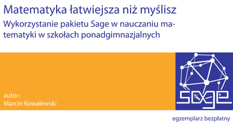

=======================
Sage i Python dla szkól
=======================

Przedstawione materiały wykorzystują Otwarty system Sage. W pierwszym
warsztacie z tego cyklu znajduje się, krótkie wprowadzenie do
Sage. Wszystkich chcących zgłębić tajniki posługiwania się tym
programem, zapraszamy do lektury książki "Matematyka łatwiejsza niż
myślisz" dostępnej w formacie PDF na stronie projektu iCSE.

   `http://icse.us.edu.pl/e-book/ <http://icse.us.edu.pl/e-book>`__   

.. toctree::
   :maxdepth: 1

   Nauka z komputerem - dlaczego? <wstep>
   matura

Matematyka ,,w domu i w zagrodzie"
==================================

Czy dwie pół--główki to cała główka?  

* Materiały z warsztatów prowadzonych w szkołach w latach 2012-13 w
  ramach projektu iCSE przez dra. Michała Trzęsioka. Jeden z tych
  warsztatów pt. "Demokracja - co dwie głowy to nie jedna", jest
  dostępny w formie filmu na `YouTube
  <https://youtu.be/X0JX6Ug4cV8?list=PLsfG71XutI3L6ulPjIoUjRyl-7-ZbEQed>`_.

.. toctree::
   :maxdepth: 1

   iCSE_1a_Wprowadzenie_CubeProject
   iCSE_1b_Wprowadzenie_CubeProject
   iCSE_2_Demokracja_CubeProject
   iCSE_3_Playoffs_CubeProject
   iCSE_4_MontyHall_CubeProject

Chaotyczne opowieści
====================

O prostych układach, które wprowadzają niezły chaos. Spróbuj dojść do
(uk)ładu z tym chaosem!

.. toctree::
   :maxdepth: 1

   Motyl Lorenza <motyl_lorenza>
   Od  motyla Lorenza do równania logistycznego <motyl_lorenza_II>
   Równanie logistyczne <rownanie_logistyczne>
   Równanie logistyczne: diagramy pajęczynowe i bifurkacyjne <rownanie_logistyczne_II>

Fizyka z Sage
=============

Wystrzel z armaty bez obaw o skutki, posłuchaj funkcji sinus zamiast
rysować jej wykres!

.. toctree::
   :maxdepth: 1

   Rzut ukośny: numeryczna analiza równań ruchu <rzut_ukosny>
   Akcelerometr w domu  <akcelerometr>
   gramy_funkcje
   gps
   
Młody Technik - artykuły
========================

  - Proste modele ze złożonym zachowaniem czyli o chaosie ( :download:`pdf <MT_logistyczne/proste_a_zlozone.pdf>` )
  - Rzut ukośny, czyli o prawie Newtona i równaniach różniczkowych ( :download:`pdf <MT_armata_ode/armata_ode.pdf>` )
   

Krótki kurs Sage
================

.. toctree::
   :maxdepth: 1

   sagewfizyce

