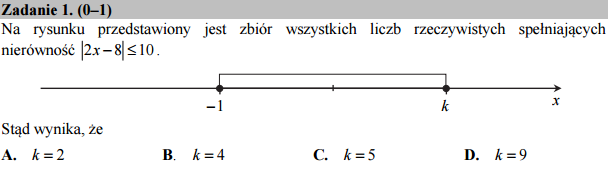

Zadanie 01 - Nierówności - graficznie!
--------------------------------------

Poniższy kod poda nam odpowiedź:

.. sagecellserver::
    
    show( solve(abs(2*x-8)<10,x))

Dla bliższego zrozumienia dlaczego, możemy narysować prawą stronę nierówności. Kiedy będzie ona mniejsza od :math:`10`?

.. sagecellserver::

    plot(abs(2*x-8),(x,-2,10),figsize=4,gridlines=True)
