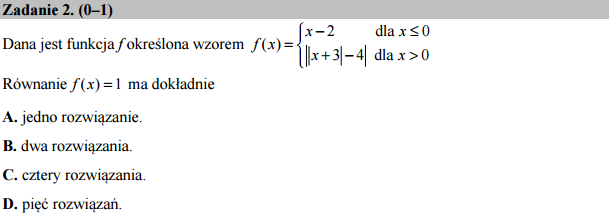

Zadanie 02 - Forget before assume!
----------------------------------

Poniższy kod:

.. sagecellserver::

    forget()
    assume(x<=0)
    print len(solve(x-2==1,x))
    forget()
    assume(x>0)
    print len(solve((abs(x+3)-4)==1,x))

